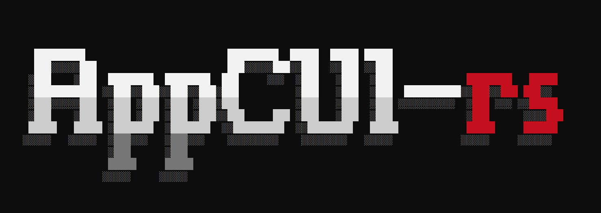

# AppCUI-rs



```                                                              
⯈ 𝗔𝗽𝗽𝗖𝗨𝗜-𝗿𝘀 🖳
```


AppCUI is a simple, easy-to-use and cross-platform library for creating text-based user interfaces in Rust:
* [Book](https://gdt050579.github.io/AppCUI-rs/)
* [Documentation]()


## ✨ Features
- [x] multiple out-of-the-box controls (buttons, labels, text boxes, check boxes, radio buttons, list views, tree views, combo boxes, date/time pickers, color pickers, etc.). 
- [x] menus and toolbars
- [x] multi-platform support (Windows via API, Linux via ncurses, MacOS via termios)
- [x] multi-threading support
- [x] timers
- [x] mouse support
- [x] clipboard support
- [x] color themes
- [x] support for Unicode characters
- [x] predefined dialogs (message box, input box, color picker, save & open dialogs, folder navigator, etc)

## 📸 Screenshots 

## 🚀 Quick Start

Add the following to your `Cargo.toml`:

```toml
[dependencies]
appcui = "*"
```

Then create a new Rust project and add the following code:

```rust
use appcui::prelude::*;

fn main() -> Result<(), appcui::system::Error> {
    let mut app = App::new().build()?;
    let mut win = window!("Test,d:c,w:30,h:9");
    win.add(label!("'Hello World !',d:c,w:13,h:1")));
    app.add_window(win);
    app.run();
    Ok(())
}
```

Then run the project with `cargo run`. You should see a window with the title `Test` and the text `Hello World !` in the center.

## 🧪 Examples

- 🌍 [Hello World](examples/hello_world/)
- 🧮 [Calculator](examples/calculator/)
- 🎨 [Color Picker](examples/colorpicker/)
- 📋 [Menus](examples/menus/)

Check out the [examples](examples) folder for more examples.


## 🛣️ Roadmap

- [x] Basic set of widgets and support for Windows, Linux and MaxOS
- [ ] WebGL support
- [ ] OpenGL / SDL / Vulkan support
- [ ] TextArea suuport for code highlighting

## 🤝 Contributing

Contributions, issues, and feature requests are welcome!  
Check out [CONTRIBUTING.md](CONTRIBUTING.md) to get started.

Join the discussion in [GitHub Discussions](https://github.com/youruser/AppCUI/discussions).
