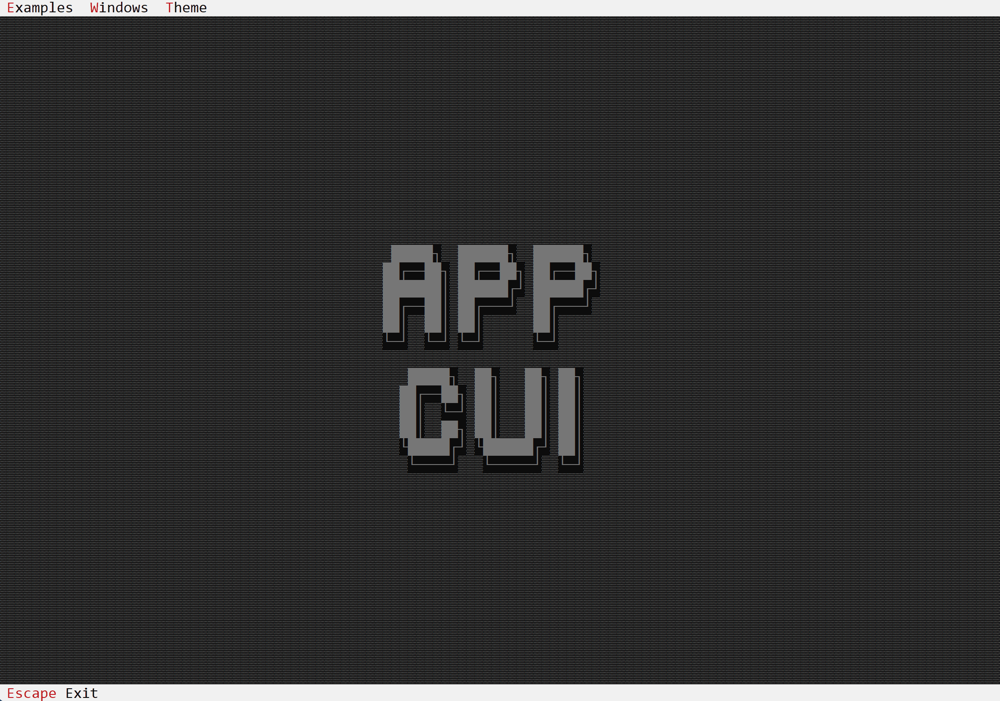

# AppCUI-rs


```                                                              
⯈ 𝗔𝗽𝗽𝗖𝗨𝗜-𝗿𝘀 🖳
```


AppCUI is a simple, easy-to-use and cross-platform library for creating text-based user interfaces in Rust:
* [Book](https://gdt050579.github.io/AppCUI-rs/)
* [Documentation]()


## ✨ Features
- [x] multiple out-of-the-box controls (buttons, labels, text boxes, check boxes, radio buttons, list views, tree views, combo boxes, date/time pickers, color pickers, etc.). 
- [x] menus and toolbars
- [x] multi-platform support (Windows via API, Linux via ncurses, MacOS via termios)
- [x] multi-threading support
- [x] timers
- [x] mouse support
- [x] clipboard support
- [x] color themes
- [x] support for Unicode characters
- [x] predefined dialogs (message box, input box, color picker, save & open dialogs, folder navigator, etc)

## 📸 Screenshots 



## 🚀 Quick Start

Add the following to your `Cargo.toml`:

```toml
[dependencies]
appcui = "*"
```

Then create a new Rust project and add the following code:

```rust
use appcui::prelude::*;

fn main() -> Result<(), appcui::system::Error> {
    let mut app = App::new().build()?;
    let mut win = window!("Test,d:c,w:30,h:9");
    win.add(label!("'Hello World !',d:c,w:13,h:1")));
    app.add_window(win);
    app.run();
    Ok(())
}
```

Then run the project with `cargo run`. You should see a window with the title `Test` and the text `Hello World !` in the center.

## 🧪 Examples

- 🌍 [Hello World](examples/hello_world/)
- 🧮 [Calculator](examples/calculator/)
- 🎨 [Color Picker](examples/colorpicker/)
- 📋 [Menus](examples/menus/)

Check out the [examples](examples) folder for more examples.

## 🛠️ A more complex example

Am example that creates a window with a button that when pressed increases a counter.

```rust
use appcui::prelude::*;

// Create a window that handles button events and has a counter
#[Window(events = ButtonEvents)]
struct CounterWindow {
    counter: i32
}

impl CounterWindow {
    fn new() -> Self {
        let mut w = Self {
            // set up the window title and position
            base: window!("'Counter window',d:c,w:30,h:5"),
            // initial counter is 1
            counter: 1            
        };
        // add a single button with the caption "1" (like the counter)
        w.add(button!("'1',d:b,w:20"));
        w
    }
}
impl ButtonEvents for CounterWindow {
    // When the button is pressed, this function will be called
    // with the handle of the button that was pressed
    // Since we only have one button, we don't need to store its handle 
    // in the struct, as we will receive the handle via the on_pressed method
    fn on_pressed(&mut self, handle: Handle<Button>) -> EventProcessStatus {
        // increase the counter
        self.counter += 1;
        // create a text that containe the new counter
        let text = format!("{}",self.counter);
        // aquire a mutable reference to the button using its handle
        if let Some(button) = self.control_mut(handle) {
            // set the caption of the button to th new text
            button.set_caption(&text);
        }
        // Tell the AppCUI framework that we have processed this event
        // This allows AppCUI to repaint the button
        EventProcessStatus::Processed
    }
}

fn main() -> Result<(), appcui::system::Error> {
    // create a new application
    let mut a = App::new().build()?;
    // add a new window (of type CounterWindow) to the application
    a.add_window(CounterWindow::new());
    // Run AppCUI framework (this wil start the window loop and messaage passing)
    a.run();
    Ok(())
}
```

## 🛣️ Roadmap

- [x] Basic set of widgets and support for Windows, Linux and MaxOS
- [ ] WebGL support
- [ ] OpenGL / SDL / Vulkan support
- [ ] TextArea suuport for code highlighting

## 🤝 Contributing

Contributions, issues, and feature requests are welcome!  
Check out [CONTRIBUTING.md](CONTRIBUTING.md) to get started.

Join the discussion in [GitHub Discussions](https://github.com/youruser/AppCUI/discussions).
