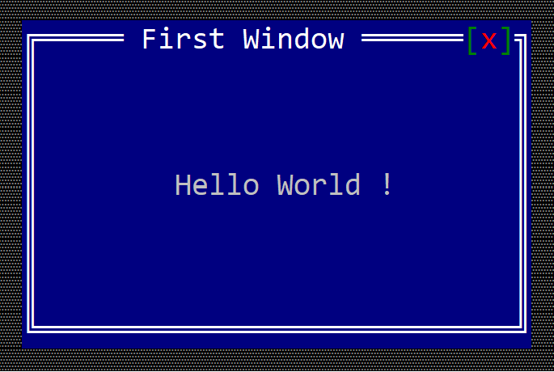

# First Application

Let's start by building a simple window that prints `Hello World` 
on the screen.

Firts, make sure that you have the following dependency added in your
project `cargo.toml` file:

```ini
[dependencies]
appcui = <version>
```

Then, replace your `main.rs` with the following snippet:
```rs
use appcui::prelude::*;

fn main() -> Result<(), appcui::system::Error> {
    let mut app = App::new().build()?;
    let mut win = Window::new("First Window", Layout::new("d:c,w:30,h:9"), window::Flags::None);
    win.add(Label::new("Hello World !",Layout::new("d:c,w:13")));
    app.add_window(win);
    app.run();
    Ok(())
}
```

After compiling and executing this code you should see something like this:



**OBS**: Keep in mind that depending on your terminal and other settings this image
might look differently.
