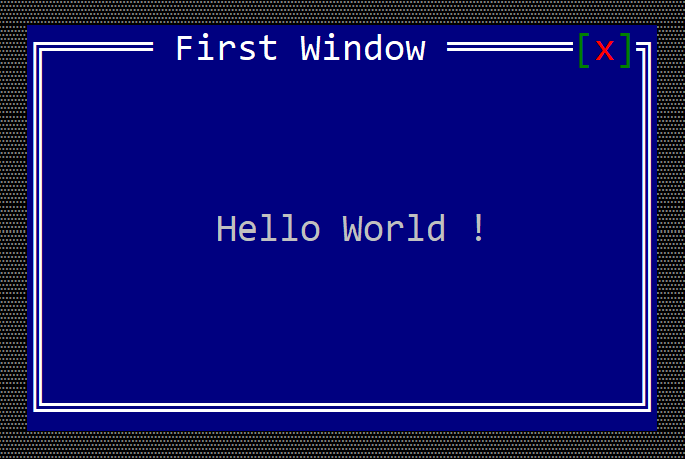

# First Application

Let's start by building a simple window that prints `Hello World` 
on the screen.

First, make sure that you have the following dependency added to your
project's `Cargo.toml` file:

```toml
[dependencies]
appcui = <version>
```

Then, replace your `main.rs` with the following snippet:
```rs
use appcui::prelude::*;

fn main() -> Result<(), appcui::system::Error> {
    let mut app = App::new().build()?;
    let mut win = Window::new(
        "First Window",
        LayoutBuilder::new().alignment(Alignment::Center).width(30).height(9).build(),
        window::Flags::Sizeable,
    );
    win.add(Label::new(
        "Hello World !",
        LayoutBuilder::new().alignment(Alignment::Center).width(13).height(1).build(),
    ));
    app.add_window(win);
    app.run();
    Ok(())
}
```

Or use macros to make the code more compact:

```rs
use appcui::prelude::*;

fn main() -> Result<(), appcui::system::Error> {
    let mut app = App::new().build()?;
    let mut win = window!("'First Window',a:c,w:30,h:9");
    win.add(label!("'Hello World !',a:c,w:13,h:1"));
    app.add_window(win);
    app.run();
    Ok(())
}
```

After compiling and executing this code you should see something like this:



**Note:** Depending on your terminal and other settings, the result may look different from the screenshot.
