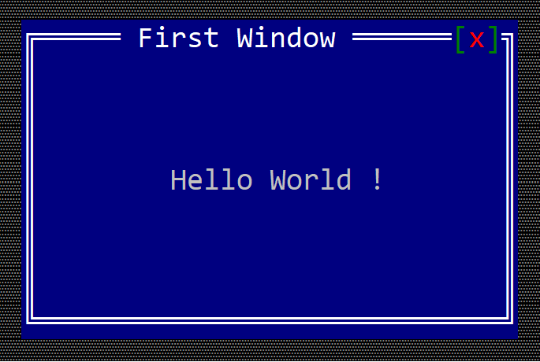

# First Application

Let's start by building a simple window that prints `Hello World` 
on the screen.

First, make sure that you have the following dependency added to your
project's `Cargo.toml` file:

```toml
[dependencies]
appcui = <version>
```

Since AppCUI support multiple modes you can create a `Hello World` app in different ways:

## Using the multi-window system

Replace your `main.rs` with the following snippet:
```rs
use appcui::prelude::*;

fn hello_world_window() -> Window {
    let mut win = Window::new(
        "First Window",
        LayoutBuilder::new().alignment(Alignment::Center).width(30).height(9).build(),
        window::Flags::Sizeable,
    );
    win.add(Label::new(
        "Hello World !",
        LayoutBuilder::new().alignment(Alignment::Center).width(13).height(1).build(),
    ));
    win
}
fn main() -> Result<(), appcui::system::Error> {
    App::new().window(hello_world_window).run()
}
```

## Using the multi-window system with macros

This variant is the equivalent of the previous one - just more compact:

```rs
use appcui::prelude::*;

fn main() -> Result<(), appcui::system::Error> {
    App::new()
        .window(|| {
            let mut win = window!("'First Window',a:c,w:30,h:9");
            win.add(label!("'Hello World !',a:c,w:13,h:1"));
            win
        })
        .run()
}
```

After compiling and executing this code you should see something like this:



**Note:** Depending on your terminal and other settings, the result may look different from the screenshot.

## Using FrameApp or InputApp modes

These modes allow you to write direcly to the screen - and are simpler but imply that you have to do most of the work:

```rs
use appcui::prelude::*;

struct HelloWorld;
impl FrameApp for HelloWorld {
    fn on_paint(&self, surface: &mut Surface) {
        surface.write_string(0, 0, "Hello World !", charattr!("white"), false);
    }
}

fn main() -> Result<(), appcui::system::Error> {
    App::frame_app(HelloWorld {}).run()
}
```
