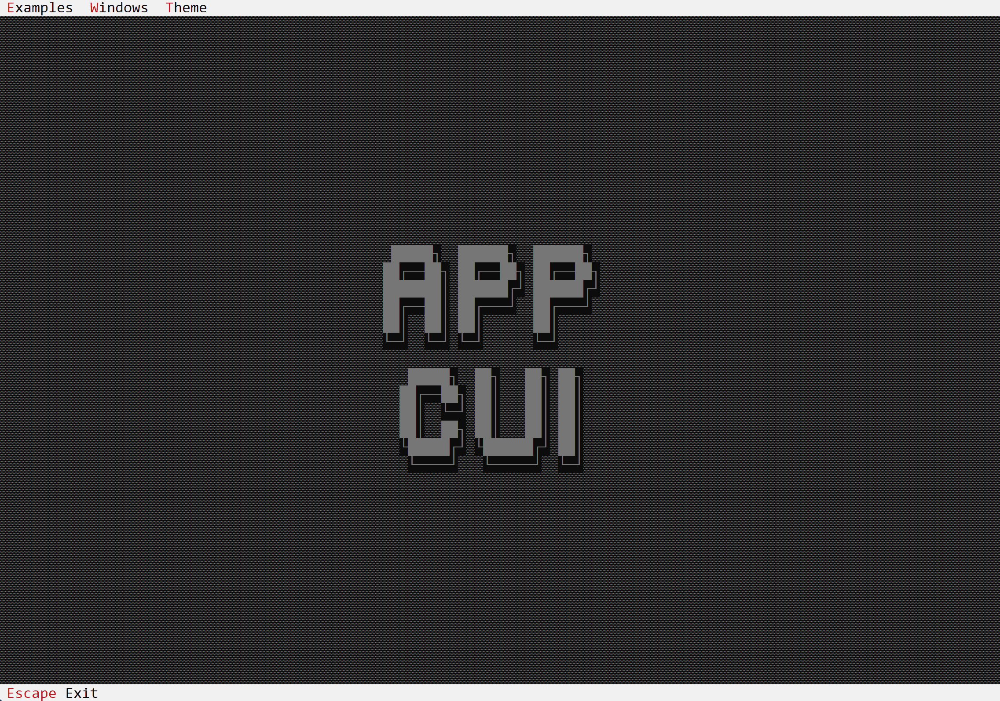

# What is AppCUI

`AppCUI` is a cross-platform TUI (**T**ext **U**ser **I**nterface / **T**erminal **U**ser **I**nterface) / CUI (**C**onsole **U**ser **I**nterface) framework designed to allow quick creation of TUI/CUI-based applications.
AppCUI includes many out-of-the-box controls (such as buttons, checkboxes, radioboxes, windows, tab controls, lists, comboboxes, etc.), and provides macros to help you create custom controls quickly.

The core of AppCUI is written completely in Rust and is designed to be fast and efficient. It is based on a handle-based system, where each control is represented by a handle. This allows for easy manipulation of controls and their properties. 

