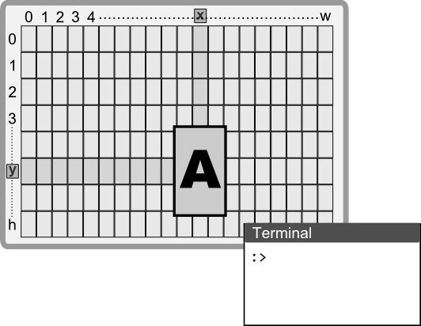

# Backends

AppCUI supports various backends (but each one comes with advantages and drawbacks).
A backend is the terminal that takes the information (characters) from the virtual screen of AppCUI and displays them.



Each backend supported by AppCUI has the following properties:
* **Output rendering** - each character from the AppCUI surface is display on the screen
* **Input reading** - the backend is capable of identifying keyboard and mouse events and convert them to internal AppCUI events
* **Clipboard support** - the backend interacts with the OS and provides functionality for Copy / Cut / Paste based on OS-es API

The following backends are supported:
1. Windows Console
2. Windows VT (Virtual Terminal)
3. NCurses
4. Termios
5. Web Terminal
6. CrossTerm

**Remarks**: These types are available via `appcui::backend::Type` and can be used to initialize an application

```rust
let mut a = App::with_backend(apcui::backend::/*type*/).build()?;
```

where the `appcui::backend::Type` enum is defined as follows:

```rust
pub enum Type {
    #[cfg(target_os = "windows")]
    WindowsConsole,
    #[cfg(target_os = "windows")]
    WindowsVT,
    #[cfg(target_family = "unix")]
    Termios,
    #[cfg(target_os = "linux")]
    NcursesTerminal,
    #[cfg(target_arch = "wasm32")]
    WebTerminal,
    CrossTerm
}
```

## OS Support

| OS      | Windows Console | Windows VT | NCurses | Termios | Web Terminal | CrossTerm |
| ------- | --------------- | ---------- | ------- | ------- | ------------ | --------- |
| Windows | Yes             | Yes        | -       | -       | -            | Yes       |
| Linux   | -               | -          | Yes     | Yes     | -            | Yes       |
| Mac/OSX | -               | -          | Yes     | Yes     | -            | Yes       |
| Web     | -               | -          | -       | -       | Yes          | -         |


## Display

Each backend comes with different support related to what can be displayed on the screen.
* **16 colors** - support for 16 colors for foreground and background 
* **True colors** - support for true colors (24-bit) for foreground and background
* **UTF-8** - support for UTF-8 encoding
* **Ascii** - support for ASCII encoding
* **WTF-16** - support for WTF-16 encoding (a subset of UTF-8) - only for Windows
* **Cursor** - support for cursor
* **Cursor Blinking** - support for cursor blinking

| Display         | Windows Console | Windows VT | NCurses | Termios | Web Terminal | CrossTerm |
| --------------- | --------------- | ---------- | ------- | ------- | ------------ | --------- |
| 16 colors       | Yes             | Yes        | Yes     | Yes     | Yes          | Yes       |
| True colors     | -               | Yes        | -       | Yes     | Yes          | Yes       |
| ASCII           | Yes             | Yes        | Yes     | Yes     | Yes          | Yes       |
| WTF-16          | Yes             | Yes        | Yes     | Yes     | Yes          | Yes       |
| UTF-8           | -               | Yes        | -       | Yes     | Yes          | Yes       |
| Cursor          | Yes             | Yes        | Yes     | -       | Yes          | Yes       |
| Cursor Blinking | Yes             | Yes        | -       | -       | -            | Yes       |

**Remarks**:
1. **True colors** support requires the feature `TRUE_COLORS` to be enabled (keep in mind that by doing this you also increase the size of your Color and Character structures - if you don't need this or your terminal does not support true colors, you will only allocate aditional space that will not be used).
2. **Cursor blinking** is not supported by all terminals (the AppCUI can enable - show/hide the cursor, but it is the terminal job to make it blink)

In terms of the output method, each backend uses a different approach:

| Backend         | Output method                                                           |
| --------------- | ----------------------------------------------------------------------- |
| Windows Console | Direct output via Windows API                                           |
| Windows VT      | ANSI sequences                                                          |
| NCurses         | Direct output via NCurses API. NCurses must be installed on the system. |
| Termios         | ANSI sequences                                                          |
| Web Terminal    | HTML elements and browser APIs                                          |
| CrossTerm       | ANSI sequences (directly via the `crossterm` crate API)                 |

## Character Attributes

Besides background and foreground colors, the following character attributes are supported:

| Display          | Windows Console | Windows VT | NCurses | Termios | Web Terminal | CrossTerm |
| ---------------- | --------------- | ---------- | ------- | ------- | ------------ | --------- |
| Bold             | -               | Yes        | Yes     | Yes     | -            | Yes       |
| Underline        | Yes             | Yes        | Yes     | Yes     | Yes          | Yes       |
| Italic           | -               | Yes        | -       | Yes     | -            | Yes       |
| Curly Underline  | -               | Yes        | -       | Yes     | -            | Yes       |
| Double Underline | -               | Yes        | -       | Yes     | -            | Yes       |
| Dotted Underline | -               | Yes        | -       | Yes     | -            | Yes       |
| Strike Through   | -               | Yes        | -       | Yes     | -            | Yes       |


## Input

Capturing the input implies the following capabilites from any backend:
* identifying keyboard events
* identifying keyboard combinations such as `Alt`+Key or `Ctrl`+Key or `Alt+Ctrl`+Key
* Identifying that the state of the `Shift`, `Ctrl` and `Alt` keys has changed (pressed or released)
* Identifying mouse events
* Identifying mouse combinations such as `Alt`+Mouse or `Ctrl`+Mouse or `Alt+Ctrl`+Mouse
* Identifying mouse drag / move events
* Identifying mouse wheel events

### Keyboard

| Keys               | Windows Console | Windows VT | NCurses | Termios | Web Terminal | CrossTerm |
| ------------------ | --------------- | ---------- | ------- | ------- | ------------ | --------- |
| Alt+Key            | Yes             | Yes        | Yes     | -       | Yes          | Yes       |
| Shift+Key          | Yes             | Yes        | Yes     | -       | Yes          | Yes       |
| Ctrl+Key           | Yes             | Yes        | Yes     | -       | Yes          | Yes       |
| Alt+Shift+Key      | Yes             | Yes        | -       | -       | -            | -         |
| Ctrl+Shift+Key     | Yes             | Yes        | -       | -       | -            | -         |
| Ctrl+Alt+Key       | Yes             | Yes        | -       | -       | -            | -         |
| Ctrl+Alt+Shift+Key | Yes             | Yes        | -       | -       | -            | -         |
| Alt pressed        | Yes             | Yes        | -       | -       | -            | -         |
| Shift pressed      | Yes             | Yes        | -       | -       | -            | -         |
| Ctrl pressed       | Yes             | Yes        | -       | -       | -            | -         |

### Mouse

| Mouse events | Windows Console | Windows VT | NCurses | Termios | Web Terminal | CrossTerm |
| ------------ | --------------- | ---------- | ------- | ------- | ------------ | --------- |
| Click        | Yes             | Yes        | Yes     | Yes     | Yes          | Yes       |
| Move & Drag  | Yes             | Yes        | Yes     | Yes     | Yes          | Yes       |
| Wheel        | Yes             | Yes        | Yes     | -       | Yes          | Yes       |

**Remarks**: Input support is highlighly dependent on the terminal and the OS. AppCUI uses the following approach to intercept the input:

| Backend         | Approach                                                                                           |
| --------------- | -------------------------------------------------------------------------------------------------- |
| Windows Console | Read the input directly from the console via Windows API                                           |
| Windows VT      | Read the input directly from the console via Windows API                                           |
| NCurses         | Read the input directly from the console via NCurses API. NCurses must be installed on the system. |
| Termios         | Read the input directly from the console via Termios API                                           |
| Web Terminal    | Read the input directly from the browser                                                           |
| CrossTerm       | Read the input via the `crossterm` crate API                                                       |


## System events

System events are events that are not related to the keyboard or mouse, but are related to the system and indicate that the console has been changed in some way.

| Events         | Windows Console | Windows VT | NCurses | Termios | Web Terminal | CrossTerm |
| -------------- | --------------- | ---------- | ------- | ------- | ------------ | --------- |
| Console Resize | Yes             | Yes        | Yes     | -       | Yes          | Yes       |
| Console Closed | Yes             | Yes        | -       | -       | Yes          | -         |

## Other capabilities

| Capabilities  | Windows Console | Windows VT | NCurses | Termios | Web Terminal | CrossTerm |
| ------------- | --------------- | ---------- | ------- | ------- | ------------ | --------- |
| Set dimension | Yes             | Yes        | -       | -       | Yes          | -         |
| Set title     | Yes             | Yes        | -       | -       | Yes          | -         |

## Clipboard

AppCUI provides clipboard support for copying and pasting text. The clipboard functionality is available on the following backends:

| Backend         | Clipboard Support | API Used                                                |
| --------------- | ----------------- | ------------------------------------------------------- |
| Windows Console | Yes               | Windows API                                             |
| Windows VT      | Yes               | Windows API                                             |
| NCurses         | Yes               | via copypasta crate                                     |
| Termios         | -                 | -                                                       |
| Web Terminal    | Yes               | Browser API                                             |
| CrossTerm       | Yes               | via copypasta crate (Linux/Mac) or Windows API (Window) |

## Defaults

By default, when using initializing an `App` objct via `App::new()`, the folowing backend will be used :

| OS      | Default backend | Other available backends |
| ------- | --------------- | ------------------------ |
| Windows | Windows Console | Windows VT, CrossTerm    |
| Linux   | NCurses         | CrissTerm                |
| Mac/OSX | Termios         | NCurses, CrossTerm       |
