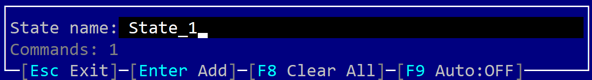

# Recording Events

Writing complex debug or unit-test scenarios might be a tedious task. However, it can be automated with the record events feature from AppCUI.

The first thing is to enable this feature (via `cargo.toml`) where you need to enable the feature **EVENT_RECORDER** for default building, like in the following snipped.


```toml
[features]
default = ["EVENT_RECORDER"]
DEBUG_SHOW_WINDOW_TITLE_BOUNDERIES = []
EVENT_RECORDER = []
```

Once you do this, any program that uses AppCUI will enable a special hotkey `Ctrl+Alt+Space` that will allow you to open a special configuration window similar to the one from the next image:



You can use this window to perform the following action:
1. Add a new state (by typeing its name and pressing `Enter`) - this wil efectivelly add a new `Paint` and `ChackHash` commands
2. Enable automated mode (via shortkey `F9`). Enabling auto record mode will efectively check whenever the screen changes because of the action performed and automatiicaly add a `Paint` and `CheckHash` commands. It will also filter out all other raw events (related to key strokes and mouse).
3. Clear all events recorded up to this moment (via hotket `F8`)

The tipical way of using this feature is as follows:
* enable the feature from `cargo.toml`
* run you application
* if you prefer to do this manually, perform certain action that change the state of the application, then press `Ctrl+Alt+Space` and in the configuration menu type the name of the new state and hit `Enter`.
* if you prefer automated mode, press `Ctrl+Alt+Space` and enable automatic mode via `F9` short key.
* Once you finish doing your scenario, exit the application. At that point a file named `events.txt` will be dropped near your application. You can use its content as part of a unit test or for debug purposes.