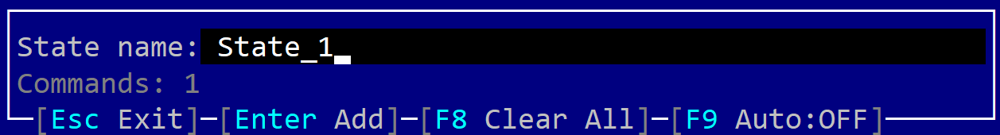

# Recording Events

Writing complex debug or unit-test scenarios might be a tedious task. However, it can be automated with the record events feature from AppCUI.

The first step is to enable this feature in `Cargo.toml`: add the **EVENT_RECORDER** feature to your default features, as in the following snippet.


```toml
[features]
default = ["EVENT_RECORDER"]
DEBUG_SHOW_WINDOW_TITLE_BOUNDERIES = []
EVENT_RECORDER = []
```

Once you do this, any program that uses AppCUI will enable a special hotkey `Ctrl+Alt+Space` that will allow you to open a special configuration window similar to the one from the next image:



You can use this window to perform the following actions:
1. Add a new state (by typing its name and pressing `Enter`)—this will effectively add new `Paint` and `CheckHash` commands.
2. Enable automated mode (via the shortcut `F9`). Enabling auto-record mode will effectively detect whenever the screen changes because of an action performed and automatically add `Paint` and `CheckHash` commands. It will also filter out all other raw events (related to keystrokes and the mouse).
3. Clear all events recorded up to this moment (via the hotkey `F8`).

The typical way of using this feature is as follows:
* Enable the feature from `Cargo.toml`.
* Run your application.
* If you prefer to do this manually, perform actions that change the state of the application, then press `Ctrl+Alt+Space` and, in the configuration menu, type the name of the new state and press `Enter`.
* If you prefer automated mode, press `Ctrl+Alt+Space` and enable automatic mode via the `F9` shortcut.
* Once you finish your scenario, exit the application. At that point a file named `events.txt` will be written next to your application. You can use its content as part of a unit test or for debugging.