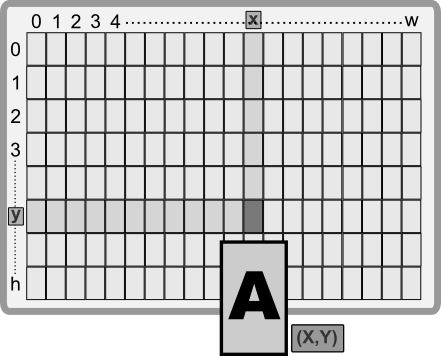

# Screen area and sizes

The screen in AppCUI is a 2D matrix of characters, with different widths (`w`) and heights (`h`).


It is important to note that each character is going to have the same size. 
For each character we have the following attributes:
* Forenground color (the color of the character that we are printing)
* Background color (the color of the character background)
* Attributes: Bold, Italic, Underline, Boxed

The following collors are supported by AppCUI via `Color` enum from `AppCUI::graphics` module:

| Color      | Enum variant       | RGB                                      | Color                                                                                                        |
| ---------- | ------------------ | ---------------------------------------- | ------------------------------------------------------------------------------------------------------------ |
| Black      | `Color::Black`     | Red=**0**, Green=**0**, Blue=**0**       | <div style="width: 24px; height: 24px; background-color: rgb(0, 0, 0);border: 2px solid white;"></div>       |
| Dark Blue  | `Color::DarkBlue`  | Red=**0**, Green=**0**, Blue=**128**     | <div style="width: 24px; height: 24px; background-color: rgb(0, 0, 128);border: 2px solid white;"></div>     |
| Dark Green | `Color::DarkGreen` | Red=**0**, Green=**128**, Blue=**0**     | <div style="width: 24px; height: 24px; background-color: rgb(0, 128, 0);border: 2px solid white;"></div>     |
| Dark Red   | `Color::DarkRed`   | Red=**128**, Green=**0**, Blue=**0**     | <div style="width: 24px; height: 24px; background-color: rgb(128, 0, 0);border: 2px solid white;"></div>     |
| Teal       | `Color::Teal`      | Red=**0**, Green=**128**, Blue=**128**   | <div style="width: 24px; height: 24px; background-color: rgb(0, 128, 128);border: 2px solid white;"></div>   |
| Magenta    | `Color::Magenta`   | Red=**128**, Green=**0**, Blue=**128**   | <div style="width: 24px; height: 24px; background-color: rgb(128, 0, 128);border: 2px solid white;"></div>   |
| Olive      | `Color::Olive`     | Red=**128**, Green=**128**, Blue=**0**   | <div style="width: 24px; height: 24px; background-color: rgb(128, 128, 0);border: 2px solid white;"></div>   |
| Silver     | `Color::Silver`    | Red=**192**, Green=**192**, Blue=**192** | <div style="width: 24px; height: 24px; background-color: rgb(192, 192, 192);border: 2px solid white;"></div> |
| Gray       | `Color::Gray`      | Red=**128**, Green=**128**, Blue=**128** | <div style="width: 24px; height: 24px; background-color: rgb(128, 128, 128);border: 2px solid white;"></div> |
| Blue       | `Color::Blue`      | Red=**0**, Green=**0**, Blue=**255**     | <div style="width: 24px; height: 24px; background-color: rgb(0, 0, 255);border: 2px solid white;"></div>     |
| Green      | `Color::Green`     | Red=**0**, Green=**255**, Blue=**0**     | <div style="width: 24px; height: 24px; background-color: rgb(0, 255, 0);border: 2px solid white;"></div>     |
| Red        | `Color::Red`       | Red=**255**, Green=**0**, Blue=**0**     | <div style="width: 24px; height: 24px; background-color: rgb(255, 0, 0);border: 2px solid white;"></div>     |
| Aqua       | `Color::Aqua`      | Red=**0**, Green=**255**, Blue=**255**   | <div style="width: 24px; height: 24px; background-color: rgb(0, 255, 255);border: 2px solid white;"></div>   |
| Pink       | `Color::Pink`      | Red=**255**, Green=**0**, Blue=**255**   | <div style="width: 24px; height: 24px; background-color: rgb(255, 0, 255);border: 2px solid white;"></div>   |
| Yellow     | `Color::Yellow`    | Red=**255**, Green=**255**, Blue=**0**   | <div style="width: 24px; height: 24px; background-color: rgb(255, 255, 0);border: 2px solid white;"></div>   |
| White      | `Color::White`     | Red=**255**, Green=**255**, Blue=**255** | <div style="width: 24px; height: 24px; background-color: rgb(255, 255, 255);border: 2px solid white;"></div> |

Besides this list, a special enuma variant `Color::Transparent` can be used to draw without a color (or in simple terms to keep the existing color). For example, if the current character has a forenground color `Red` writing another character on the same position with color `Transparent` will keep the color `Red` for the character.

**OBS**: Not all terminals support this exact set of colors. Further more, some terminals might allow changing the RGB color for certain colors in the pallete.

The list of attributes available in AppCUI are described by `CharFlags` enum from `AppCUI::graphics` module and include the following flags:
* `Bold` - bolded character
* `Underline` - underlined character
* `Italic` - italic character

These flags can be used with `|` operator if you want to combine them. For example: `CharFlags::Bold | CharFlags::Underline` means a character that is both bolded and underlined.

# Character

As previously explained, a character is the basic unit of AppCUI (we can say that it is similar to what a pixel is for a regular UX system).
The following method can be used to build a character:
```rust,no_compile
pub fn new<T>(code: T, fore: Color, back: Color, flags: CharFlags) -> Character
```
where:
* `fore` and `back` are characters colors (foreground and background)
* `code` can be a character (like `'a'` or `'b'`) or a value of type `SpecialCharacter` that can be used to quickly access special characters (like arrows). Any type of UTF-8 character is allowed.
* `flags` are a set of flags (like `Bold`, `Underline`, ...) that can be used. 

The list of all special characters that are supported by AppCUI (as described in the `SpacialCharacter` enum) are:

## Box lines and corners

| Variant <br>(appcui::graphics::**SpecialCharacter** enum) | Unicode code | Visual Representation                                                                                                  |
| --------------------------------------------------------- | ------------ | ---------------------------------------------------------------------------------------------------------------------- |
| `SpecialCharacter::BoxTopLeftCornerDoubleLine`            | 0x2554       | <table style="width: 48px; height: 24px;" border="2"><tr><td align="center" valign="middle">&#x2554;</td></tr></table> |
| `SpecialCharacter::BoxTopRightCornerDoubleLine`           | 0x2557       | <table style="width: 48px; height: 24px;" border="2"><tr><td align="center" valign="middle">&#x2557;</td></tr></table> |
| `SpecialCharacter::BoxBottomRightCornerDoubleLine`        | 0x255D       | <table style="width: 48px; height: 24px;" border="2"><tr><td align="center" valign="middle">&#x255D;</td></tr></table> |
| `SpecialCharacter::BoxBottomLeftCornerDoubleLine`         | 0x255A       | <table style="width: 48px; height: 24px;" border="2"><tr><td align="center" valign="middle">&#x255A;</td></tr></table> |
| `SpecialCharacter::BoxHorizontalDoubleLine`               | 0x2550       | <table style="width: 48px; height: 24px;" border="2"><tr><td align="center" valign="middle">&#x2550;</td></tr></table> |
| `SpecialCharacter::BoxVerticalDoubleLine`                 | 0x2551       | <table style="width: 48px; height: 24px;" border="2"><tr><td align="center" valign="middle">&#x2551;</td></tr></table> |
| `SpecialCharacter::BoxCrossDoubleLine`                    | 0x256C       | <table style="width: 48px; height: 24px;" border="2"><tr><td align="center" valign="middle">&#x256C;</td></tr></table> |
| `SpecialCharacter::BoxTopLeftCornerSingleLine`            | 0x250C       | <table style="width: 48px; height: 24px;" border="2"><tr><td align="center" valign="middle">&#x250C;</td></tr></table> |
| `SpecialCharacter::BoxTopRightCornerSingleLine`           | 0x2510       | <table style="width: 48px; height: 24px;" border="2"><tr><td align="center" valign="middle">&#x2510;</td></tr></table> |
| `SpecialCharacter::BoxBottomRightCornerSingleLine`        | 0x2518       | <table style="width: 48px; height: 24px;" border="2"><tr><td align="center" valign="middle">&#x2518;</td></tr></table> |
| `SpecialCharacter::BoxBottomLeftCornerSingleLine`         | 0x2514       | <table style="width: 48px; height: 24px;" border="2"><tr><td align="center" valign="middle">&#x2514;</td></tr></table> |
| `SpecialCharacter::BoxHorizontalSingleLine`               | 0x2500       | <table style="width: 48px; height: 24px;" border="2"><tr><td align="center" valign="middle">&#x2500;</td></tr></table> |
| `SpecialCharacter::BoxVerticalSingleLine`                 | 0x2502       | <table style="width: 48px; height: 24px;" border="2"><tr><td align="center" valign="middle">&#x2502;</td></tr></table> |
| `SpecialCharacter::BoxCrossSingleLine`                    | 0x253C       | <table style="width: 48px; height: 24px;" border="2"><tr><td align="center" valign="middle">&#x253C;</td></tr></table> |
| `SpecialCharacter::SingleLineDownT`                       | 0x252C       | <table style="width: 48px; height: 24px;" border="2"><tr><td align="center" valign="middle">&#x252C;</td></tr></table> |

## Arrows

| Variant <br>(appcui::graphics::**SpecialCharacter** enum) | Unicode code | Visual Representation                                                                                                  |
| --------------------------------------------------------- | ------------ | ---------------------------------------------------------------------------------------------------------------------- |
| `SpecialCharacter::ArrowUp`                               | 0x2191       | <table style="width: 48px; height: 24px;" border="2"><tr><td align="center" valign="middle">&#x2191;</td></tr></table> |
| `SpecialCharacter::ArrowDown`                             | 0x2193       | <table style="width: 48px; height: 24px;" border="2"><tr><td align="center" valign="middle">&#x2193;</td></tr></table> |
| `SpecialCharacter::ArrowLeft`                             | 0x2190       | <table style="width: 48px; height: 24px;" border="2"><tr><td align="center" valign="middle">&#x2190;</td></tr></table> |
| `SpecialCharacter::ArrowRight`                            | 0x2192       | <table style="width: 48px; height: 24px;" border="2"><tr><td align="center" valign="middle">&#x2192;</td></tr></table> |
| `SpecialCharacter::ArrowUpDown`                           | 0x2195       | <table style="width: 48px; height: 24px;" border="2"><tr><td align="center" valign="middle">&#x2195;</td></tr></table> |
| `SpecialCharacter::ArrowLeftRight`                        | 0x2194       | <table style="width: 48px; height: 24px;" border="2"><tr><td align="center" valign="middle">&#x2194;</td></tr></table> |
| `SpecialCharacter::TriangleUp`                            | 0x25B2       | <table style="width: 48px; height: 24px;" border="2"><tr><td align="center" valign="middle">&#x25B2;</td></tr></table> |
| `SpecialCharacter::TriangleDown`                          | 0x25BC       | <table style="width: 48px; height: 24px;" border="2"><tr><td align="center" valign="middle">&#x25BC;</td></tr></table> |
| `SpecialCharacter::TriangleLeft`                          | 0x25C4       | <table style="width: 48px; height: 24px;" border="2"><tr><td align="center" valign="middle">&#x25C4;</td></tr></table> |
| `SpecialCharacter::TriangleRight`                         | 0x25BA       | <table style="width: 48px; height: 24px;" border="2"><tr><td align="center" valign="middle">&#x25BA;</td></tr></table> |


## Blocks

| Variant <br>(appcui::graphics::**SpecialCharacter** enum) | Unicode code | Visual Representation                                                                                                  |
| --------------------------------------------------------- | ------------ | ---------------------------------------------------------------------------------------------------------------------- |
| `SpecialCharacter::Block0`                                | 0x20         | <table style="width: 48px; height: 24px;" border="2"><tr><td align="center" valign="middle">&#x20;</td></tr></table>   |
| `SpecialCharacter::Block25`                               | 0x2591       | <table style="width: 48px; height: 24px;" border="2"><tr><td align="center" valign="middle">&#x2591;</td></tr></table> |
| `SpecialCharacter::Block50`                               | 0x2592       | <table style="width: 48px; height: 24px;" border="2"><tr><td align="center" valign="middle">&#x2592;</td></tr></table> |
| `SpecialCharacter::Block75`                               | 0x2593       | <table style="width: 48px; height: 24px;" border="2"><tr><td align="center" valign="middle">&#x2593;</td></tr></table> |
| `SpecialCharacter::Block100`                              | 0x2588       | <table style="width: 48px; height: 24px;" border="2"><tr><td align="center" valign="middle">&#x2588;</td></tr></table> |
| `SpecialCharacter::BlockUpperHalf`                        | 0x2580       | <table style="width: 48px; height: 24px;" border="2"><tr><td align="center" valign="middle">&#x2580;</td></tr></table> |
| `SpecialCharacter::BlockLowerHalf`                        | 0x2584       | <table style="width: 48px; height: 24px;" border="2"><tr><td align="center" valign="middle">&#x2584;</td></tr></table> |
| `SpecialCharacter::BlockLeftHalf`                         | 0x258C       | <table style="width: 48px; height: 24px;" border="2"><tr><td align="center" valign="middle">&#x258C;</td></tr></table> |
| `SpecialCharacter::BlockRightHalf`                        | 0x2590       | <table style="width: 48px; height: 24px;" border="2"><tr><td align="center" valign="middle">&#x2590;</td></tr></table> |
| `SpecialCharacter::BlockCentered`                         | 0x25A0       | <table style="width: 48px; height: 24px;" border="2"><tr><td align="center" valign="middle">&#x25A0;</td></tr></table> |
| `SpecialCharacter::LineOnTop`                             | 0x2594       | <table style="width: 48px; height: 24px;" border="2"><tr><td align="center" valign="middle">&#x2594;</td></tr></table> |
| `SpecialCharacter::LineOnBottom`                          | 0x2581       | <table style="width: 48px; height: 24px;" border="2"><tr><td align="center" valign="middle">&#x2581;</td></tr></table> |
| `SpecialCharacter::LineOnLeft`                            | 0x258F       | <table style="width: 48px; height: 24px;" border="2"><tr><td align="center" valign="middle">&#x258F;</td></tr></table> |
| `SpecialCharacter::LineOnRight`                           | 0x2595       | <table style="width: 48px; height: 24px;" border="2"><tr><td align="center" valign="middle">&#x2595;</td></tr></table> |

## Other

| Variant <br>(appcui::graphics::**SpecialCharacter** enum) | Unicode code | Visual Representation                                                                                                  |
| --------------------------------------------------------- | ------------ | ---------------------------------------------------------------------------------------------------------------------- |
| `SpecialCharacter::CircleFilled`                          | 0x25CF       | <table style="width: 48px; height: 24px;" border="2"><tr><td align="center" valign="middle">&#x25CF;</td></tr></table> |
| `SpecialCharacter::CircleEmpty`                           | 0x25CB       | <table style="width: 48px; height: 24px;" border="2"><tr><td align="center" valign="middle">&#x25CB;</td></tr></table> |
| `SpecialCharacter::CheckMark`                             | 0x221A       | <table style="width: 48px; height: 24px;" border="2"><tr><td align="center" valign="middle">&#x221A;</td></tr></table> |
| `SpecialCharacter::MenuSign`                              | 0x2261       | <table style="width: 48px; height: 24px;" border="2"><tr><td align="center" valign="middle">&#x2261;</td></tr></table> |
| `SpecialCharacter::FourPoints`                            | 0x205E       | <table style="width: 48px; height: 24px;" border="2"><tr><td align="center" valign="middle">&#x205E;</td></tr></table> |
| `SpecialCharacter::ThreePointsHorizontal`                 | 0x2026       | <table style="width: 48px; height: 24px;" border="2"><tr><td align="center" valign="middle">&#x2026;</td></tr></table> |

# Other character constructors

Besides `Character::new(...)` the following constructors are also available:

1. ```rust, no_compile
    pub fn with_char<T>(code: T) -> Character
    ``` 
    this is the same as calling:
    ```rust, no_compile
    Character::new(code, Color::Transparent, Color::Transparent, CharFlags::None)
    ```

2. ```rust, no_compile 
    pub fn with_color(fore: Color, back: Color) -> Character
    ``` 
    this is the same as calling:
    ```rust, no_compile 
    Character::new(0, fore, fore, CharFlags::None)
    ```
    **Note**: Using the character with code 0 means keeping the existing character but chainging the colors and attributes.


# Macro builds

You can also use `char!` macro to quickly create a character. The macro supports tha following positional and named parameters:

| Position    | Parameter        | Type                                                                             |
| ----------- | ---------------- | -------------------------------------------------------------------------------- |
| #1 (first)  | character        | `character` or `string` (for special chars)                                      |
| #2 (second) | foreground color | `Color` for foreground (special constants are accepted in this case - see below) |
| #3 (third)  | background color | `Color` for background (special constants are accepted in this case - see below) |

and the named parameters:

| Name                                             | Type      | Optional | Description                                                                                                                                                                                                                                                                                                                                                                                                                                             |
| ------------------------------------------------ | --------- | -------- | ------------------------------------------------------------------------------------------------------------------------------------------------------------------------------------------------------------------------------------------------------------------------------------------------------------------------------------------------------------------------------------------------------------------------------------------------------- |
| `value` or `char` or `ch`                        | String    | Yes      | The character or the name or representation of a special character. If string characters `'` or `"` are being used, the content of the string is analyzed. This is useful for when the character is a special token such as `:` or `=` or `,`. If not specified a special character with value `0` is being used that translates as an invariant character (meaning that it will not modify the existing character, but only its color and attributes.) |
| `code` or `unicode`                              | Hex value | Yes      | The unicode value of a character. Using this parameter will invalidate the previous parameter                                                                                                                                                                                                                                                                                                                                                           |
| `fore` or `foreground` or `forecolor` or `color` | Color     | Yes      | The foreground color of the character. If not specified it is defaulted to `Transparent`.                                                                                                                                                                                                                                                                                                                                                               |
| `back` or `background` or `backcolor`            | Color     | Yes      | The background color of the character. If not specified it is defaulted to `Transparent`.                                                                                                                                                                                                                                                                                                                                                               |
| `attr` or `attributes`                           | Flags     | Yes      | One of the following combination: `Bold`, `Italic`, `Underline`                                                                                                                                                                                                                                                                                                                                                                                         |

The following values can be used as color parameters for `foreground` and `background` parameters:
          
| Values               | Color      | Enum variant       | Color                                                                                                        |
| -------------------- | ---------- | ------------------ | ------------------------------------------------------------------------------------------------------------ |
| `black`              | Black      | `Color::Black`     | <div style="width: 24px; height: 24px; background-color: rgb(0, 0, 0);border: 2px solid white;"></div>       |
| `DarkBlue` or `db`   | Dark Blue  | `Color::DarkBlue`  | <div style="width: 24px; height: 24px; background-color: rgb(0, 0, 128);border: 2px solid white;"></div>     |
| `DarkGreen` or `dg`  | Dark Green | `Color::DarkGreen` | <div style="width: 24px; height: 24px; background-color: rgb(0, 128, 0);border: 2px solid white;"></div>     |
| `DarkRed` or `dr`    | Dark Red   | `Color::DarkRed`   | <div style="width: 24px; height: 24px; background-color: rgb(128, 0, 0);border: 2px solid white;"></div>     |
| `Teal`               | Teal       | `Color::Teal`      | <div style="width: 24px; height: 24px; background-color: rgb(0, 128, 128);border: 2px solid white;"></div>   |
| `Magenta`            | Magenta    | `Color::Magenta`   | <div style="width: 24px; height: 24px; background-color: rgb(128, 0, 128);border: 2px solid white;"></div>   |
| `Olive`              | Olive      | `Color::Olive`     | <div style="width: 24px; height: 24px; background-color: rgb(128, 128, 0);border: 2px solid white;"></div>   |
| `Silver` or `Gray75` | Silver     | `Color::Silver`    | <div style="width: 24px; height: 24px; background-color: rgb(192, 192, 192);border: 2px solid white;"></div> |
| `Gray` or `gray50`   | Gray       | `Color::Yellow`    | <div style="width: 24px; height: 24px; background-color: rgb(255, 255, 0);border: 2px solid white;"></div>   |
| `Blue` or `b`        | Blue       | `Color::Blue`      | <div style="width: 24px; height: 24px; background-color: rgb(0, 0, 255);border: 2px solid white;"></div>     |
| `Green` or `g`       | Green      | `Color::Green`     | <div style="width: 24px; height: 24px; background-color: rgb(0, 255, 0);border: 2px solid white;"></div>     |
| `Red` or `r`         | Red        | `Color::Red`       | <div style="width: 24px; height: 24px; background-color: rgb(255, 0, 0);border: 2px solid white;"></div>     |
| `Aqua` or `a`        | Aqua       | `Color::Aqua`      | <div style="width: 24px; height: 24px; background-color: rgb(0, 255, 255);border: 2px solid white;"></div>   |
| `Pink`               | Pink       | `Color::Pink`      | <div style="width: 24px; height: 24px; background-color: rgb(255, 0, 255);border: 2px solid white;"></div>   |
| `Yellow` or `y`      | Yellow     | `Color::Yellow`    | <div style="width: 24px; height: 24px; background-color: rgb(255, 255, 0);border: 2px solid white;"></div>   |
| `White` or `w`       | White      | `Color::White`     | <div style="width: 24px; height: 24px; background-color: rgb(255, 255, 255);border: 2px solid white;"></div> |

For `Transparent` color you can use the following values: `transparent`, `invisible` or `?`.

You can also specify special characters by either using their specific name from the enum `SpecialChars` or by using certaing adnotations as presented in the following table:

| Value                                    | Variant <br>(appcui::graphics::**SpecialCharacter** enum) | Visual Representation                                                                                                  |
| ---------------------------------------- | --------------------------------------------------------- | ---------------------------------------------------------------------------------------------------------------------- |
| `up` or &#x2f;&#x7c;&#x5c;               | `SpecialCharacter::ArrowUp`                               | <table style="width: 48px; height: 24px;" border="2"><tr><td align="center" valign="middle">&#x2191;</td></tr></table> |
| `down` or &#x5c;&#x7c;&#x2f;             | `SpecialCharacter::ArrowDown`                             | <table style="width: 48px; height: 24px;" border="2"><tr><td align="center" valign="middle">&#x2193;</td></tr></table> |
| `left` or `<-`                           | `SpecialCharacter::ArrowLeft`                             | <table style="width: 48px; height: 24px;" border="2"><tr><td align="center" valign="middle">&#x2190;</td></tr></table> |
| `right` or `->`                          | `SpecialCharacter::ArrowRight`                            | <table style="width: 48px; height: 24px;" border="2"><tr><td align="center" valign="middle">&#x2192;</td></tr></table> |
| `updown` or `up-down`                    | `SpecialCharacter::ArrowUpDown`                           | <table style="width: 48px; height: 24px;" border="2"><tr><td align="center" valign="middle">&#x2195;</td></tr></table> |
| `leftright` or `left-right` or <br>`<->` | `SpecialCharacter::ArrowLeftRight`                        | <table style="width: 48px; height: 24px;" border="2"><tr><td align="center" valign="middle">&#x2194;</td></tr></table> |
| `/\`                                     | `SpecialCharacter::TriangleUp`                            | <table style="width: 48px; height: 24px;" border="2"><tr><td align="center" valign="middle">&#x25B2;</td></tr></table> |
| `\/`                                     | `SpecialCharacter::TriangleDown`                          | <table style="width: 48px; height: 24px;" border="2"><tr><td align="center" valign="middle">&#x25BC;</td></tr></table> |
| <&#x7c;                                  | `SpecialCharacter::TriangleLeft`                          | <table style="width: 48px; height: 24px;" border="2"><tr><td align="center" valign="middle">&#x25C4;</td></tr></table> |
| &#x7c;>                                  | `SpecialCharacter::TriangleRight`                         | <table style="width: 48px; height: 24px;" border="2"><tr><td align="center" valign="middle">&#x25BA;</td></tr></table> |
| `...`                                    | `SpecialCharacter::ThreePointsHorizontal`                 | <table style="width: 48px; height: 24px;" border="2"><tr><td align="center" valign="middle">&#x2026;</td></tr></table> |
| ^&#x7c;^                                 | `SpecialCharacter::SingleLineDownT`                       | <table style="width: 48px; height: 24px;" border="2"><tr><td align="center" valign="middle">&#x252C;</td></tr></table> |

# Character attributes

Sometimes, you might want to use a character with a specific color and attributes. For example, you might want to use a bolded character with a red color on a yellow background. This is in particular useful when building a theme where you just select the attributes and colors and then apply them to the characters.
AppCUI provides a specific structure called `CharAttribute` that allows you to define colors and attributes for a character. 
To create a `CharAttribute` you can use the following methods:

```rust,no_compile
impl CharAttribute {
    pub fn new(fore: Color, back: Color, flags: CharFlags) -> CharAttribute {...}
    pub fn with_color(fore: Color, back: Color) -> CharAttribute {...}
    pub fn with_fore_color(fore: Color) -> CharAttribute {...}
    pub fn with_back_color(back: Color) -> CharAttribute {...}
}
```
or
the macro `charattr!`  that works similar to `char!` but it returns a `CharAttribute` object. The macro supports tha following positional and named parameters:

| Position    | Parameter        | Type                                                                             |
| ----------- | ---------------- | -------------------------------------------------------------------------------- |
| #1 (second) | foreground color | `Color` for foreground (special constants are accepted in this case - see below) |
| #2 (third)  | background color | `Color` for background (special constants are accepted in this case - see below) |

and the named parameters:

| Name                                             | Type      | Optional | Description                                                                                                                                                                                                                                                                                                                                                                                                                                             |
| ------------------------------------------------ | --------- | -------- | ------------------------------------------------------------------------------------------------------------------------------------------------------------------------------------------------------------------------------------------------------------------------------------------------------------------------------------------------------------------------------------------------------------------------------------------------------- |
| `fore` or `foreground` or `forecolor` or `color` | Color     | Yes      | The foreground color of the character. If not specified it is defaulted to `Transparent`.                                                                                                                                                                                                                                                                                                                                                               |
| `back` or `background` or `backcolor`            | Color     | Yes      | The background color of the character. If not specified it is defaulted to `Transparent`.                                                                                                                                                                                                                                                                                                                                                               |
| `attr` or `attributes`                           | Flags     | Yes      | One of the following combination: `Bold`, `Italic`, `Underline`                                                                                                                                                                                                                                                                                                                                                                                         |


# Examples

**Example 1**: Letter `A` with a Red color on an Yellow background:
```rust,no_compile
Character::new('A',Color::Red,Color::Yellow,CharFlags::None)
```
or
```rs,no_compile
char!("A,red,yellow")
```
or
```rs,no_compile
char!("A,r,y")
```


**Example 2**: Letter `A` (bolded and underlined) with a White color on a Dark blue background:
```rust,no_compile
Character::new('A',Color::White,Color::DarkBlue,CharFlags::Bold | CharFlags::Underline)
```
or
```rs,no_compile
char!("A,fore=White,back=DarkBlue,attr=[Bold,Underline]")
```
or
```rs,no_compile
char!("A,w,db,attr=Bold+Underline")
```


**Example 3**: An arrow towards left a Red color while keeping the current background:
```rust,no_compile
Character::new(SpecialCharacter::ArrowLeft,Color::Red,Color::Transparent,CharFlags::None)
```
or
```rs,no_compile
char!("ArrowLeft,fore=Red,back=Transparent")
```
or
```rs,no_compile
char!("<-,red")
```
or
```rs,no_compile
char!("<-,r")
```


**Example 4**: An arrow towards left a DarkGreen color, Bolded and Underlined while keeping the current background. We will use a CharAttribute for this example:
```rust,no_compile
let attr = CharAttribute::new(Color::DarkGreen,Color::Transparent,CharFlags::Bold | CharFlags::Underline);  
let c = Character::with_attr(SpecialCharacter::ArrowLeft,attr);
```
or
```rs,no_compile
let attr = charattr!("DarkGreen,Transparent,attr:Bold+Underline");
let c = Character::with_attr(SpecialCharacter::ArrowLeft,attr));
```
or
```rs,no_compile
let attr = charattr!("dg,?,attr:Bold+Underline");
let c = Character::with_attr(SpecialCharacter::ArrowLeft,attr);
```
