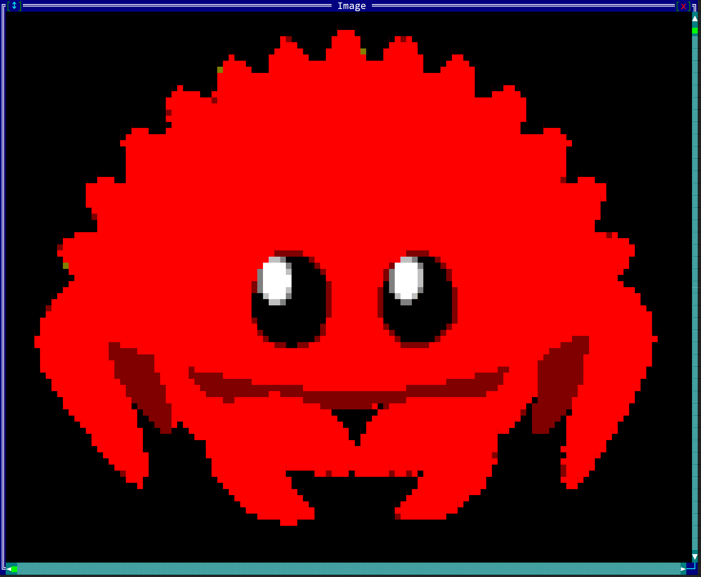
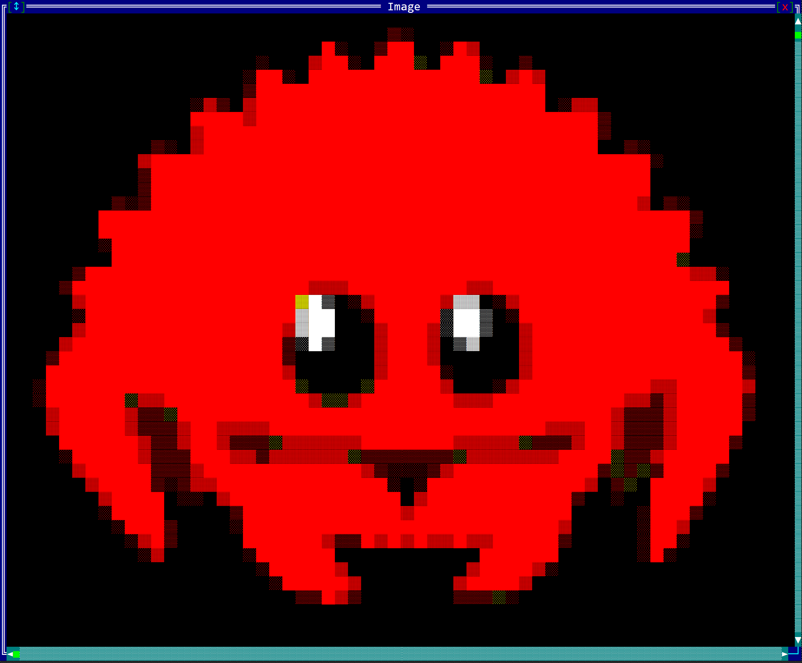

# Images

While AppCUI is developed for CLI usage, it can still use images to some degree, meaning that it can store images as an array of pixels and it has various methods to represent them using characters and combinations of existing colors.

To create an image, use the class `Image` with the following construction methods:
1. `Image::new(width,height)` creates an image with a specific size. That image will be filled with a transparent pixel that you can later change
2. `Image::from_str(...)` creates a 16 color image based on a string representation.
3. `Image::from_buffer(buffer, size)` creates an image from a buffer of pixel values encoded as u32 ARGB values.


## Methods

Once an image is created you can use the following methods to manipulate it:

| Method                        | Purpose                                                                                                                                         |
| ----------------------------- | ----------------------------------------------------------------------------------------------------------------------------------------------- |
| `clear(...)`                  | Fills the entire image with a specific pixel                                                                                                    |
| `pixel(...)`                  | Provides the pixel from a specific coordinate in the image or None otherwise                                                                    |
| `set_pixel(...)`              | Sets the pixel from a specific coordinate in the image                                                                                          |
| `width()`                     | The width of the image in pixels                                                                                                                |
| `height()`                    | The height of the image in pixels                                                                                                               |
| `size()`                      | The size (width and height) of the image in pixels                                                                                              |
| `render_size(render_options)` | The size (in characters) needed for a surface object to allow the entire image to be painted. It requires a **RenderOptions** object to compute |
| `remove_alpha()`              | Removes the alpha channel from all pixels, making them fully opaque                                                                             |

## Pixel

A pixel is a simple structure defined as follows:

```rs
#[derive(Copy, Clone, Debug, PartialEq, Default)]
pub struct Pixel {
    pub red: u8,
    pub green: u8,
    pub blue: u8,
    pub alpha: u8,
}
```

You can create a pixel in the following way:
1. using direct construction:
    ```rs
    let px = Pixel { red:10, green: 20, blue:30, alpha: 255 };
    ```
2. using the `.new(...)` constructor:
    ```rs
    let px = Pixel::new(10, 20, 30, 255);
    ```
3. using the `.with_rgb(...)` constructor:
    ```rs
    let px = Pixel::with_rgb(10, 20, 30);
    ```
4. using the `.with_color(...)` constructor:
    ```rs
    let px = Pixel::with_color(Color::Aqua);
    ```
5. using the **From** implementation from an u32 (in an ARGB format - `A`lpha `R`ed `G`reen `B`lue).
    ```rs
    let px = Pixel::from(0xFF005090u32);
    ```
6. using the **Default** implementation (this will create a transparent pixel where `Red=0`, `Green=0`, `Blue=0` and `Alpha=0`)
    ```rs
    let px = Pixel::default();
    ```

## Usage

A typical way to create an image is as follows:
1. create a new `Image` object
2. optionally, fill the entire image with a different pixel than the default one
3. use `.set_pixel(...)` method to fill the image. At this point additional crates that can load an image from a file can be used to transfer the content of that image into this object.

The following example draws a horizontal `Red` line on a `Blue` background image of size `32x32`:

```rs
let mut img = Image::new(32,32);
img.clear(Pixel::with_color(Color::Blue));
for i in 5..30 {
    img.set_pixel(i,10,Pixel::with_color(Color::Red));
}
```

## Building from a string

A more common usage is to build a small image from a string that specifies colors for each pixel. The format in this case is as follows:
* each line is enclosed between two characters `|`
* outside of these characters any other character is being ignored (usually you add spaces or new lines to align the text)
* each line must have the same width (in terms of the number of characters that are located between `|` characters )

for example, a `5x5` image will be represented as follows:
```rs
let string_representation = r#"
      |.....|
      |.....|
      |.....|
      |.....|
      |.....|
"#;
```

Within the space between the characters `|` the following characters have a color association:

| Character                       | Enum variant       | RGB                                      | Color                                                                                                        |
| ------------------------------- | ------------------ | ---------------------------------------- | ------------------------------------------------------------------------------------------------------------ |
| `0`<br>` `(space)<br>`.`(point) | `Color::Black`     | Red=**0**, Green=**0**, Blue=**0**       | <div style="width: 24px; height: 24px; background-color: rgb(0, 0, 0);border: 2px solid white;"></div>       |
| `1`<br>`B`(capital **B**)       | `Color::DarkBlue`  | Red=**0**, Green=**0**, Blue=**128**     | <div style="width: 24px; height: 24px; background-color: rgb(0, 0, 128);border: 2px solid white;"></div>     |
| `2`<br>`G`(capital **G**)       | `Color::DarkGreen` | Red=**0**, Green=**128**, Blue=**0**     | <div style="width: 24px; height: 24px; background-color: rgb(0, 128, 0);border: 2px solid white;"></div>     |
| `3`<br>`T`(capital **T**)       | `Color::Teal`      | Red=**0**, Green=**128**, Blue=**128**   | <div style="width: 24px; height: 24px; background-color: rgb(0, 128, 128);border: 2px solid white;"></div>   |
| `4`<br>`R`(capital **R**)       | `Color::DarkRed`   | Red=**128**, Green=**0**, Blue=**0**     | <div style="width: 24px; height: 24px; background-color: rgb(128, 0, 0);border: 2px solid white;"></div>     |
| `5`<br>`M` or `m`               | `Color::Magenta`   | Red=**128**, Green=**0**, Blue=**128**   | <div style="width: 24px; height: 24px; background-color: rgb(128, 0, 128);border: 2px solid white;"></div>   |
| `6`<br>`O` or `o`               | `Color::Olive`     | Red=**128**, Green=**128**, Blue=**0**   | <div style="width: 24px; height: 24px; background-color: rgb(128, 128, 0);border: 2px solid white;"></div>   |
| `7`<br>`S`(capital **S**)       | `Color::Silver`    | Red=**192**, Green=**192**, Blue=**192** | <div style="width: 24px; height: 24px; background-color: rgb(192, 192, 192);border: 2px solid white;"></div> |
| `8`<br>`s`(lower **s**)         | `Color::Gray`      | Red=**128**, Green=**128**, Blue=**128** | <div style="width: 24px; height: 24px; background-color: rgb(128, 128, 128);border: 2px solid white;"></div> |
| `9`<br>`b`(lower **b**)         | `Color::Blue`      | Red=**0**, Green=**0**, Blue=**255**     | <div style="width: 24px; height: 24px; background-color: rgb(0, 0, 255);border: 2px solid white;"></div>     |
| `g`(lower **g**)                | `Color::Green`     | Red=**0**, Green=**255**, Blue=**0**     | <div style="width: 24px; height: 24px; background-color: rgb(0, 255, 0);border: 2px solid white;"></div>     |
| `r`(lower **r**)                | `Color::Red`       | Red=**255**, Green=**0**, Blue=**0**     | <div style="width: 24px; height: 24px; background-color: rgb(255, 0, 0);border: 2px solid white;"></div>     |
| `A` or `a`<br>`t`(lower **t**)  | `Color::Aqua`      | Red=**0**, Green=**255**, Blue=**255**   | <div style="width: 24px; height: 24px; background-color: rgb(0, 255, 255);border: 2px solid white;"></div>   |
| `P` or `p`                      | `Color::Pink`      | Red=**255**, Green=**0**, Blue=**255**   | <div style="width: 24px; height: 24px; background-color: rgb(255, 0, 255);border: 2px solid white;"></div>   |
| `Y` or `y`                      | `Color::Yellow`    | Red=**255**, Green=**255**, Blue=**0**   | <div style="width: 24px; height: 24px; background-color: rgb(255, 255, 0);border: 2px solid white;"></div>   |
| `W` or `w`                      | `Color::White`     | Red=**255**, Green=**255**, Blue=**255** | <div style="width: 24px; height: 24px; background-color: rgb(255, 255, 255);border: 2px solid white;"></div> |

So ... to create an image of a red heart &#9829; you will need to create the following string:
```rs
let heart = r#"
    |..rr.rr..|
    |.rrrrrrr.|
    |.rrrrrrr.|
    |..rrrrr..|
    |...rrr...|
    |....r....|
"#;
let img = Image::from_str(heart);
```

## Rendering images

AppCUI framework relies on characters. As such, an image cannot be displayed **as it is**. However, there is one method in the [Surface](../surface.md) object that can be used to approximate an image:

```rs
impl Surface {
    // other methods
    pub fn draw_image(&mut self, x: i32, 
                                y: i32, 
                                image: &Image, 
                                render_options: &image::RenderOptions
                    ) { ... }
}
```

This method attempts to draw an image using characters and the available colors. The `RenderOptions` object controls how the image is rendered and can be created using the builder pattern:

### RenderOptionsBuilder Methods

The `RenderOptionsBuilder` provides a fluent interface for configuring render options. All methods return `Self` for method chaining:

| Method                       | Parameter Type | Default       | Purpose                                                           |
| ---------------------------- | -------------- | ------------- | ----------------------------------------------------------------- |
| `new()`                      | -              | -             | Creates a new builder with default settings                       |
| `scale(scale)`               | `Scale`        | `NoScale`     | Sets the scaling factor for the image                             |
| `character_set(char_set)`    | `CharacterSet` | `SmallBlocks` | Sets the character set for rendering                              |
| `color_schema(schema)`       | `ColorSchema`  | `Auto`        | Sets the color schema for rendering                               |
| `luminance_threshold(value)` | `f64`          | `0.5`         | Sets the luminance threshold (0.0-1.0) for black/white conversion |
| `build()`                    | -              | -             | Finalizes the builder and returns a `RenderOptions` object        |

**Example:**
```rs
let render_options = image::RenderOptionsBuilder::new()
    .scale(image::Scale::Scale50)
    .character_set(image::CharacterSet::AsciiArt)
    .color_schema(image::ColorSchema::Color16)
    .luminance_threshold(0.3)
    .build();
```

The following rendering options are available:

### Character Sets
* `SmallBlocks` - Uses small block characters (default)
* `LargeBlocks` - Uses large block characters  
* `DitheredShades` - Uses dithered shading
* `Braille` - Uses braille characters
* `AsciiArt` - Uses ASCII art characters

### Color Schemas
* `Auto` - Automatic color detection (default)
* `Color16` - 16-color mode
* `TrueColors` - True color mode (if feature enabled)
* `GrayScale4` - 4-level grayscale
* `GrayScaleTrueColors` - True color grayscale (if feature enabled)
* `BlackAndWhite` - Black and white mode

### Scaling Options
* `Scale::NoScale` => 100%
* `Scale::Scale50` => 50%
* `Scale::Scale33` => 33%
* `Scale::Scale25` => 25%
* `Scale::Scale20` => 20%
* `Scale::Scale10` => 10%
* `Scale::Scale5` => 5%

Let's consider an image of [Cuddly Ferris](https://www.rustacean.net/assets/cuddlyferris.svg) and see how it will be displayed using different rendering methods:


| Methods        | Result                                                      |
| -------------- | ----------------------------------------------------------- |
| SmallBlocks    |     |
| LargeBlocks    |  |
| DitheredShades |        |
| AsciiArt       |        |
