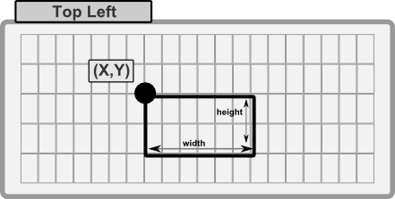
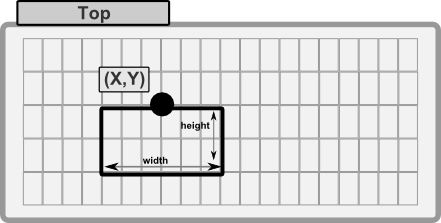
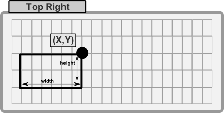
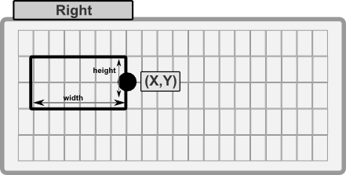
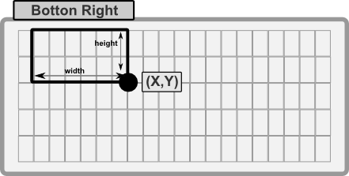
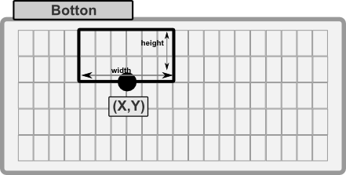
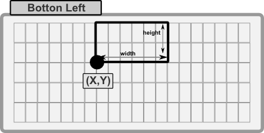
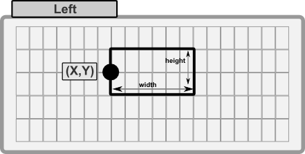
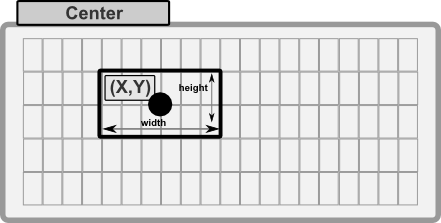

# Rectangles

Rectangles are the most basic shape you can draw on a surface. They are defined by a position and a size. The position is the top-left corner of the rectangle, and the size is the width and height of the rectangle.

In AppCUI a rectangle is defined based on the following structure:

```rust
#[derive(Copy, Clone, Debug)]
pub struct Rect {
    left: i32,
    top: i32,
    right: i32,
    bottom: i32,
}
```

A rectangle can be created using the following methods:
1. `Rect::new(left, top, right, bottom)` - creates a new rectangle based on the provided coordinates.
2. `Rect::with_size(left, top, width, height)` - creates a new rectangle based on the provided position and size.
3. `Rect::with_alignment(x, y, width, height, align)` - creates a new rectangle based on the provided position, size and alignment.
4. `Rect::with_point_and_size(point, size)` - creates a new rectangle based on the provided point and size. 

The alignment in the third method is defined as follows:

```rust
#[repr(u8)]
#[derive(Copy, Clone, PartialEq, Debug)]
pub enum RectAlignment {
    TopLeft = 0,
    Top,
    TopRight,
    Right,
    BottomRight,
    Bottom,
    BottomLeft,
    Left,
    Center,
}
```

| Alignment     | Decription                                                | Preview                                   |
| ------------- | --------------------------------------------------------- | ----------------------------------------- |
| `TopLeft`     | (X,Y) represents the top-left corner of the rectangle     |          |
| `Top`         | (X,Y) represents the top-center of the rectangle          |                   |
| `TopRight`    | (X,Y) represents the top-right corner of the rectangle    |        |
| `Right`       | (X,Y) represents the right-center of the rectangle        |               |
| `BottomRight` | (X,Y) represents the bottom-right corner of the rectangle |  |
| `Bottom`      | (X,Y) represents the bottom-center of the rectangle       |             |
| `BottomLeft`  | (X,Y) represents the bottom-left corner of the rectangle  |    |
| `Left`        | (X,Y) represents the left-center of the rectangle         |                 |
| `Center`      | (X,Y) represents the center of the rectangle              |             |

To draw a rectangle on a surface, you can use the following methods:

| Method           | Description                                                                                           |
| ---------------- | ----------------------------------------------------------------------------------------------------- |
| `draw_rect(...)` | Draws a rectangle on the surface by providing a `Rect` object, a line type and a character attribute. |
| `fill_rect(...)` | Fills a rectangle on the surface by providing a `Rect` object and a character attribute.              |

Example:

```rust
use appcui::graphics::*;

let mut surface = Surface::new(100, 50);
let r = Rect::new(10, 10, 20, 20);
// fill the rectangel with spaces (dark blue background)
surface.fill_rect(r, Character::new(' ', Color::White, Color::DarkBlue, CharFlags::None));
// draw a border around the rectangle (white on black)
surface.draw_rect(r, LineType::Single, CharAttribute::with_color(Color::White, Color::Black));
```

## Methods

A rectangle has the following methods:
| Method               | Description                                                                    |
| -------------------- | ------------------------------------------------------------------------------ |
| `left()`             | Returns the left coordinate of the rectangle.                                  |
| `top()`              | Returns the top coordinate of the rectangle.                                   |
| `right()`            | Returns the right coordinate of the rectangle.                                 |
| `bottom()`           | Returns the bottom coordinate of the rectangle.                                |
| `width()`            | Returns the width of the rectangle.                                            |
| `height()`           | Returns the height of the rectangle.                                           |
| `size()`             | Returns the size of the rectangle as a `Size` object.                          |
| `center_x()`         | Returns the x coordinate of the center of the rectangle.                       |
| `center_y()`         | Returns the y coordinate of the center of the rectangle.                       |
| `center()`           | Returns the center of the rectangle as a `Point` object.                       |
| `top_left()`         | Returns the top-left corner of the rectangle as a `Point` object.              |
| `top_right()`        | Returns the top-right corner of the rectangle as a `Point` object.             |
| `bottom_left()`      | Returns the bottom-left corner of the rectangle as a `Point` object.           |
| `bottom_right()`     | Returns the bottom-right corner of the rectangle as a `Point` object.          |
| `contains(...)`      | Checks if a point is inside the rectangle.                                     |
| `contains_rect(...)` | Checks if a rectangle is fully inside (no intersections) the rectangle.        |
| `inflate_with(...)`  | Inflates the rectangle by the given amount in left, top, right, bottom.        |
| `translate(...)`     | Translates the rectangle by the given amount in x and y.                       |
| `set_left(...)`      | Sets the left coordinate of the rectangle, optionally preserving the width.    |
| `set_top(...)`       | Sets the top coordinate of the rectangle, optionally preserving the height.    |
| `set_right(...)`     | Sets the right coordinate of the rectangle, optionally preserving the width.   |
| `set_bottom(...)`    | Sets the bottom coordinate of the rectangle, optionally preserving the height. |

