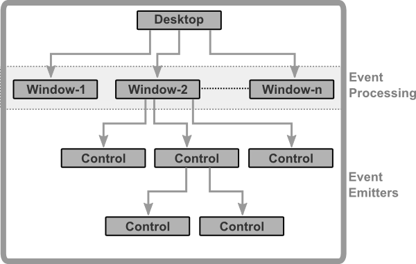

# Controls

All controls from AppCUI follow a tree-like organization (a control has a `parent control` and may have multiple `children controls`).

**Remarks**
* There is only one Desktop control. AppCUI provides a default one, but costom desktop can be created as well
* A Desktop control can have one or multiple Windows.
* All events emitted by any control are process at window level
* A control may contain other children controls

Every control has a set of common characteristics:
1. `Layout` (how it is position relative to its parent). The only exception in this case is the Desktop control that always takes the entire terminal space. More details on [Layout](layout.md) section.
2. `Visibility` (a control can be visible or not). The only exception is the Desktop control that will always be visible. A hidden control does not receive any input events and it is not drawn.
3. `Enabled` (a control can be enabled or not). The only exception are the Desktop and Window controls that are always enabled. If a control is not enabled, it will not receive any input events (key pressed or mouse events) but it will still be drawn.

Besides this, a set of commonly available methods are available for all controls. These methods allow changing / accessing some attributes like visibility, loyout, etc.

