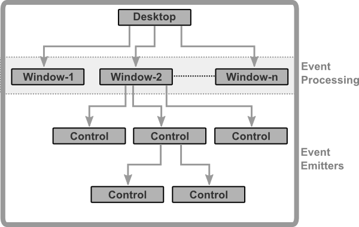

# Controls

All controls from AppCUI follow a tree-like organization: a control has a parent control and may have multiple child controls.

**Remarks:**
* There is only one Desktop control. AppCUI provides a default one, but a custom desktop can be created as well.
* A Desktop control can have one or more windows.
* All events emitted by any control are processed at window level.
* A control may contain other child controls.

Every control has a set of common characteristics:
1. `Layout` (how it is positioned relative to its parent). The only exception in this case is the Desktop control, which always takes the entire terminal space. More details are in the [Layout](layout.md) section.
2. `Visibility` (a control can be visible or not). The only exception is the Desktop control that will always be visible. A hidden control does not receive any input events and it is not drawn.
3. `Enabled` (a control can be enabled or not). The only exceptions are the Desktop and Window controls, which are always enabled. If a control is not enabled, it will not receive any input events (key presses or mouse events), but it will still be drawn.
4. `HotKey` (a combination of keys usually in the following form: `Alt`+<Letter|Number> that will automatically move the focus to the current control and execute a default action for it—for example, for a checkbox, pressing that combination will check or uncheck the checkbox).

Besides this, a set of commonly available methods exists for all controls. These methods allow changing or accessing some attributes like visibility, layout, hotkeys, etc. More details can be found in the [Common methods for all Controls](common_methods.md) section.

