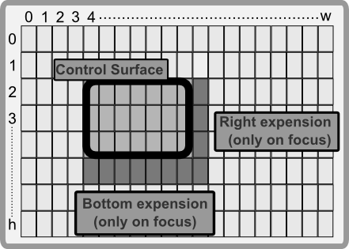

# Overlay on Focus support

Sometimes, you may want to have aditional space in a control when it has a focus (e.g. to draw some extract components that make sense only when the control has a focus). Example of such behavior include:
* **scrollbars** - when a control has scrollbars, the scrollbars are drawn only when the control has a focus.
* **searchbar** - when a control has a focus, a search bar is drawn that the control can use to filter/find inner items.
* **aditional information** - controls that operates over a container (e.g. a list) can use the overlay to show some aditional information about the current item or the current state of the control (e.g. number of items selected, etc).

## Constructor

To create a custom control that has a focus overlay, you need to use the `ControlBase::with_focus_overlay` method. 

```rs
use appcui::prelude::*;

#[CustomControl(overwrite = OnPaint)]
struct MyControl {
    // aditional fields
}
impl MyControl {
    fn new(layout: Layout) -> Self {
        Self { 
            base: ControlBase::with_focus_overlay(layout) 
            // initialization of aditional fields
        }
    }
}
```

**Remember**: Using `ControlBase::with_focus_overlay` implies that the control would receive imput events (e.g. keyboard, mouse).

## Behavior 

When a control has a focus overlay, the control will extend its size by one character to the right and one character to the bottom when if has focus. This will allow it to be drawn over its parent if needed (e.g. if a control is within a window, it will extend over the window's border). 

The control will also receive all mouse events if they are triggered over the overlay area. This means that the control has to handle them or pass them to the parent control (to allow a normal behavior).



## OnPaint trait

As previously mentioned, q custom control (if created with `ControlBase::with_focus_overlay`) will increase its size by one character to the right and one character to the bottom only if it has the focus. This means that the control will have to handle the drawing of the overlay area (if needed) in two cases:
1. when the control has the focus and it is being drawn
2. when the control does not have the focus and it is being drawn
   
A tipical implementation of the `OnPaint` trait for a custom control that has a focus overlay would do the following steps in the `on_paint` method:
1. Check if the control has the focus
2. If it has the focus:
   * draw (if needed) the overlay area (the area that is one character to the right and one character to the bottom of the control)
   * reduce the clip area of the surface to the size of the control (without the overlay area). This can be done by calling `surface.reduce_clip_by(0, 0, 1, 1)`.
3. Draw the normal area of the control

A typical implementation of the `OnPaint` trait for a custom control that has a focus overlay would look like this:

```rs
use appcui::prelude::*;

#[CustomControl(overwrite = OnPaint)]
struct MyControl {
    // aditional fields
}
impl MyControl {
    fn new(layout: Layout) -> Self {
        Self { 
            base: ControlBase::with_focus_overlay(layout) 
            // initialization of aditional fields
        }
    }
}
impl OnPaint for MyControl {
    fn on_paint(&self, surface: &mut Surface, theme: &Theme) {
        if self.has_focus() {
            // draw the overlay area
            surface.reduce_clip_by(0, 0, 1, 1);
            // now the surface has the exact same size 
            // as if it would not have the focus
        }   
        // draw the normal area
    }
}
```

## Final remarks

Keep in mind that if focus ovelay is being used you may still want to convay mouse events to the parent control. Lets consider a custom control that fills up the entire window. If the window is sizeable, it means that the bottom-right corner of the window has a grip that allows the user to resize the window. If the custom control is not passing the mouse events to the parent, the user will not be able to resize the window anymore. This means that you need to be carefull where you draw when in the overlay area as well as what events you pass to the parent.

