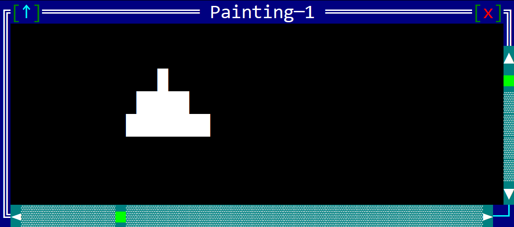

# ScrollBars

Scrollbars are a set of components that are used to navigate through a control that has a large content. They are typically used in controls that handle a large amount of data, such as text editors, image viewers, and other controls that display a lot of information. Scrollbars are usually displayed only when the control has the focus and they are not visible when the control does not have the focus. 



AppCUI provides a special structure (called `ScrollBars`) that can be used to create a set of scrollbars for a control. The `ScrollBars` structure is created by calling the `ScrollBars::new` method and it takes two parameters (the `width` and the `height` of the content to be displayed).

Scrollbars can only be used with controls that have a focus overlay. This means that the control must be created with the `ControlBase::with_focus_overlay` method.

## Methods

The `ScrollBars` structure has the following methods:

| Method                     | Purpose                                                                                                                                                                                                                                                 |
| -------------------------- | ------------------------------------------------------------------------------------------------------------------------------------------------------------------------------------------------------------------------------------------------------- |
| `paint(...)`               | Paints the scrollbars on the given surface and theme.                                                                                                                                                                                                   |
| `process_mouse_event(...)` | Processes a mouse event if it is triggered over the scrollbars and returns `true` in this case or `false` otherwise. It is a useful method to filter our scenarios where a mouse event should be pass to the parent control.                            |
| `should_repaint(...)`      | Returns `true` if the scrollbars should be repainted.                                                                                                                                                                                                   |
| `horizontal_index()`       | Returns the current horizontal index of the scrollbars.                                                                                                                                                                                                 |
| `vertical_index()`         | Returns the current vertical index of the scrollbars.                                                                                                                                                                                                   |
| `offset()`                 | Returns a point that represents from where in the current control with its current clippint the content should be drawn to the surface. This is useful when the control has a large content and it needs to be drawn in a specific area of the surface. |
| `set_indexes(...)`         | Sets the horizontal and vertical indexes of the scrollbars.                                                                                                                                                                                             |
| `resize(...)`              | Resizes the scrollbars to the given width and height. This method is often called when `on_resize(...)` trait from a custom control is being called.                                                                                                    |

## Usage

A typical usage of the `ScrollBars` structure would look like this:

1. Create a custom control (make sure it is created with `ControlBase::with_focus_overlay` method) and add a scrollbars field to it:
   
    ```rs
    use appcui::prelude::*;

    #[CustomControl(overwrite = OnPaint+OnResize+OnMouseEvents+OnKeyPressed)]
    struct MyControl {
        sb: ScrollBars
    }
    impl MyControl {
        fn new(layout: Layout) -> Self {
            Self { 
                base: ControlBase::with_focus_overlay(layout) 
                sb: ScrollBars::new(/* content width */, 
                                    /* contront height */),
            }
        }
    }
    ```
2. The `on_paint` method should look like this:
    
    ```rs
    impl OnPaint for MyControl {
        fn on_paint(&self, surface: &mut Surface, theme: &Theme) {
            if self.base.has_focus() {
                // draw the scrollbars
                self.sb.paint(surface, theme);
                // reduce the clip area to the size of the 
                // control (without the overlay area)
                surface.reduce_clip_by(0, 0, 1, 1);
            }
            // draw the content of the control
            // you can use at this point the `self.sb.offset()` method to 
            // get the offset from where the content should be drawn or 
            // the self.sb.horizontal_index() and self.sb.vertical_index() 
            // methods to get the current indexes and customize the drawing 
            // of the content
        }
    }
    ```

3. The `on_resize` method should look like this:
    
    ```rs
    impl OnResize for MyControl {
        fn on_resize(&mut self, old_size: Size, new_size: Size) {
            self.sb.resize(/* content width  */, 
                           /* content height */, 
                           &self.base);
        }
    }
    ```

    It is important to call the `resize` method of the scrollbars in the `on_resize` method of the control. This will ensure that the scrollbars are resized to fit the new size of the control.

4. The `on_mouse_event` method should look like this:
    
    ```rs
    impl OnMouseEvent for MyControl {
        fn on_mouse_event(&mut self, event: &MouseEvent) -> EventProcessStatus {
            // if the event can be processed by the scrollbars
            // then return
            if self.sb.process_mouse_event(event) {
                return EventProcessStatus::Processed;
            }
            match event {
                // process the event for the control
            }
        }
    }


5. Aditionally, you can change the indexes manually (for example via an `OnKeyPressed` event) by using the `self.sb.set_indexes(...)` method. This is useful when you want to change the indexes of the scrollbars based on a specific event (e.g. a key pressed event).
    
    ```rs
    impl OnKeyPressed for Canvas {
        fn on_key_pressed(&mut self, key: Key, _character: char) -> EventProcessStatus {
            match key.value() {
                key!("Up") => {
                    self.sb.set_indexes(self.sb.horizontal_index(), 
                                        self.sb.vertical_index().saturating_sub(1));
                    return EventProcessStatus::Processed;
                }
                key!("Down") => {
                    self.sb.set_indexes(self.sb.horizontal_index(), 
                                        self.sb.vertical_index() + 1);
                    return EventProcessStatus::Processed;
                }
                key!("Left") => {
                    self.sb.set_indexes(self.sb.horizontal_index().saturating_sub(1), 
                                        self.sb.vertical_index());
                    return EventProcessStatus::Processed;
                }
                key!("Right") => {
                    self.sb.set_indexes(self.sb.horizontal_index() + 1, 
                                        self.sb.vertical_index());
                    return EventProcessStatus::Processed;
                }
                // process other keys
                _ => {}
            }
            EventProcessStatus::Ignored
        }
    }
    ```