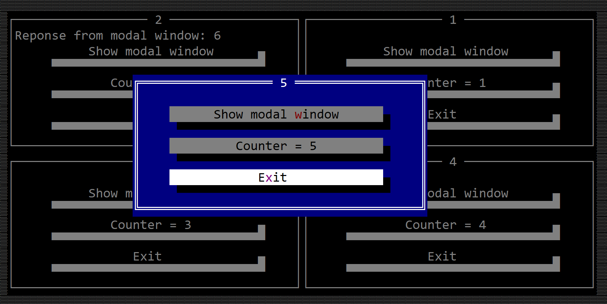

# Modal Window

A modal window is a window that captures the entire focus for the duration of its existance. In other word, when a modal window is started, it will be on top of everything else and the entire input (mouse and keyboard will be treated by it). 

When a modal window is opened the rest of the windows or other modal windows will be disabled:


A modal window is in fact just like a regular window (you can add other controls, you can resize and move it) and you can intercept events just like in a regular window case. However, since a modal window can not lose the focus, it has another property (**response**) that implies that it will provide a response once its execution ends. The **response** can be any kind of type (including a void type).

To create a modal window that will handle events from its children, use `#[ModalWindow(...)]` method:

```rs
#[ModalWindow(events=..., response=...)]
struct MyModalWindow {
    // specific fields
}
```

Besides the normal [methods](./window.md#methods) that a regular Window has, the following extra methods are available:

| Method           | Purpose                                                                             |
|------------------|-------------------------------------------------------------------------------------|
| `exit()`         | Exits the current modal window without returning anything. This translates into returning `None` from the call of method `show(...)` |
| `exit_with(...)` | Exits and returns a value of the same type as the parameter `reponse` from the `#[ModalWindo(...)]` definition. This translates into returning `Some(value)` from the call of method `show(...)` |
| `show()`         | Shows the modal window and capture the entire input. The execution flow is blocked until method `show` returns. |


Pressing `Escape` key in a modal window will automatically call the `exit()` method and the modal window will be closed.
To disable this behavior, you can add `WindowEvents` to the list of events and then return `ActionRequest::Deny` when implementing `on_cancel`.

```rust,no_run
#[ModalWindow(events=WindowEvents, response=...)]
struct MyModalWindow {
    // specific fields
}
impl WindowEvents for MyWindow {
    fn on_cancel(&mut self) -> ActionRequest {
        ActionRequest::Deny
    }
}

```


# Execution flow

Normaly, a modal window looks like the following template:

```rust
// ResponseType is a type of data that you want to return
// it could be anything like: u32, String, something user-defined
#[ModalWindow(events=..., response=ResponseType)]
struct MyWindow {
    // specific fields
}
impl MyWindow {
    fn new(...) -> MyWindow { /* constructor */ }
    // other methods
}
// SomeEvent in this context could be any event supported by a Window
// such as: ButtonEvents, ToolBarEvents, ...
impl SomeEvent for MyWindow {
    fn event_methods(&mut self...) {
        // some operations / checks
        self.exit_with(ResponseType::new(...)); // ResponseType::new(...) something that creates a new object of type ResponseType
    }
}
```

Once all of this is in place, you can start the modal window in the following way:
```rust,no_run
let r: ResponseType = MyWindow::new(...).show();
```

# Example

The following example creates a window with a button that starts a modal window that doubles a value received from the first window.

```rust
#[ModalWindow(events=ButtonEvents,response=i32)]
struct MyModalWin {
    value: i32,
}
impl MyModalWin {
    fn new(value: i32) -> Self {
        let mut w = MyModalWin {
            base: ModalWindow::new("Calc", Layout::new("d:c,w:40,h:12"), window::Flags::None),
            value: value * 2,
        };
        w.add(Label::new(format!("{} x 2 = {}", value, value * 2).as_str(), Layout::new("d:c,w:16,h:1")));
        w.add(button!("Close,d:b,w:15"));
        w
    }
}
impl ButtonEvents for MyModalWin {
    fn on_pressed(&mut self, _handle: Handle<Button>) -> EventProcessStatus {
        self.exit_with(self.value);
        EventProcessStatus::Processed
    }
}

#[Window(events = ButtonEvents)]
struct MyWin {
    text: Handle<Label>,
    value: i32,
}

impl MyWin {
    fn new() -> Self {
        let mut win = MyWin {
            base: window!("'My Win',d:c,w:40,h:16"),
            text: Handle::None,
            value: 1,
        };
        win.text = win.add(label!("'Value=10',d:c,w:24,h:1"));
        win.add(button!("Double,d:b,w:15"));
        win
    }
}
impl ButtonEvents for MyWin {
    fn on_pressed(&mut self, _handle: Handle<Button>) -> EventProcessStatus {
        // first run the modal window
        if let Some(response) = MyModalWin::new(self.value).show() {
            // set the new value
            self.value = response;
            let h = self.text;
            if let Some(label) = self.get_control_mut(h) {
                label.set_caption(format!("Value={}", response).as_str());
            }
        }
        EventProcessStatus::Processed
    }
}

fn main() -> Result<(), appcui::system::Error> {
    let mut a = App::new().build()?;
    a.add_window(MyWin::new());
    a.run();
    Ok(())
}
```