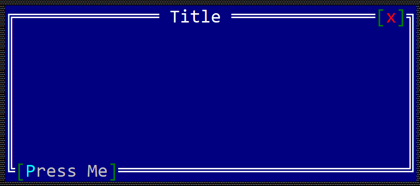

# Button toolbar item

A toolbar button is a item that can be positioned on the top or bottom part of a windows (like in the following image).



To create a button within a toolbar use the `toolbar::Button::new(...)` method:

```rust
let toolbar_button = toolbar::Button::new("content");
```

or the `toolbaritem!` macro:

```rust
let toolbar_button_1 = toolbaritem!("content,type=button");
let toolbal_button_2 = toolbaritem!("content='Start',type:button");
let toolbal_button_3 = toolbaritem!("content='&Stop',type:button,tooltip:'a tooltip'");
let toolbal_button_4 = toolbaritem!("content='hidden button',type:button,visible:false");
```


Using the character `&` as part of the button caption will associate the next character (if it is a letter or number) as a hot-key for the button. For example, the following caption `St&art` will set `Alt+A` as a hot-key for the button.


The following parameters are supported for a toolbar button:

| Parameter name      | Type   | Positional parameter                | Purpose                                                                                       |
| ------------------- | ------ | ----------------------------------- | --------------------------------------------------------------------------------------------- |
| `text` or `caption` | String | **Yes** (first postional parameter) | The caption (text) written on the button                                                      |
| `type`              | String | **No**                              | For a button use: `type:Button`                                                               |
| `tooltip`           | String | **No**                              | The tooltip associated with the button                                                        |
| `visible`           | Bool   | **No**                              | `true` if the toolbar item is visible (this is also the default setting) or `false` otherwise |

Besides the default methods that every toolbar item has (as described [here](../toolbar.md#common-methods)), the following methods are available for a toolbar label:

| Method             | Purpose                                                                                                                                   |
| ------------------ | ----------------------------------------------------------------------------------------------------------------------------------------- |
| `set_caption(...)` | Set the new caption for a button. The width (in characters) of the button is the considered to be the number of characters in its content |
| `caption()`        | Returns the current caption of a button.                                                                                                  |

## Events

To intercept button clicks, implement `ToolBarEvents` for the current window, as presented in the following example:
```rust,no_run
#[Window(events=ToolBarEvents)]
struct MyWin { /* data members */ }

impl ToolBarEvens for MyWin {
    fn on_button_clicked(&mut self, handle: Handle<toolbar::Button>) -> EventProcessStatus {
        // process click events from a toolbar button
    }
}
```

## Example

The following example creates two buttons on the bottom right part of a window toolbar that can be used to increase the value of a number.

```rust,no_run
#[Window(events = ToolBarEvents)]
struct MyWin {
    increase_button: Handle<toolbar::Button>,
    decrease_button: Handle<toolbar::Button>,
    text: Handle<Label>,
    number: u32,
}

impl MyWin {
    fn new() -> Self {
        let mut win = MyWin {
            base: window!("'My Win',d:c,w:40,h:6"),
            increase_button: Handle::None,
            decrease_button: Handle::None,
            text: Handle::None,
            number: 10,
        };
        // create a group
        let g = win.toolbar().create_group(toolbar::GroupPosition::BottomRight);
        // add buttons
        win.increase_button = win.toolbar().add(g, toolbar::Button::new("+"));
        win.decrease_button = win.toolbar().add(g, toolbar::Button::new("-"));
        // add a label
        win.text = win.add(label!("10,d:c,w:2,h:1"));
        win
    }
}
impl ToolBarEvents for MyWin {
    fn on_button_clicked(&mut self, handle: Handle<toolbar::Button>) -> EventProcessStatus {
        match () {
            _ if handle == self.increase_button => self.number += 1,
            _ if handle == self.decrease_button => self.number -= 1,
            _ => {}
        }
        let h = self.text;
        let n = self.number;
        if let Some(label) = self.control_mut(h) {            
            label.set_caption(format!("{}", n).as_str());
        }
        EventProcessStatus::Processed
    }
}

fn main() -> Result<(), appcui::system::Error> {
    let mut a = App::new().build()?;
    a.add_window(MyWin::new());
    a.run();
    Ok(())
}

```