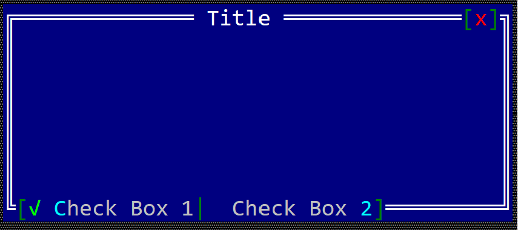

# CheckBox toolbar item

A toolbar checkbox is a item that can be positioned on the top or bottom part of a windows (like in the following image)  that can have two states (checked or un-checked).



To create a checkbox within a toolbar use the `toolbar::CheckBox::new(...)` method:

```rust
let toolbar_checkbox = toolbar::CheckBox::new("content", true);
```

or the `toolbaritem!` macro:

```rust
let toolbar_checkbox_1 = toolbaritem!("content,type=checkbox");
let toolbal_checkbox_2 = toolbaritem!("content='Start',type:checkbox,checked: true");
let toolbal_checkbox_3 = toolbaritem!("content='&Stop',type:checkbox,tooltip:'a tooltip'");
let toolbal_checkbox_4 = toolbaritem!("content='hidden button',type:checkbox,visible:false");
```


Using the character `&` as part of the button caption will associate the next character (if it is a letter or number) as a hot-key for the checkbox. For example, the following caption `&Option one` will set `Alt+O` as a hot-key for the checkbox.


The following parameters are supported for a toolbar checkbox:

| Parameter name      | Type   | Positional parameter                | Purpose |
|---------------------|--------|-------------------------------------|---------|
| `text` or `caption` | String | **Yes** (first postional parameter) | The caption (text) written on the button |
| `type`              | String | **No**                              | For a button use: `type:Button` |
| `tooltip`           | String | **No**                              | The tooltip associated with the button |
| `visible`           | Bool   | **No**                              | `true` if the toolbar item is visible (this is also the default setting) or `false` otherwise |
| `check` or `checked`| Bool   | **No**                              | `true` if the checkbox is checked or `false` otherwise |
| `type`              | String | **No**                              | For a button use: `type:Button` |

Besides the default methods that every toolbar item has (as described [here](../toolbar.md#common-methods)), the following methods are available for a toolbar label:

| Method             | Purpose                                                                                                          |
|--------------------|------------------------------------------------------------------------------------------------------------------|
| `set_caption(...)` | Sets the new caption for a checkbox. The width (in characters) of the checkbox is the considered to be the number of characters in its content |
| `get_caption()`    | Returns the current caption of a checkbox. |
| `set_checked()`    | Sets the new checked stated of the checkbox. |
| `is_checked()`     | `true` if the toolbar checkbox is checked or `false` otherwise |

## Events

To intercept a change in a checkbox checked state, you need to implement `ToolBarEvents` for the current window, as presented in the following example:
```rust,no_run
#[Window(events=ToolBarEvents)]
struct MyWin { /* data members */ }

impl ToolBarEvens for MyWin {
    fn on_checkbox_clicked(&mut self, handle: Handle<toolbar::CheckBox>, checked: bool) -> EventProcessStatus {
        // do an action based on the new state of the checkbox
        // parameter `checked` is true if the toolbar checkbox is checked or false otherwise 
    }
}
```

## Example

The following example creates a window with two checkboxes toolbar items and a label. Clicking on each one of the checkboxes will show a message on the label that states the check state of that checkbox.


```rust,no_run
#[Window(events = ToolBarEvents)]
struct MyWin {
    cb1: Handle<toolbar::CheckBox>,
    cb2: Handle<toolbar::CheckBox>,
    text: Handle<Label>,
    number: u32,
}

impl MyWin {
    fn new() -> Self {
        let mut win = MyWin {
            base: window!("'My Win',d:c,w:40,h:6"),
            cb1: Handle::None,
            cb2: Handle::None,
            text: Handle::None,
            number: 10,
        };
        // create a group
        let g = win.get_toolbar().create_group(toolbar::GroupPosition::BottomRight);
        // add checkboxes
        win.cb1 = win.get_toolbar().add(g, toolbar::CheckBox::new("Opt-1",false));
        win.cb2 = win.get_toolbar().add(g, toolbar::CheckBox::new("Opt-2",false));
        // add a label
        win.text = win.add(label!("'',d:c,w:20,h:1"));
        win
    }
}
impl ToolBarEvents for MyWin {
    fn on_checkbox_clicked(&mut self, handle: Handle<toolbar::CheckBox>, checked: bool) -> EventProcessStatus {
        let txt = match () {
            _ if handle == self.cb1 => format!("Opt-1 is {}",checked),
            _ if handle == self.cb2 => format!("Opt-2 is {}",checked),
            _ => String::new(),
        };
        let h = self.text;
        if let Some(label) = self.get_control_mut(h) {
            label.set_caption(&txt);
        }
        EventProcessStatus::Ignored
    }
}

fn main() -> Result<(), appcui::system::Error> {
    let mut a = App::new().build()?;
    a.add_window(MyWin::new());
    a.run();
    Ok(())
}

```