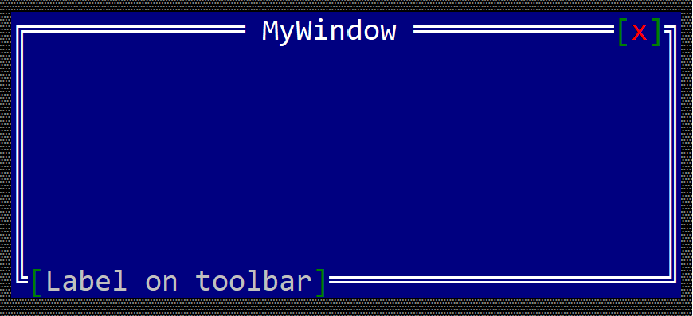

# Label toolbar item

A toolbar label is a text that can be written on the top or bottom part of a windows (like in the following image).



To create a label toolbar use the `toolbar::Label::new(...)` method:

```rust
let toolbar_label = toolbar::Label::new("content");
```

or the `toolbaritem!` macro:

```rust
let toolbar_label_1 = toolbaritem!("content,type=label");
let toolbal_label_2 = toolbaritem!("content='label text',type:label");
let toolbal_label_3 = toolbaritem!("content='label text',type:label,tooltip:'a tooltip'");
```

The following parameters are supported for a toolbar label:

| Parameter name      | Type   | Positional parameter                | Purpose |
|---------------------|--------|-------------------------------------|---------|
| `text` or `caption` | String | **Yes** (first postional parameter) | The caption (text) written on the label |
| `type`              | String | **No**                              | For a label use: `type:Label` |
| `tooltip`           | String | **No**                              | The tooltip associated with the label |

Besides the default methods that every toolbar item has (as described [here](../toolbar.md#common-methods)), the following methods are available for a toolbar label:

| Method             | Purpose                                                                                                          |
|--------------------|------------------------------------------------------------------------------------------------------------------|
| `set_caption(...)` | Set the new caption for a label. The size of the label is the considered the number of characters in its content |
| `get_caption()`    | Returns the current caption of a label. |

# Example

The following example shows 3 lables that show a number writen in base 10, 16 and 2. The first two labels (for base 10 and base 16 are part of one group located on the bottom left part of the window); the last label is part of a separate group located on the top-right side of the window. In the center of the window, there is a button that when clicked increases the number and updates the values in each label.
