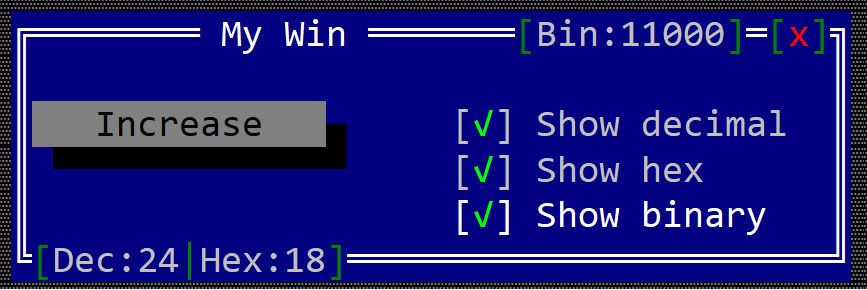

# Label toolbar item

A toolbar label is a text that can be written on the top or bottom part of a windows (like in the following image).


To create a label toolbar use the `toolbar::Label::new(...)` method:

```rust
let toolbar_label = toolbar::Label::new("content");
```

or the `toolbaritem!` macro:

```rust
let toolbar_label_1 = toolbaritem!("content,type=label");
let toolbal_label_2 = toolbaritem!("content='label text',type:label");
let toolbal_label_3 = toolbaritem!("content='label text',type:label,tooltip:'a tooltip'");
let toolbal_label_4 = toolbaritem!("content='hidden label',type:label,visible:false");
```

The following parameters are supported for a toolbar label:

| Parameter name      | Type   | Positional parameter                | Purpose |
|---------------------|--------|-------------------------------------|---------|
| `text` or `caption` | String | **Yes** (first postional parameter) | The caption (text) written on the label |
| `type`              | String | **No**                              | For a label use: `type:Label` |
| `tooltip`           | String | **No**                              | The tooltip associated with the label |
| `visible`           | Bool   | **No**                              | `true` if the toolbar item is visible (this is also the default setting) or `false` otherwise |

Besides the default methods that every toolbar item has (as described [here](../toolbar.md#common-methods)), the following methods are available for a toolbar label:

| Method             | Purpose                                                                                                          |
|--------------------|------------------------------------------------------------------------------------------------------------------|
| `set_caption(...)` | Set the new caption for a label. The size of the label is the considered the number of characters in its content |
| `get_caption()`    | Returns the current caption of a label. |

# Example

The following example shows 3 lables that show a number written in base 10, 16 and 2. 
* the first two labels (for base 10 and base 16 are part of one group located on the bottom left part of the window); 
* the last label is part of a separate group located on the top-right side of the window. 
* at the left of the window, there is a button that if clicked increases the number and updates the values in each label;
* at the right of the window, 3 checkboxes can change the visibility state for the labels

```rust
#[Window(events = ButtonEvents+CheckBoxEvents)]
struct MyWin {
    increase_button: Handle<Button>,
    dec: Handle<toolbar::Label>,
    hex: Handle<toolbar::Label>,
    bin: Handle<toolbar::Label>,
    show_dec: Handle<CheckBox>,
    show_hex: Handle<CheckBox>,
    show_bin: Handle<CheckBox>,
    number: u32,
}

impl MyWin {
    fn new() -> Self {
        let mut win = MyWin {
            base: window!("'My Win',d:c,w:40,h:6"),
            increase_button: Handle::None,
            dec: Handle::None,
            hex: Handle::None,
            bin: Handle::None,
            show_dec: Handle::None,
            show_hex: Handle::None,
            show_bin: Handle::None,
            number: 24,
        };
        // add the increasebutton
        win.increase_button = win.add(button!("Increase,w:15,d:l"));
        // add checkboxes
        win.show_dec = win.add(checkbox!("'Show decimal',x:20,y:1,w:16,checked:true"));
        win.show_hex = win.add(checkbox!("'Show hex',x:20,y:2,w:16,checked:true"));
        win.show_bin = win.add(checkbox!("'Show binary',x:20,y:3,w:16,checked:true"));
        // add toolbar labels
        let first_group = win.get_toolbar().create_group(toolbar::GroupPosition::BottomLeft);
        let second_group = win.get_toolbar().create_group(toolbar::GroupPosition::TopRight);
        win.dec = win.get_toolbar().add(first_group, toolbar::Label::new(""));
        win.hex = win.get_toolbar().add(first_group, toolbar::Label::new(""));
        win.bin = win.get_toolbar().add(second_group, toolbar::Label::new(""));
        win.update_toolbar_labels();
        win
    }
    fn update_toolbale_label(&mut self, handle: Handle<toolbar::Label>, text: String) {
        if let Some(label) = self.get_toolbar().get_mut(handle) {
            label.set_content(text.as_str());
        }
    }
    fn update_visibility_status_for_label(&mut self, handle: Handle<toolbar::Label>, visible: bool) {
        if let Some(label) = self.get_toolbar().get_mut(handle) {
            label.set_visible(visible);
        }        
    }
    fn update_toolbar_labels(&mut self) {
        self.update_toolbale_label(self.dec, format!("Dec:{}", self.number));
        self.update_toolbale_label(self.hex, format!("Hex:{:X}", self.number));
        self.update_toolbale_label(self.bin, format!("Bin:{:b}", self.number));
    }
}

impl ButtonEvents for MyWin {
    fn on_pressed(&mut self, _handle: Handle<Button>) -> EventProcessStatus {
        self.number += 1;
        self.update_toolbar_labels();
        return EventProcessStatus::Processed;
    }
}
impl CheckBoxEvents for MyWin {
    fn on_status_changed(&mut self, handle: Handle<CheckBox>, checked: bool) -> EventProcessStatus {
        match () {
            _ if handle == self.show_bin => self.update_visibility_status_for_label(self.bin, checked),
            _ if handle == self.show_hex => self.update_visibility_status_for_label(self.hex, checked),
            _ if handle == self.show_dec => self.update_visibility_status_for_label(self.dec, checked),
            _ => {}
        }
        EventProcessStatus::Processed
    }
}

fn main() -> Result<(), appcui::system::Error> {
    let mut a = App::new().build()?;
    a.add_window(MyWin::new());
    a.run();
    Ok(())
}
```

Upon execution you should see something that looks like the following image:

