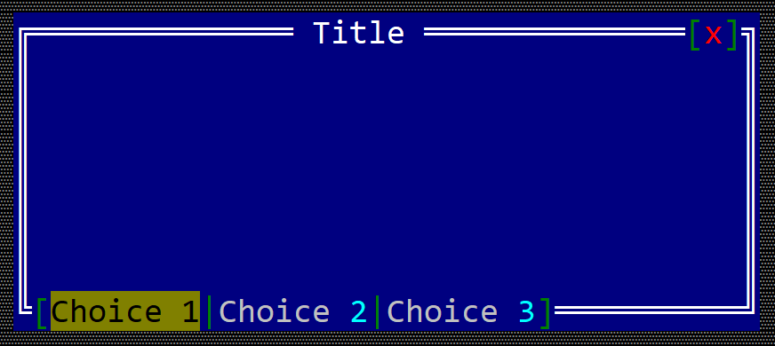

# SingleChoice toolbar item

A toolbar singlechoice item is a item that can be positioned on the top or bottom part of a windows (like in the following image)  that can have two states (selected or un-selected).

Within a group, only one singlechoice item can be selected.



To create a checkbox within a toolbar use the `toolbar::SingleChoice::new(...)` method:

```rust
let toolbar_singlechoice = toolbar::SingleChoice::new("SingleChoice");
```

or the `toolbaritem!` macro:

```rust
let toolbar_sc_1 = toolbaritem!("content,type=singlechoice");
let toolbal_sc_2 = toolbaritem!("content='Choice One',type:singlechoice");
let toolbal_sc_3 = toolbaritem!("content='&Second choice',type:singlechoice,tooltip:'a tooltip'");
let toolbal_sc_4 = toolbaritem!("content='hidden choice',type:singlechoice,visible:false");
```


Using the character `&` as part of the button caption will associate the next character (if it is a letter or number) as a hot-key for the singlechoice item. For example, the following caption `First &choice` will set `Alt+C` as a hot-key for the singlechoice item.


The following parameters are supported for a toolbar singlechoice:

| Parameter name        | Type   | Positional parameter                | Purpose |
|-----------------------|--------|-------------------------------------|---------|
| `text` or `caption`   | String | **Yes** (first postional parameter) | The caption (text) written on the single choice |
| `type`                | String | **No**                              | For a singlechoince use: `type:SingleChoince` |
| `tooltip`             | String | **No**                              | The tooltip associated with the singlechoice |
| `visible`             | Bool   | **No**                              | `true` if the toolbar item is visible (this is also the default setting) or `false` otherwise |

Besides the default methods that every toolbar item has (as described [here](../toolbar.md#common-methods)), the following methods are available for a toolbar label:

| Method             | Purpose                                                                                                          |
|--------------------|------------------------------------------------------------------------------------------------------------------|
| `set_caption(...)` | Sets the new caption for a singlechoince. The width (in characters) of the singlechoince is the considered to be the number of characters in its content |
| `get_caption()`    | Returns the current caption of a singlechoice item. |
| `select()`         | Sets the current single choice as the selected single choince for the current group. |
| `is_selected()`    | `true` if the toolbar single choice is selected or `false` otherwise |

**OBS**: Keep in mind that using `select()` method only works if the single choice has already been added to a toolbar. Using this methid without adding the item to a toolbar will result in a panic.

## Events

To intercept if the current choice has change, you need to implement `ToolBarEvents` for the current window, as presented in the following example:
```rust,no_run
#[Window(events=ToolBarEvents)]
struct MyWin { /* data members */ }

impl ToolBarEvens for MyWin {
    fn on_choice_selected(&mut self, _handle: Handle<toolbar::SingleChoice>) -> EventProcessStatus {
        // do an action based on the new selection
    }
}
```

## Example

The following example creates a window with two single choice toolbar items and a label. Clicking on each one of the singlechoice items will show a message on the label that states the selected singlechoice.


```rust,no_run
#[Window(events = ToolBarEvents)]
struct MyWin {
    opt1: Handle<toolbar::SingleChoice>,
    opt2: Handle<toolbar::SingleChoice>,
    text: Handle<Label>,
}

impl MyWin {
    fn new() -> Self {
        let mut win = MyWin {
            base: window!("'My Win',d:c,w:40,h:6"),
            opt1: Handle::None,
            opt2: Handle::None,
            text: Handle::None,
        };
        // create a group
        let g = win.get_toolbar().create_group(toolbar::GroupPosition::BottomLeft);
        // add buttons
        win.opt1 = win.get_toolbar().add(g, toolbar::SingleChoice::new("First Choice"));
        win.opt2 = win.get_toolbar().add(g, toolbar::SingleChoice::new("Second Choice"));
        // add a label
        win.text = win.add(label!("'',d:c,w:22,h:1"));
        win
    }
}
impl ToolBarEvents for MyWin {
    fn on_choice_selected(&mut self, handle: Handle<toolbar::SingleChoice>) -> EventProcessStatus {
        let txt = match () {
            _ if handle == self.opt1 => "First choice selected",
            _ if handle == self.opt2 => "Second choice selected",
            _ => "",
        };
        let h = self.text;
        if let Some(label) = self.get_control_mut(h) {
            label.set_caption(txt);
        }
        EventProcessStatus::Processed
    }
}

fn main() -> Result<(), appcui::system::Error> {
    let mut a = App::new().build()?;
    a.add_window(MyWin::new());
    a.run();
    Ok(())
}

```