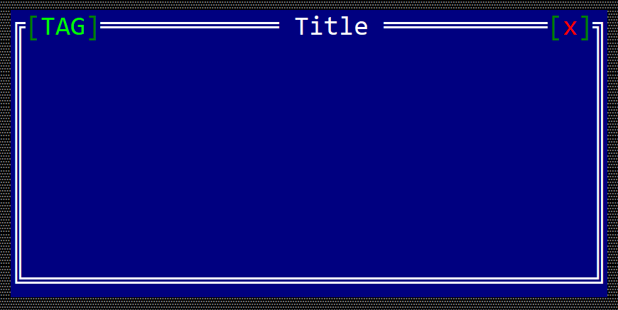
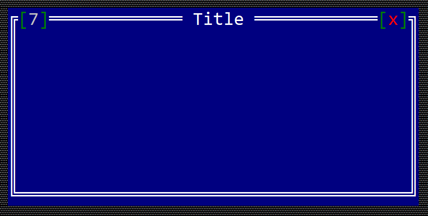

# Window

A window is the core component of an application and it is the object where all events from children controls are being processed.


To create a Window use:
* `Window::new` method (with 3 parameters: a title, a layout and initialization flags)
* `Window::with_type` method (with 4 parameters: a title, a layout , initialization flags and a type)
* macro `window!`. 
```rs
let w = Window::new("Title", Layout::new("x:10,y:5,w:15,h:9"),window::Flags::None);
let w2 = window!("Title,d:c,w:10,h:10");
let w3 = window!("title='Some Title',d:c,w:30,h:10,flags=[Sizeable])");
let w4 = window!("title='WithTag',d:c,w:30,h:10,tag:MyTag)");
let w5 = window!("Title,d:c,w:10,h:10,key:Alt+F10");
let w6 = window!("Title,d:c,w:10,h:10,key:auto");
```

Keep in mind that window will **NOT** handle any events from its children. 

A window supports all common parameters (as they are described in [Instantiate via Macros](../instantiate_via_macros.md) section). Besides them, the following **named parameters** are also accepted:

| Parameter name                 | Type           | Positional parameter                | Purpose                                                                                                                                                   |
| ------------------------------ | -------------- | ----------------------------------- | --------------------------------------------------------------------------------------------------------------------------------------------------------- |
| `title` or `text` or `caption` | String         | **Yes** (first postional parameter) | The title (text) of the window                                                                                                                            |
| `flags`                        | String or List | **No**                              | Window initialization flags                                                                                                                               |
| `type`                         | String         | **No**                              | Window type                                                                                                                                               |
| `tag`                          | String         | **No**                              | The tag of the window                                                                                                                                     |
| `hotkey` or `hot-key` or `key` | Key            | **No**                              | The hotkey associated with a window. You can also use the `auto` value to ask the framework to find the first available key (from `Alt`+`1` to `Alt`+`9`) |


To create a window that will handle events from its children, use `#[Window(...)]` method:
```rs
#[Window(events=..., )]
struct MyWindow {
    // specific fields
}
```


A window supports the following initialization flags:
* `window::Flags::None` - regular window (with a close button)
* `window::Flags::Sizeable` or `Sizeable` (for **window!** macro) - a window that has the resize grip and the maximize button
* `window::Flags::NoCloseButton` or `NoCloseButton` (for **window!** macro) - a window without a close button
* `window::Flags::FixedPosition` or `FixedPosition` (for **window!** macro) - a window that can not be moved

and the following types:
* `window::Type::Normal` or `Normal` (for **window!** macro) - a regular window
* `window::Type::Error` or `Error` (for **window!** macro) - a window with a red background to indicate an error message
* `window::Type::Notification` or `Notification` (for **window!** macro) - a window with a different background designed for notification messages
* `window::Type::Warning` or `Warning` (for **window!** macro) - a window with a different background designed for Warning messages


## Methods

Besides the [Common methods for all Controls](../common_methods.md) a button also has the following aditional methods:

| Method                | Purpose                                                                                                           |
| --------------------- | ----------------------------------------------------------------------------------------------------------------- |
| `add(...)`            | Adds a new control as a child control for current window                                                          |
| `control(...)`        | Returns an immutable reference to a control based on its handle                                                   |
| `control_mut(...)`    | Returns a mutable reference to a control based on its handle                                                      |
| `toolbar()`           | Returns a mutable reference to current window toolbar                                                             |
| `set_title(...)`      | Sets the title of Window.<br>Example: `win.set_title("Title")` - this will set the title of the window to `Title` |
| `title()`             | Returns the title of the current window                                                                           |
| `set_tag(...)`        | Sets the tag of Window.<br>Example: `win.set_tag("ABC")` - this will set the tag of the window to `ABC`           |
| `tag()`               | Returns the tag of the current window                                                                             |
| `clear_tag()`         | Clears the current tag. Its equivalent to `set_tag("")`                                                           |
| `set_auto_hotkey()`   | Automatically selects a free hotkey (in a format `Alt`+{number} where `{number}` is between 1 and 9)              |
| `enter_resize_mode()` | Enters the resize mode programatically                                                                            |
| `close`               | Closes current window                                                                                             |

## Key association

In terms of key association, a Window has two modes:
* Normal mode (for whem a window is has focus)
* Resize/Move mode (in this mode you can use arrows and various combinations to move the window)

### For normal mode

| Key                                                  | Purpose                                                                                                                                                                               |
| ---------------------------------------------------- | ------------------------------------------------------------------------------------------------------------------------------------------------------------------------------------- |
| `Ctrl`+`Alt`+`M` or <br> `Ctrl`+`Alt`+`R`            | Switch the window to resize/move mode                                                                                                                                                 |
| `Escape`                                             | Trigers a call cu `on_cancel(...)` method. By default this will close the window. Howeverm you can change the behavior and return `ActionRequest::Deny` from the `on_cancel` callback |
| `Up` or <br> `Alt`+`Up` or <br> `Ctrl`+`Up`          | Moves to the closes control on upper side the curent one.                                                                                                                             |
| `Down` or <br> `Alt`+`Down` or <br> `Ctrl`+`Down`    | Moves to the closest control on the bottom side of the curent one                                                                                                                     |
| `Left` or <br> `Alt`+`Left` or <br> `Ctrl`+`Left`    | Moves to the closest control on the left side of the curent one                                                                                                                       |
| `Right` or <br> `Alt`+`Right` or <br> `Ctrl`+`Right` | Moves to the closest control on the right side of the curent one                                                                                                                      |

**OBS**: Keep in mind that if any of these keys (in particular `Left`, `Right`, `Up` and `Down`) are capture by one of the children of a window, they will not pe process by the window.


### For resize/move mode

| Key                                     | Purpose                                                                                                                                                          |
| --------------------------------------- | ---------------------------------------------------------------------------------------------------------------------------------------------------------------- |
| `Escape` or `Enter` or `Tab` or `Space` | Switch back to the normal mode                                                                                                                                   |
| `Left`, `Up`, `Right`, `Down`           | Arrow keys can be used to move the window                                                                                                                        |
| `C`                                     | Centers the current window to the Desktop                                                                                                                        |
| `M` or `R`                              | Maximizes or Restores the size of the current Windows                                                                                                            |
| `Alt`+{`Left`, `Up`, `Right`, `Down`}   | Moves the window towards one of the margins of the Desktop. For example `Alt`+`Up` will move current window to the top margin of the client space of the Desktop |
| `Ctrl`+{`Left`, `Up`, `Right`, `Down`}  | Increases or decreases the Width or Height of the current Window                                                                                                 |

## Events

Window related events can be intercepted via `WindowEvents` trait. You will need to add `WindowEvents` in the list of events like in the following example:
```rust
#[Window(events=WindowEvents)]
struct MyWindow { ... }
impl WindowEvents for MyWindow { ... }
```

`WindowEvents` is defined in the following way:
```rust
pub trait WindowEvents {
    fn on_close(&mut self) -> EventProcessStatus {
        EventProcessStatus::Ignored
    }
    fn on_layout_changed(&mut self, old_layout: Rect, new_layout: Rect) {}
    fn on_activate(&mut self) {}
    fn on_deactivate(&mut self) {}
    fn on_accept(&mut self) {}
    fn on_cancel(&mut self) -> ActionRequest {
        ActionRequest::Allow
    }
}
```

These methods are called under the following scenarious:

| Method                   | Called when                                                                                                                                                                                                                                                                                                                                  |
| ------------------------ | -------------------------------------------------------------------------------------------------------------------------------------------------------------------------------------------------------------------------------------------------------------------------------------------------------------------------------------------- |
| `on_layout_changed(...)` | Called whenever the size or position of a window changes.                                                                                                                                                                                                                                                                                    |
| `on_activate(...)`       | Called whenever a window or a modal window receives the focus                                                                                                                                                                                                                                                                                |
| `on_deactivate(...)`     | Called whenever a window or a modal window loses the focus                                                                                                                                                                                                                                                                                   |
| `on_accept(...)`         | Called **only for modal windows** when you hit the `Enter` key                                                                                                                                                                                                                                                                               |
| `on_cancel(...)`         | For a modal window this method is xalled when you press `Escape`. You can use this method to disable closing via `Escape` key and for an exit with a value (via method `exit_with(...)`<br><br>For a regular window (non-modal) this method can be called when you pressed `Esc` key or when you pressed the **close button** from a window. |

## Window Tags

For every window, a tag can be set for a window (a tag is a string associated with a Window that reflects its purpose). To set a tag use `.set_tag("<name")` method.
For example, the following code:

```rs
fn main() -> Result<(), appcui::system::Error> {
    let mut app = App::new().build()?;
    let mut win = window!("Title,d:c,w:40,h:9");
    win.set_tag("TAG");
    app.add_window(win);
    app.run();
    Ok(())
}
```
should generate a window that looks like the following:


## Window Hot Key

You can also associate a hot key to a window. A hot key allows you to quickly switch between windows. In the next example, we set up `Alt+7` as a hot key for a windows.

```rs
fn main() -> Result<(), appcui::system::Error> {
    let mut app = App::new().build()?;
    let mut win = window!("Title,d:c,w:40,h:9");
    win.set_hotkey(key!("Alt+7"));
    app.add_window(win);
    app.run();
    Ok(())
}
```
should generate a window that looks like the following:
