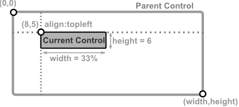
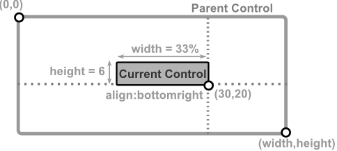
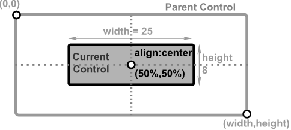

# Absolute position

In this mode parameters `x` and `y` must be used to specify a point from where the control will be constructed. 
When using this mode, parameters `dock`, `left`, `right`, `top`, `bottom` can not be used. 
If `width` or `height` are not specified , they will be defaulted to `1 character` (unless there is a minimum width or minumum height specified for that controls - in which case that limit will be applied).
If `align` is not specified, it will be defaulted to `topleft` 

If `x`, `y`, `width` or `height` are provided using percentages, the control will automatically adjust its size if its parent size changes. 

| Layout                         | Result                                                                 |
|--------------------------------|------------------------------------------------------------------------|
| **x:8,y:5,w:33%,h:6** or **x:8,y:5,w:33%,h:6,a:tl**      |If no alignament is provided, top-left will be considered as a default.   | 
| **x:30,y:20,w:33%,h:6,a:br**   |                                     |
| **x:50%,y:50%,w:25,h:8,a:c**   |                         |
