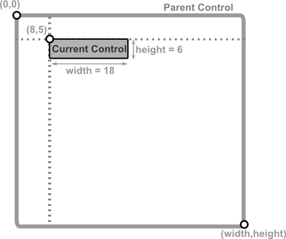

# Absolute position

This mode is used when the control is positioned using absolute coordinates relative to the parent.

**Required parameters**
- `x` and `y` must be provided and represent the **top-left** corner of the control.

**Optional parameters**
- `width` and `height` can be provided to set the size of the control. If not provided, they will be defaulted to `1 character` (unless there is a minimum width or minumum height specified for that controls - in which case that limit will be applied).

To create a control using this mode, you can use the following syntax:
* `Layout::absolute(...)` - and you will need to provide the `x`, `y`, `width` and `height` parameters.
* `LayoutBuilder` - and you will need to use the `x(...)`, `y(...)` and optionall `width(...)` and `height(...)` methods.
* `layout!` procmacro - and you will need to provide the `x`, `y` and optionally `width` and `height` parameters.

**Remarks**:
- using `Layout::absolute(...)` does not support percentages for any parameter (if these are needed, consider using `LayoutBuilder` or `layout!` procmacro)

## Visual representation

Let's consider that we want to position a control with its top-left corner the coordonates (8,5) and the size of 18 characters width and 6 characters hight. We can create the layout for this control using three methods as follows:


<table>
<tr>
<td style="width:45%; vertical-align:top;">


```rs
Layout::absolute(8,5,18,6)
```
```rs
LayoutBuilder::new().x(8)
                    .y(5)
                    .width(18)
                    .height(6)
                    .build()
```
```
layout!("x:8,y:5,w:18,h:6")
```

</td>

<td style="width:55%; vertical-align:center;">




</td>

</tr>
</table>


## Examples

1. A control is postioned at the (8,5) coordinates and its size is set to 30 characters wide and 6 characters high:
    
    - Using `Layout::absolute(...)`
        ```rs
        Layout::absolute(8, 5, 30, 6)
        ```
    
    - Using `LayoutBuilder`
        ```rs
        LayoutBuilder::new().x(8).y(5).width(30).height(6).build()
        ```
    
    - Using `layout!` procmacro
        ```rs
        layout!("x:8,y:5,w:30,h:6")
        ```
        or
        ```rs
        layout!("x:8,y:5,width:30,height:6")
        ```
2. A control is positioned at the (4,3) coordinates and its size is set to be 50% of its parent width with a height of 10 characters:
    
    - Using `LayoutBuilder`
        ```rs
        LayoutBuilder::new().x(4).y(3).width(0.5).height(10).build()
        ```
    - Using `layout!` procmacro
        ```rs
        layout!("x:4,y:3,width:50%,height:10")
        ```
        or
        ```rs
        layout!("x:4,y:3,w:50%,h:10")
        ```

3. A control is position in the 25% of its parent width and 50% of its parent height, with a height of 8 characters and the default width:

    - Using `LayoutBuilder`
        ```rs
        LayoutBuilder::new().x(0.25).y(0.5).height(8).build()
        ```
    - Using `layout!` procmacro
        ```rs
        layout!("x:25%,y:50%,height:8")
        ```
        or
        ```rs
        layout!("x:25%,y:50%,h:8")
        ```