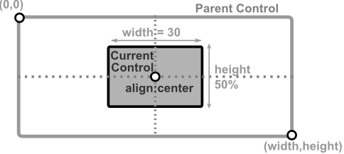
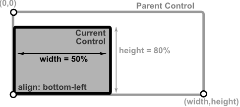
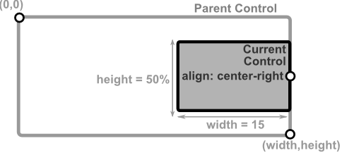

# Aligned Layout


This mode positions a control **relative to its parent container** using predefined alignment positions, such as **Top-Left**, **Center**, or **Bottom-Right**.
Unlike docking, alignment does **not stretch the control**; the control keeps its specified width and height.

## Key Difference Between Dock and Alignment
- **Dock** stretches the control to fill space along one axis or completely (e.g., `Dock::Left` stretches vertically).
- **Alignment** keeps the control’s size fixed and positions it relative to the parent.

## Required Parameters
- `alignment` must be provided and specifies the position inside the parent. Possible values from the `Alignment` enum:
  - `Alignment::TopLeft` – Top-left corner.
  - `Alignment::TopCenter` – Top edge, centered horizontally.
  - `Alignment::TopRight` – Top-right corner.
  - `Alignment::CenterLeft` – Left edge, centered vertically.
  - `Alignment::Center` – Center of the parent.
  - `Alignment::CenterRight` – Right edge, centered vertically.
  - `Alignment::BottomLeft` – Bottom-left corner.
  - `Alignment::BottomCenter` – Bottom edge, centered horizontally.
  - `Alignment::BottomRight` – Bottom-right corner.

## Optional Parameters
- `width` – Control width (absolute or percentage of parent width).
- `height` – Control height (absolute or percentage of parent height).
- If `width` or `height` are not provided, they default to **1 character** or the control's minimum size.

To create a control with an aligned layout you can use:
- `Layout::aligned(...)` - and provide an alignament, a width and a height (in characters)
- `LayoutBuilder` – using `.alignment(...)`, and optionally `.width()` and/or `.height()`.
- `layout!` macro – using `align` or `a` parameter with values such as `topleft`/`tl`, `bottom-right`/`br`, `center`/`c`.

## Remarks
- using `Layout::aligned(...)` does not support percentages for any parameter (if these are needed, consider using `LayoutBuilder` or `layout!` procmacro)

## Visual Representation

Here are some examples of how the layout will look like for different types of alignment.

| Layout Description                                                                                                                     | Visual representation                               |
| -------------------------------------------------------------------------------------------------------------------------------------- | --------------------------------------------------- |
| A control with `width` = **20** characters, `height` = **50%** of parent height, aligned in the center of the parent                   |  |
| A control with `width` = **50%** of parent width, `height` = **80%** of parent height, aligned at the bottom left corner of the parent |      |
| A control with `width` = **15** characters, `height` = **50%** of parent height, aligned at the center-right edge of the parent        |      |

## Examples

1. Align a control of size `20x4` at the center of its parent top edge
    ```rs
    // using Layout
    Layout::aligned(Alignment::TopCenter, 20, 4)
    // using LayoutBuilder
    LayoutBuilder::new().alignment(Alignment::TopCenter).width(20).height(4).build()
    // or using macro:
    layout!("alignment:top-center, width:20, height:4")
    // or using short aliases:
    layout!("a:tc,w:20,h:4")
    ```

2. Align a control of size `15x3` to the bottom-right corner of its parent
    ```rs
    // using Layout
    Layout::aligned(Alignment::BottomRight, 15, 3)
    // using LayoutBuilder
    LayoutBuilder::new().alignment(Alignment::BottomRight).width(15).height(3).build()
    // or using macro
    layout!("align:bottom-right, width:15, height:3")
    // or using short aliases
    layout!("a:br,w:15,h:3")
    ```

3. Align a control of size `30x10` to the center of the parent
    ```rs
    // using Layout
    Layout::aligned(Alignment::Center, 30, 10)
    // using LayoutBuilder
    LayoutBuilder::new().alignment(Alignment::Center).width(30).height(10).build()
    // or using macro
    layout!("align:center, width:30, height:10")
    // or using short aliases
    layout!("a:c,w:30,h:10")
    ```

