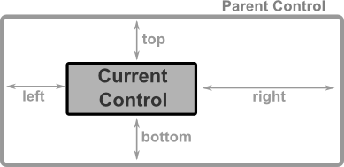
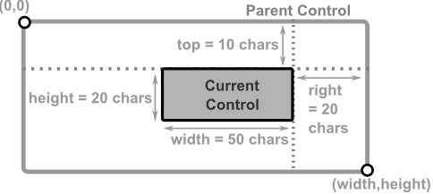
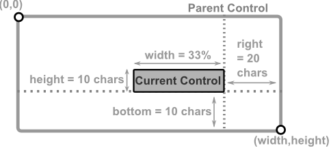
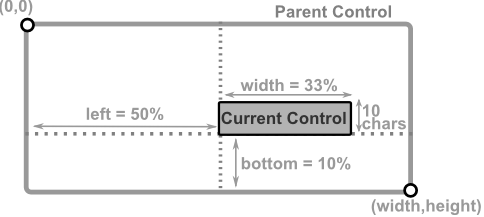

# Anchors

Anchors (``left``, ``right``, ``top`` and ``bottom``) represent the distance between the object and its parent margins. When one of the anchors is present, the ``dock`` key can not be used. Depending on the combination of anchors used, other keys may be unusable.

## Corner anchors

Corner anchors are cases when the following combinations of anchors are used toghether (``left`` and ``top``), (``left`` and ``bottom``), (``right`` and ``top``) and (``right`` and ``bottom``).
When this combinations are used, ``x`` and ``y`` keys can not be used. Using them will reject the layout.
If **width** or **height** are not specified , they will be defaulted to ``1 character`` (unless there is a minimum width or minumum height specified for that controls - in which case that limit will be applied).

The combination of anchors also decides how (top,left) and (right,bottom) corners of a control are computed, as follows:

| Combination              | Top-Left corner                                       | Bottom-Right corner                      |
|--------------------------|-------------------------------------------------------|------------------------------------------|
| ``top`` and ``left``     | (left, top)                                           | (left+width, top+height)                 |
| ``top`` and ``right``    | (parentWidth-right-width, top)                        | (parentWidth-right, top+height)          |
| ``bottom`` and ``left``  | (left, parentHeight-bottom-height)                    | (left+width, parentHeight-bottom)        |
| ``bottom`` and ``right`` | (parentWidth-right-width, parentHeight-bottom-height) | (parentWidth-right, parentHeight-bottom) |

where:
* `parentWidth` is the width of the parent control
* `parentHeight` the height of the parent control

**Examples**

| Layout                     | Result                                 |
|----------------------------|----------------------------------------|
| **t:10,r:20,w:50,h:20**    |  |
| **b:10,r:20,w:33%,h:10**   |  |
| **b:10%,l:50%,w:25%,h:10** |  |

## Using Left-Right anchors

When ``Left`` and ``right`` anchors are used together, there are several restrictions. First of all, ``width``  and ``x`` parameters can not be specified. Width is deduced as the difference between parents width and the sum of left and right anchors. Left anchor will also be considered the "x" value.
However, ``height`` parameter should be specified (if not specified it will be defaulted to ``1 character`` (unless a minimum height is specified for that controls - in which case that limit will be applied).
`align` paramter can also be specified , but only with the following values: ``top``, **center** or ``bottom``. If not specified it will be defaulted to **center**.

**Examples**

| Layout                         | Result                                 |
|--------------------------------|----------------------------------------|
| **l:10,r:20,h:20,y:80%,a:b**   | .. image:: pics/layout_anchor_lr_1.png |
| **l:10,r:20,h:100%,y:50%,a:c** | .. image:: pics/layout_anchor_lr_2.png |
| **l:10,r:20,h:50%,y:0,a:t**    | .. image:: pics/layout_anchor_lr_3.png |

## Using Top-Bottom anchors

When ``top`` and ``bottom`` anchors are used together, there are several restrictions. First of all, ``height`` and ``y`` parameters can not be specified. Height is deduced as the difference between parents height and the sum of top and bottom anchors. Top anchor will also be considered the "y" value.
However, ``width`` parameter should be specified (if not specified it will be defaulted to ``1 character`` (unless a minimum width is specified for that controls - in which case that limit will be applied).
`align` paramter can also be specified , but only with the following values: ``left``, **center** or ``right``. If not specified it will be defaulted to **center**.

**Examples**

| Layout                         | Result                                 |
|--------------------------------|----------------------------------------|
| **t:10,b:20,w:90,x:80%,a:r**   | .. image:: pics/layout_anchor_tb_1.png |
| **t:10,b:20,w:100%,x:50%,a:c** | .. image:: pics/layout_anchor_tb_2.png |
| **t:10,b:20,w:50%,x:0,a:l**    | .. image:: pics/layout_anchor_tb_3.png |

## 3-margin anchors

When using 3 of the 4 anchors, the following keys can not be used: ``x``, ``y``, ``align`` and ``dock``. Using them will reject the layout.
The following table reflects these dependencies:

| Combination                            | Result                                      |
|----------------------------------------|---------------------------------------------|
| ``left`` and ``top`` and ``right`` or ``left`` and ``bottom`` and ``right``     | ``height`` optional (see remarks)  ``width`` = parentWidth - (left+right)|
| ``top`` and ``left`` and ``bottom`` or ``top`` and ``right`` and ``bottom``     | ``width`` optional (see remarks)  ``height`` = parentHeight - (top+bottom)|

**Remarks** 
* if ``height`` or ``width`` are not present and can not be computed as a different betweem two margins, they are defaulted to value 1. If limits are present (min Width or min Height) those limits are applied. This is usually usefull for controls that have a fixed width or height (e.g. a button, a combobox).

The position of the control is also computed based on the combination of the 3 anchors selectd, as shown in the next table:

| Combination                           | Top-Left corner                    | Bottom-Right corner                      |
|---------------------------------------|------------------------------------|------------------------------------------|
| ``left`` and ``top`` and ``right``    | (left, top)                        | (parentWidth-right, top+height)          |
| ``left`` and ``bottom`` and ``right`` | (left, parentHeight-bottom-height) | (parentWidth-right, parentHeight-bottom) |
| ``top`` and ``left`` and ``bottom``   | (left, top)                        | (left+width, parentHeight-bottom)        |
| ``top`` and ``right`` and ``bottom``  | (parentWidth-right-width, top)     | (parentWidth-right, parentHeight-bottom) |

where:
* `parentWidth` is the width of the parent control
* `parentHeight` the height of the parent control

**Examples**

| Layout                     | Result                                |
|----------------------------|---------------------------------------|
| **l:10,t:5,r:30,h:50%**    | .. image:: pics/layout_anchor_ltr.png |
| **l:10,b:10,r:30,h:30**    | .. image:: pics/layout_anchor_lbr.png |
| **l:10,t:10,b:100,w:50%**  | .. image:: pics/layout_anchor_tlb.png |
| **r:10%,t:10,b:100,w:75%** | .. image:: pics/layout_anchor_trb.png |

## 4-margin anchors

When all of the 4 anchors, the rest of the keys ( ``x``, ``y``, ``width``, ``height``, ``align`` and ``dock``) can not be used. Using them will reject the layout.

**Example**

| Layout                | Result                                 |
|-----------------------|----------------------------------------|
| **l:10,t:5,r:30,b:5** | .. image:: pics/layout_anchor_tlbr.png |
