# Anchors

Anchors (`left`, `right`, `top` and `bottom`) represent the distance between the object and its parent margins. When one of the anchors is present, the `dock` key can not be used. Depending on the combination of anchors used, other keys may be unusable.


## Corner anchors


Corner anchors are cases when the following combinations of anchors are used together (`left` and `top`), (`left` and `bottom`), (`right` and `top`) and (`right` and `bottom`).
When these combinations are used, `x` and `y` keys cannot be used. Using them will reject the layout.
If **width** or **height** are not specified, they will be defaulted to `1 character` (unless there is a minimum width or minimum height specified for those controls - in which case that limit will be applied).

The combination of anchors also decides how (top,left) and (right,bottom) corners of a control are computed, as follows:

| Combination          | Top-Left corner                                       | Bottom-Right corner                      |
| -------------------- | ----------------------------------------------------- | ---------------------------------------- |
| `top` and `left`     | (left, top)                                           | (left+width, top+height)                 |
| `top` and `right`    | (parentWidth-right-width, top)                        | (parentWidth-right, top+height)          |
| `bottom` and `left`  | (left, parentHeight-bottom-height)                    | (left+width, parentHeight-bottom)        |
| `bottom` and `right` | (parentWidth-right-width, parentHeight-bottom-height) | (parentWidth-right, parentHeight-bottom) |

where:
* `parentWidth` is the width of the parent control
* `parentHeight` is the height of the parent control

### Visual Representation

| Layout Description                                                                                                                                                                                   | Visual representation                            |
| ---------------------------------------------------------------------------------------------------------------------------------------------------------------------------------------------------- | ------------------------------------------------ |
| A control anchored to **top** and **right** margins with `top` = **10**, `right` = **20**, `width` = **50** characters and `height` = **20** characters                                              |  |
| A control anchored to **bottom** and **right** margins with `bottom` = **10**, `right` = **20**, `width` = **33%** of parent width and `height` = **10** characters                                  |  |
| A control anchored to **bottom** and **left** margins with `bottom` = **10%** of parent height, `left` = **50%** of parent width, `width` = **25%** of parent width and `height` = **10** characters |  |

### Examples

1. Anchor control to top and right with fixed dimensions
    ```rs
    // using LayoutBuilder
    LayoutBuilder::new().top(10)
                        .right(20)
                        .width(50)
                        .height(20)
                        .build()
    // or using macro:
    layout!("top:10,right:20,width:50,height:20")
    // or using macro with aliases:
    layout!("t:10,r:20,w:50,h:20")
    ```

2. Anchor control to bottom and right with percentage width
    ```rs
    // using LayoutBuilder
    LayoutBuilder::new().bottom(10)
                        .right(20)
                        .width(0.33)
                        .height(10)
                        .build()
    // or using macro:
    layout!("bottom:10,right:20,width:33%,height:10")
    // or using macro with aliases:
    layout!("b:10,r:20,w:33%,h:10")
    ```


## Using Left-Right anchors

When `left` and `right` anchors are used together, there are several restrictions. First of all, `width` and `x` parameters cannot be specified. Width is deduced as the difference between parent's width and the sum of left and right anchors. Left anchor will also be considered as the "x" coordinate.
However, `height` parameter should be specified (if not specified it will be defaulted to `1 character` (unless a minimum height is specified for those controls - in which case that limit will be applied)).
`align` parameter can also be specified, but only with the following values: `top`, `center` or `bottom`. If not specified it will be defaulted to `center`.

### Visual Representation

| Layout Description                                                                                                                                         | Visual representation                              |
| ---------------------------------------------------------------------------------------------------------------------------------------------------------- | -------------------------------------------------- |
| A control with **left** and **right** anchors, positioned at `y` = **80%** of parent height with `height` = **20** characters and **bottom** pivot         | 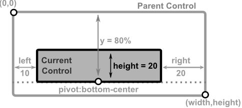 |
| A control with **left** and **right** anchors, positioned at `y` = **50%** of parent height with `height` = **100%** of parent height and **center** pivot | 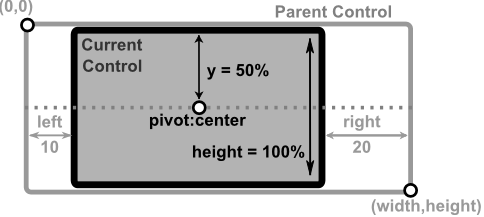 |
| A control with **left** and **right** anchors, positioned at `y` = **0** with `height` = **50%** of parent height and **top** pivot                        | 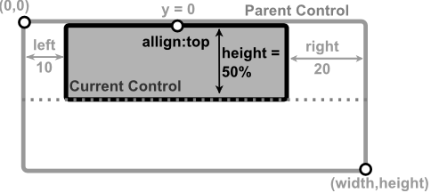 |

### Examples

1. Left-Right anchors with bottom pivot positioning
    ```rs
    // using LayoutBuilder
    LayoutBuilder::new().left(10)
                        .right(20)
                        .height(20)
                        .y(0.8)
                        .pivot(Pivot::Bottom)
                        .build()
    // or using macro:
    layout!("left:10,right:20,height:20,y:80%,pivot:bottom")
    // or using macro with aliases:
    layout!("l:10,r:20,h:20,y:80%,p:b")
    ```

2. Left-Right anchors with center pivot and full height
    ```rs
    // using LayoutBuilder
    LayoutBuilder::new().left(10)
                        .right(20)
                        .height(1.0)
                        .y(0.5)
                        .pivot(Pivot::Center)
                        .build()
    // or using macro:
    layout!("left:10,right:20,height:100%,y:50%,pivot:center")
    // or using macro with aliases:
    layout!("l:10,r:20,h:100%,y:50%,p:c")
    ```

## Using Top-Bottom anchors

When `top` and `bottom` anchors are used together, there are several restrictions. First of all, `height` and `y` parameters cannot be specified. Height is deduced as the difference between parent's height and the sum of top and bottom anchors. Top anchor will also be considered as the "y" coordinate.
However, `width` parameter should be specified (if not specified it will be defaulted to `1 character` (unless a minimum width is specified for those controls - in which case that limit will be applied)).
`align` parameter can also be specified, but only with the following values: `left`, `center` or `right`. If not specified it will be defaulted to `center`.

### Visual Representation

| Layout Description                                                                                                                                      | Visual representation                              |
| ------------------------------------------------------------------------------------------------------------------------------------------------------- | -------------------------------------------------- |
| A control with **top** and **bottom** anchors, positioned at `x` = **80%** of parent width with `width` = **90** characters and **right** pivot         | 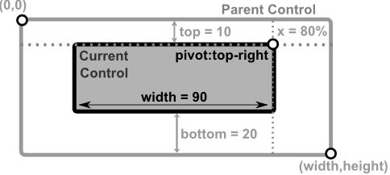 |
| A control with **top** and **bottom** anchors, positioned at `x` = **50%** of parent width with `width` = **100%** of parent width and **center** pivot | 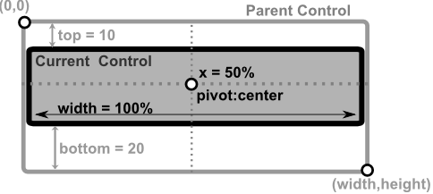 |
| A control with **top** and **bottom** anchors, positioned at `x` = **0** with `width` = **50%** of parent width and **left** pivot                      | 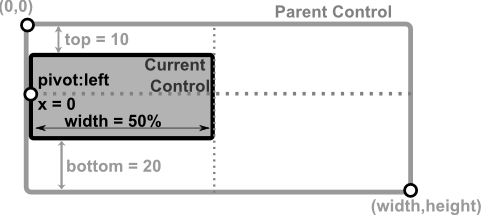 |

### Examples

1. Top-Bottom anchors with right pivot positioning
    ```rs
    // using LayoutBuilder
    LayoutBuilder::new().top(10)
                        .bottom(20)
                        .width(90)
                        .x(0.8)
                        .pivot(Pivot::Right)
                        .build()
    // or using macro:
    layout!("top:10,bottom:20,width:90,x:80%,pivot:right")
    // or using macro with aliases:
    layout!("t:10,b:20,w:90,x:80%,p:r")
    ```

2. Top-Bottom anchors with center pivot and full width
    ```rs
    // using LayoutBuilder
    LayoutBuilder::new().top(10)
                        .bottom(20)
                        .width(1.0)
                        .x(0.5)
                        .pivot(Pivot::Center)
                        .build()
    // or using macro:
    layout!("top:10,bottom:20,width:100%,x:50%,pivot:center")
    // or using macro with aliases:
    layout!("t:10,b:20,w:100%,x:50%,p:c")
    ```

## 3-margin anchors

When using 3 of the 4 anchors, the following keys cannot be used: `x`, `y`, `align` and `dock`. Using them will reject the layout.
The following table reflects these dependencies:


| Combination                                                           | Result                                                                       |
| --------------------------------------------------------------------- | ---------------------------------------------------------------------------- |
| `left` and `top` and `right`<br>or<br>`left` and `bottom` and `right` | `height` optional (see remarks)<br><br>`width` = parentWidth - (left+right)  |
| `top` and `left` and `bottom`<br>or<br>`top` and `right` and `bottom` | `width` optional (see remarks)<br><br>`height` = parentHeight - (top+bottom) |

**Remarks** 
* if `height` or `width` are not present and cannot be computed as a difference between two margins, they are defaulted to value 1. If limits are present (min Width or min Height) those limits are applied. This is usually useful for controls that have a fixed width or height (e.g. a button, a combobox).

The position of the control is also computed based on the combination of the 3 anchors selected, as shown in the next table:

| Combination                     | Top-Left corner                    | Bottom-Right corner                      |
| ------------------------------- | ---------------------------------- | ---------------------------------------- |
| `left` and `top` and `right`    | (left, top)                        | (parentWidth-right, top+height)          |
| `left` and `bottom` and `right` | (left, parentHeight-bottom-height) | (parentWidth-right, parentHeight-bottom) |
| `top` and `left` and `bottom`   | (left, top)                        | (left+width, parentHeight-bottom)        |
| `top` and `right` and `bottom`  | (parentWidth-right-width, top)     | (parentWidth-right, parentHeight-bottom) |

where:
* `parentWidth` is the width of the parent control
* `parentHeight` is the height of the parent control

### Visual Representation

| Layout Description                                                                                                                                                                | Visual representation                             |
| --------------------------------------------------------------------------------------------------------------------------------------------------------------------------------- | ------------------------------------------------- |
| A control anchored to **left**, **top**, and **right** margins with `left` = **10**, `top` = **8**, `right` = **20**, and `height` = **33%** of parent height                     | 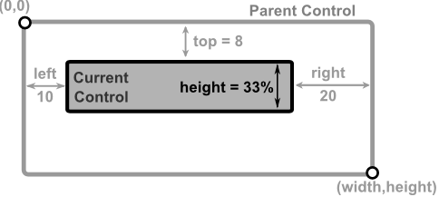 |
| A control anchored to **left**, **bottom**, and **right** margins with `left` = **20**, `bottom` = **5**, `right` = **10**, and `height` = **33%** of parent height               | 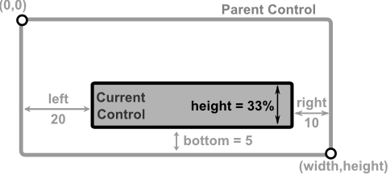 |
| A control anchored to **top**, **left**, and **bottom** margins with `top` = **8**, `left` = **10**, `bottom` = **15**, and `width` = **80%** of parent width                     | 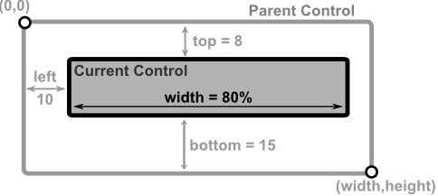 |
| A control anchored to **top**, **right**, and **bottom** margins with `top` = **8**, `right` = **30**, `bottom` = **20%** of parent height, and `width` = **50%** of parent width | 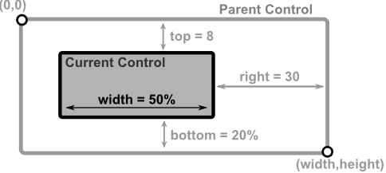 |

### Examples

1. Three-margin anchors with left, top, and right
    ```rs
    // using LayoutBuilder
    LayoutBuilder::new().left(10)
                        .top(8)
                        .right(20)
                        .height(0.33)
                        .build()
    // or using macro:
    layout!("left:10,top:8,right:20,height:33%")
    // or using macro with aliases:
    layout!("l:10,t:8,r:20,h:33%")
    ```

2. Three-margin anchors with top, left, and bottom
    ```rs
    // using LayoutBuilder
    LayoutBuilder::new().top(8)
                        .left(10)
                        .bottom(15)
                        .width(0.8)
                        .build()
    // or using macro:
    layout!("top:8,left:10,bottom:15,width:80%")
    // or using macro with aliases:
    layout!("t:8,l:10,b:15,w:80%")
    ```


## 4-margin anchors

When all of the 4 anchors are used, the rest of the keys (`x`, `y`, `width`, `height`, `align`, `pivot` and `dock`) cannot be used. Using them will reject the layout.

**Example**

| Layout Description                                                                                                  | Visual representation                              |
| ------------------------------------------------------------------------------------------------------------------- | -------------------------------------------------- |
| A control anchored to all four margins with `left` = **20**, `top` = **7**, `right` = **10**, and `bottom` = **10** | 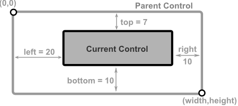 |

### Examples

1. Four-margin anchors with all sides constrained
    ```rs
    // using LayoutBuilder
    LayoutBuilder::new().left(20)
                        .top(7)
                        .right(10)
                        .bottom(10)
                        .build()
    // or using macro:
    layout!("left:20,top:7,right:10,bottom:10")
    // or using macro with aliases:
    layout!("l:20,t:7,r:10,b:10")
    ```
