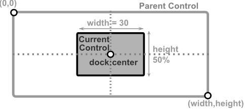
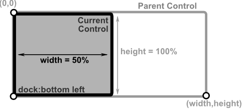
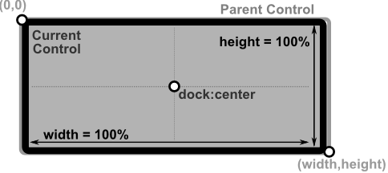

# Docking

To dock a control inside its parent use `d` or `dock` key. 
When docking a control, the following keys can not be used: `align`, `x`, `y`, `left`, `right`, `top`, `bottom`.
`Width` and `height` should be used to specify the size of control. If not specified, they are defaulted to `100%`.

| Layout                               | Outcome                                                   |
|--------------------------------------|-----------------------------------------------------------|
| **d:c,w:30,h:50%**                   |                        |
| **d:bl,w:50%**                       | As `height` is not specified, it will be defaulted to 100%     |
| **d:c** or **d:tl** or **d:br**  or any dock without `width` and `height` parameter | As both `width` and `height` parameters are missing, they will be defaulted to **100%**. This means that current control will ocupy its entire parent surface. This is the easyest way to make a control fill all of its parent surface.   |
