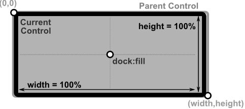
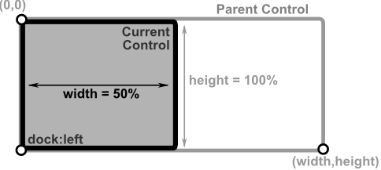
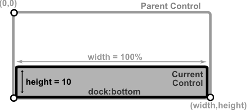

# Dock Layout

This mode positions a control by docking it to one side of its parent container or making it fill the entire parent area. Docking is useful for creating resizable layouts that automatically adjust when the parent is resized.

**Required parameters**
- `dock` must be provided and specifies how the control is docked. Possible values from the **Dock** enum:
    - `Dock::Left` – Dock to the left edge and stretch vertically.
    - `Dock::Right` – Dock to the right edge and stretch vertically.
    - `Dock::Top` – Dock to the top edge and stretch horizontally.
    - `Dock::Bottom` – Dock to the bottom edge and stretch horizontally.
    - `Dock::Fill` – Fill the entire parent container.

**Optional parameters**
- For `Dock::Left` and `Dock::Right`, you can provide `width` to set the control's width. If not provided it will be defaulted to `1 character width` (unless a minimum width is enforced by the control). The height will stretch automatically.
- For `Dock::Top` and `Dock::Bottom`, you can provide `height` to set the control's height. If not provided it will be defaulted to `1 character height` (unless a minimum height is enforced by the control). The width will stretch automatically.

To create a control using this mode, you can use the following syntax:
* `Layout::fill()` - a short format for using the `Dock::Fill` mode.
* `LayoutBuilder` - using `.dock(Dock::...)` and optionally `.width()` or `.height()`.
* `layout!` macro - using `dock` or `d` parameter with values `left`, `right`, `top`, `bottom`, or `fill`.

**Remarks**:
- For `Dock::Fill`, using `width` and `height` are will invalidate the layout.
- For `Dock::Left` and `Dock::Right`, using `width` parameter will invalidate the layout.
- For `Dock::Top` and `Dock::Bottom`, using `height` parameter will invalidate the layout.

## Visual Representation

Here are some examples of how the layout will look like for different types of docking.

| Layout Description                                                                                                                     | Visual representation                               |
| -------------------------------------------------------------------------------------------------------------------------------------- | --------------------------------------------------- |
| A control that fills the entire parent container using `Dock::Fill`                                                                   |    |
| A control docked to the left edge with **50%** width, stretching vertically to fill the parent height                                |    |
| A control docked to the bottom edge with **10** characters height, stretching horizontally to fill the parent width                  |  |


## Examples

1. Dock control to the left with fixed width

    ```rs
    // using LayoutBuilder:
    LayoutBuilder::new().dock(Dock::Left).width(20).build()
    // or using macro:
    layout!("dock:left,width:20")
    // or using macro with aliases:
    layout!("d:l,w:20")
    ```

2. Dock control to the bottom with height = 3

    ```rs
    // using LayoutBuilder:
    LayoutBuilder::new().dock(Dock::Bottom).height(3).build()
    // or using macro:
    layout!("d:bottom,h:3")
    // or using macro with aliases:
    layout!("d:b,h:3")
    ```

3. Fill the entire parent

    ```rs
    // using Layout class:
    Layout::fill()
    // using LayoutBuilder:
    LayoutBuilder::new().dock(Dock::Fill).build()
    // or using macro:
    layout!("dock:fill")
    // or using macro with aliases:
    layout!("d:f")
    ```


