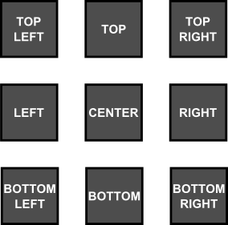

# The `layout!` proc-macro

The `layout!` proc-macro is used to create a layout from a string. The string describes a layout rule that base on the following format:

```rs
"parameter:value , parameter:value , ... parameter:value"
```

or

```rs
"parameter=value , parameter=value , ... parameter=value"
```

Where `parameter` refects the following `LayoutBuilder` method and can be one of the following:

| Parameter | Alias<br>(short) | LayoutBuilder<br>method | Value type              | Description                                                                             |
| --------- | ---------------- | ----------------------- | ----------------------- | --------------------------------------------------------------------------------------- |
| x         |                  | .x(...)                 | numerical or percentage | "X" coordonate                                                                          |
| y         |                  | .y(...)                 | numerical or percentage | "Y" coordonate                                                                          |
| left      | l                | .left_anchor(...)       | numerical or percentage | left anchor for the control<br>(the space between parent left margin and control)       |
| right     | r                | .right_anchor(...)      | numerical or percentage | right anchor for the control<br>(the space between parent right margin and control)     |
| top       | t                | .top_anchor(...)        | numerical or percentage | top anchor for the control<br>(the space between parent top margin and control)         |
| bottom    | b                | .bottom_anchor(...)     | numerical or percentage | bottom anchor for the control<br>(the space between parent bottom margin and control)   |
| width     | w                | .width(...)             | numerical or percentage | the width of the control                                                                |
| height    | h                | .height(...)            | numerical or percentage | the height of the control                                                               |
| dock      | d                | .dock(...)              | docking value           | the way the entire control is docked on its parent                                      |
| align     | a                | .alignment(...)         | alignment value         | the way the entire control is aligned against a fix point                               |
| pivot     | p                | .pivot(...)             | pivotig direction       | the way the entire control is aligned agains the point represented by (x,y) - the pivot |

**Remarks**
* Key aliases can be use to provide a shorter format for a layout. In other words, the following two formats are identical: ``width:30,height:30`` and ``w:30,h:30``
* A numerical value is represented by an integer (positive and negative) number between **-30000** and **30000**. Example: ``x:100`` --> X will be 100. Using a value outside accepted interval (**[-30000..30000]**) will reject the layout.
* A percentage value is represented by a floating value (positive and negative) succeded by the character ``%`` between **-300%** and **300%**. Example: ``x:12.75%`` --> X will be converted to a numerical value that is equal to the width of its parent multiplied by ``0.1275``. Using a value outside accepted interval (**[-300%..300%]**) will reject the layout. Percentage values can be use to ensure that if a parent size is changed, its children change their size with it.
* All layout parameters are case insensitive (meaning that 'left=10' and 'LEFT=10' have the same meaning)

## Dock values

Dock values can be one of the following:       

| Value  | Alias | Enum variant | Description                                                                                 |
| ------ | ----- | ------------ | ------------------------------------------------------------------------------------------- |
| left   | l     | Dock::Left   | The control is docked at the left edge of its parent. The `width` parameter is required.    |
| right  | r     | Dock::Right  | The control is docked at the right edge of its parent. The `width` parameter is required.   |
| top    | t     | Dock::Top    | The control is docked at the top edge of its parent. The `height` parameter is required.    |
| bottom | b     | Dock::Bottom | The control is docked at the bottom edge of its parent. The `height` parameter is required. |
| fill   | f     | Dock::Fill   | The control fills the entire space of its parent.                                           |

**Remarks**: 
* Dock value aliases can be use to provide a shorter format for a layout. In other words: ``dock:left`` is the same with ``dock:l`` or ``d:l``

### Examples

1. Dock the control at the left edge of its parent and set its width to 10:
   ```rs
   layout!("dock:left, width:10")
   ```
   or
   ```rs
   layout!("d:l, w:10")
   ```
   or (via `LayoutBuilder` method)
   ```rs
   LayoutBuilder::new().dock(Dock::Left).width(10).build()
   ```

2. Dock the control at the bottom edge of its parent and set its height to 20:
   ```rs
   layout!("dock:bottom, height:20")
   ```
   or
   ```rs
   layout!("d:b, h:20")
   ```
   or (via `LayoutBuilder` method)
   ```rs
   LayoutBuilder::new().dock(Dock::Bottom).height(20).build()
   ```

3. Fill the entire space of its parent:
   ```rs
   layout!("dock:fill")
   ```
   or
   ```rs
   layout!("d:f")
   ```
   or (via `LayoutBuilder` method)
   ```rs
   LayoutBuilder::new().dock(Dock::Fill).build()
   ```
   or (via `Layout` structure)
   ```rs
   Layout::fill()
   ```

## Align values


<table>
<tr>
<td style="width:50%; vertical-align:top;">



</td>

<td style="width:50%; vertical-align:center;">

| Value       | Alias               |
| ----------- | ------------------- |
| topleft     | lefttop, tl, lt     |
| top         | t                   |
| topright    | righttop, tr, rt    |
| right       | r                   |
| bottomright | rightbottom, br, rb |
| bottom      | b                   |
| bottomleft  | leftbottom, lb, bl  |
| left        | l                   |
| center      | c                   |

</td>

</tr>
</table>


**Remarks**: 
* Align value aliases can be use to provide a shorter format for a layout. In other words: ``dock:topleft`` is the same with ``align:tl`` or ``align:lt`` or ``a:tl``

## Pivot values

Pivot values have the same name as the align values, but they refer to the direction of width and height from a specific point (denoted by "X" and "Y" parameters). Pivot parameter is used to compute top-left and bottom-right corner of a control that is described using a (X,Y) point and a size (width, height). The following table ilustrate how this values are computed:

| Value         | Alias               | Top-Left corner        | Bottom-Right corner    |
| ------------- | ------------------- | ---------------------- | ---------------------- |
| top-left      | lefttop, tl, lt     | (x,y)                  | (x+width,y+height)     |
| top-center    | top, t              | (x-width/2,y)          | (x+width/2,y+height)   |
| top-right     | righttop, tr, rt    | (x-width,y)            | (x,y+height)           |
| center-right  | right, r            | (x-width,y-height/2)   | (x,y+height/2)         |
| bottom-right  | rightbottom, br, rb | (x-width,y-height)     | (x,y)                  |
| bottom-center | bottom, b           | (x-width/2,y-height)   | (x+width/2,y)          |
| bottom-left   | leftbottom, lb, bl  | (x,y-height)           | (x+width,y)            |
| center-left   | left, l             | (x,y-height/2)         | (x+width,y+height/2)   |
| center        | center, c           | (x-width/2,y-height/2) | (x+width/2,y+height/2) |

**Remarks**: 
* Align value aliases can be use to provide a shorter format for a layout. In other words: ``align:center`` is the same with ``align:c`` or  ``a:c``


