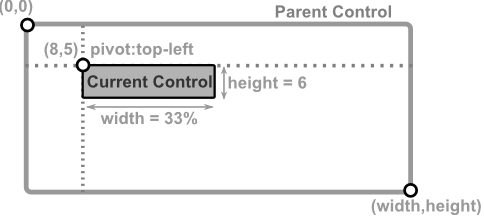
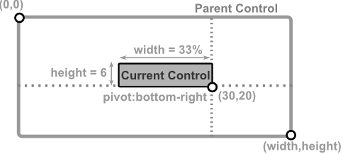
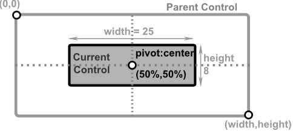

# Positioning using a pivot

This mode positions a control relative to a reference point `(x, y)` and a specified pivot, which determines which part of the control aligns with that point. Unlike absolute layout, where `(x, y)` always represents the top-left corner, pivot layout allows more flexible positioning (e.g., centering, bottom-right alignment).

**Required Parameters**
- `x` and `y` define the reference point relative to the parent.
- `pivot` specifies which part of the control aligns with `(x, y)`. For example:
  - `Pivot::TopLeft` → (x, y) is the top-left corner.
  - `Pivot::Center` → (x, y) is the center of the control.
  - `Pivot::BottomRight` → (x, y) is the bottom-right corner.


**Optional Parameters**
- `width` and `height` can be provided to set the control's size. If not provided, they default to **1 character** (unless a minimum width or height is enforced by the control).

To create a control using this mode, you can use the following syntax:
* `Layout::pivot(...)` – explicit method (absolute values only).
* `LayoutBuilder` – using `.x()`, `.y()`, `.width()`, `.height()`, and `.pivot()` (supports percentages).
* `layout!` macro – using `x`, `y`, `p` or `pivot`, and optionally `w`/`width` and/or `h`/`height` (supports percentages).

**Remarks**
- using `Layout::pivot(...)` does not support percentages for any parameter (if these are needed, consider using `LayoutBuilder` or `layout!` procmacro)
- Negative values for `x` and `y` are allowed and will position the control outside the parent.


## Visual Representation

Here are some examples of how the layout will look like for different types of pivot positioning.

| Layout Description                                                                                                                     | Visual representation                               |
| -------------------------------------------------------------------------------------------------------------------------------------- | --------------------------------------------------- |
| A control with **TopLeft** pivot positioned at **(8, 5)** with `width` = **33%** of parent width and `height` = **6** characters       |      |
| A control with **BottomRight** pivot positioned at **(30, 20)** with `width` = **33%** of parent width and `height` = **6** characters |      |
| A control with **Center** pivot positioned at **50%, 50%** of parent with `width` = **25** characters and `height` = **8** characters  |  |

## Examples

1. Center the control at `(50, 10)`, size = `20×6`
    ```rs
    // using Layout class
    Layout::pivot(50, 10, 20, 6, Pivot::Center)
    // or using LayoutBuilder
    LayoutBuilder::new().x(50)
                        .y(10)
                        .width(20)
                        .height(6)
                        .pivot(Pivot::Center)
                        .build()
    // or using macro (with full-name parameters):
    layout!("x:50,y:10,width:20,height:6,pivot:center")    
    // or using macro (with full-name parameters):
    layout!("x:50,y:10,w:20,h:6,p:c")    
    ```

2. Align **bottom-right** corner of the control at `(100, 50)` with size `25×8`
   ```rs
    // using Layout class
    Layout::pivot(100, 50, 25, 8, Pivot::BottomRight)
    // or using LayoutBuilder
    LayoutBuilder::new().x(100)
                        .y(50)
                        .width(25)
                        .height(8)
                        .pivot(Pivot::BottomRight)
                        .build()
    // or using macro (with full-name parameters):
    layout!("x:100,y:50,width:25,height:8,pivot:bottomright")    
    // or using macro (with full-name parameters):
    layout!("x:100,y:50,w:25,h:6,p:br")      
   ```

3. Center at `25%` width and `50%` height of parent with the width of `20` and default height
    ```rs
    // or using LayoutBuilder
    LayoutBuilder::new().x(0.25)
                        .y(0.50)
                        .width(20)
                        .pivot(Pivot::Center)
                        .build()
    // or using macro (with full-name parameters):
    layout!("x:25%,y:50%,width:20,pivot:center")    
    // or using macro (with full-name parameters):
    layout!("x:25%,y:50%,w:20,p:c")    
    ```