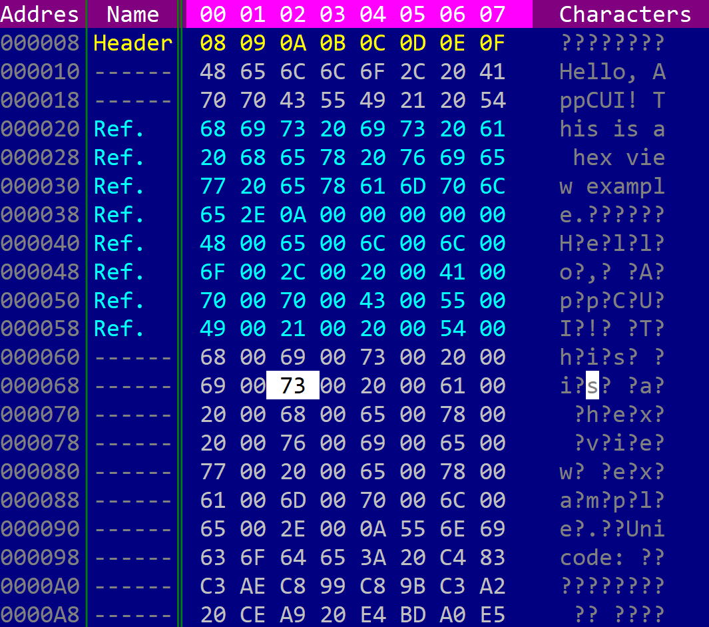

# BufferView

A BufferView is a templated (generics based) control that displays and edits a byte buffer in a hex-editor style layout. It can show raw data in multiple representations (hexadecimal, octal, binary, integers, floats, or characters), optional address and interval-name columns, and optional character-decoding panels.



It can be created using `BufferView::new(...)`, `BufferView::with_buffer(...)`, or the `bufferview!` macro.

```rs
let bv1: BufferView<Vec<u8>> = BufferView::new(layout!("..."), bufferview::Flags::None);
let bv2: BufferView<Vec<u8>> = BufferView::with_buffer(vec![1, 2, 3], layout!("..."), bufferview::Flags::ScrollBars);
let bv3 = bufferview!("Vec<u8>, d:f, flags: ScrollBars+ShowAddress+SearchBar, columns: 8, format: Hex, offset: Hex");
let bv4 = bufferview!("Vec<u8>, d:f, flags: ShowAddress+ShowIntervalNames, format: Hex(Word), endian: Little");
```

where type `T` is the type of the backing store and must implement the [`BufferAccess`](#bufferaccess) trait. `Vec<u8>` is provided out of the box.

The `bufferview!` macro creates the control with a default-constructed backing buffer (`T::default()`). Load data at runtime with [`set_buffer`](#methods) or retrieve it with [`take_buffer`](#methods).

A bufferview supports all common parameters (as they are described in [Instantiate via Macros](../instantiate_via_macros.md) section). Besides them, the following **named parameters** are also accepted:

| Parameter name                                  | Type       | Positional parameter                | Purpose                                                                                                                                                                                                             |
| ----------------------------------------------- | ---------- | ----------------------------------- | ------------------------------------------------------------------------------------------------------------------------------------------------------------------------------------------------------------------- |
| `class` or `type`                               | String     | **Yes**, first positional parameter | The [`BufferAccess`](#bufferaccess) type used as the backing store (for example `Vec<u8>` or a custom type).                                                                                                        |
| `flags`                                         | String     | **No**                              | BufferView initialization flags.                                                                                                                                                                                    |
| `lsm` or `left-scroll-margin`                   | Numeric    | **No**                              | The left margin of the bottom scroll bar in characters. If not provided the default value is 0. This should be a positive number and it only has an effect if the `ScrollBars` or `SearchBar` flags were specified. |
| `tsm` or `top-scroll-margin`                    | Numeric    | **No**                              | The top margin of the right scroll bar in characters. If not provided the default value is 0. This should be a positive number and it only has an effect if the `ScrollBars` flag was used to create the control.   |
| `offset-format` or `offset` or `address-format` | String     | **No**                              | Address column format (`Hex` or `Dec`).                                                                                                                                                                             |
| `endian`                                        | String     | **No**                              | Byte order for multi-byte numeric values (`Little` or `Big`).                                                                                                                                                       |
| `format` or `data-format` or `representation`   | String     | **No**                              | Data panel format (see [Data representation formats](#data-representation-formats)).                                                                                                                                |
| `columns` or `columns-count`                    | String     | **No**                              | Number of data columns per row (`Auto`, `Fixed(N)`, or an integer from 1 to 255).                                                                                                                                   |
| `codepage` or `cp`                              | String     | **No**                              | Character panel code page (`Default`, `ASCII`, `CP437`, `WINDOWS_1252`, or a custom name).                                                                                                                          |
| `address-width` or `aw`                         | Numeric    | **No**                              | Address column width in characters (minimum 1, maximum 24).                                                                                                                                                         |
| `address-name` or `address`                     | String     | **No**                              | Address column title (default: `Address`).                                                                                                                                                                          |
| `interval-name-width` or `inw`                  | Numeric    | **No**                              | Interval-name column width in characters (minimum 1, maximum 64).                                                                                                                                                   |
| `interval-name-title` or `interval-title`       | String     | **No**                              | Interval-name column title (default: `Name`).                                                                                                                                                                       |
| `intervals`                                     | Expression | **No**                              | Initial interval definitions passed to `set_intervals` (for example `&[Interval::new(0, 16, CharAttribute::default(), "Header")]`).                                                                                 |
| `selection-start` and `selection-end`           | Numeric    | **No**                              | Initial byte selection range. Both parameters must be provided together.                                                                                                                                            |

A bufferview supports the following initialization flags:

* `bufferview::Flags::ScrollBars` or `ScrollBars` (for macro initialization) - enables scroll bars for navigating through the buffer. The scroll bars are visible only when the control has focus.
* `bufferview::Flags::SearchBar` or `SearchBar` (for macro initialization) - enables a search bar for finding byte patterns. The search bar is visible only when the control has focus.
* `bufferview::Flags::HideHeader` or `HideHeader` (for macro initialization) - hides the column header row.
* `bufferview::Flags::ShowAddress` or `ShowAddress` (for macro initialization) - shows the address column on the left.
* `bufferview::Flags::ShowIntervalNames` or `ShowIntervalNames` (for macro initialization) - shows the interval-name column.
* `bufferview::Flags::NoPanelDimming` or `NoPanelDimming` (for macro initialization) - disables dimming of the inactive panel (data or character panel).
* `bufferview::Flags::ShowAsciiStrings` or `ShowAsciiStrings` (for macro initialization) - shows the ASCII string panel below the data area.
* `bufferview::Flags::ShowUtf16AsciiStrings` or `ShowUtf16AsciiStrings` (for macro initialization) - highlights UTF-16LE ASCII strings in the character panel.
* `bufferview::Flags::DecodeUTF8Characters` or `DecodeUTF8Characters` (for macro initialization) - decodes UTF-8 sequences in the character panel.
* `bufferview::Flags::ReadOnly` or `ReadOnly` (for macro initialization) - disables in-place editing.
* `bufferview::Flags::TabSwitchesActivePanel` or `TabSwitchesActivePanel` (for macro initialization) - makes the `Tab` key switch between the data panel and the character panel (instead of leaving the control).

## Data representation formats

The main data panel can display buffer contents in several formats. The active format is set via the `format` macro parameter or with `set_data_representation_format`.

| Format           | Enum value                                                                                                                   | Description                             |
| ---------------- | ---------------------------------------------------------------------------------------------------------------------------- | --------------------------------------- |
| Hex (byte)       | `DataRepresentationFormat::Hex(HexFormat::Byte)` or `Hex`                                                                    | One byte per column, shown as `NN`.     |
| Hex (word)       | `DataRepresentationFormat::Hex(HexFormat::Word)` or `Hex(Word)`                                                              | Two bytes per column, shown as `NNNN`.  |
| Hex (dword)      | `DataRepresentationFormat::Hex(HexFormat::DWord)` or `Hex(DWord)`                                                            | Four bytes per column.                  |
| Hex (qword)      | `DataRepresentationFormat::Hex(HexFormat::QWord)` or `Hex(QWord)`                                                            | Eight bytes per column.                 |
| Octal            | `DataRepresentationFormat::Oct` or `Oct`                                                                                     | One byte per column in octal.           |
| Binary           | `DataRepresentationFormat::Bin` or `Bin`                                                                                     | One byte per column in binary.          |
| Character        | `DataRepresentationFormat::Char` or `Char`                                                                                   | One byte per column as a raw character. |
| Unsigned integer | `DataRepresentationFormat::UInt(UIntFormat::U8)` or `UInt`, `UInt(U16)`, `UInt(U32)`, `UInt(U64)`                            | Multi-byte unsigned integers.           |
| Signed integer   | `DataRepresentationFormat::Int(IntFormat::I8)` or `Int`, `Int(I16)`, `Int(I32)`, `Int(I64)`                                  | Multi-byte signed integers.             |
| Float            | `DataRepresentationFormat::Float(FloatFormat::Scientific32)` or `Float`, `Float(Scientific64)`, `Float(E4M3)`, `Float(E5M2)` | Floating-point values.                  |

When a multi-byte format is active, the byte order is controlled by [`set_endian`](#methods) (`Endian::Little` or `Endian::Big`). The address column format is controlled separately via [`set_offset_format`](#methods) (`OffsetFormat::Hex` or `OffsetFormat::Dec`).

The number of columns per row can be fixed or computed automatically to fill the available width:

* `ColumnsCount::Fixed(N)` or macro `columns: N` / `columns: Fixed(N)` - exactly `N` columns per row.
* `ColumnsCount::Auto` or macro `columns: Auto` - as many columns as fit in the current control width.

## BufferAccess

To connect a BufferView to your data, the backing type must implement the `bufferview::BufferAccess` trait:

```rs
pub trait BufferAccess : Default {
    fn count(&self) -> u64;
    fn get(&mut self, pos: u64) -> Option<u8>;
    fn can_write(&self) -> bool;
    fn set(&mut self, pos: u64, value: u8) -> bool;
    fn can_resize(&self) -> bool;
    fn resize(&mut self, new_size: u64, fill_byte: u8) -> bool;
}
```

* `count` returns the number of bytes in the buffer.
* `get` reads a byte at `pos`, or returns `None` if the position is not readable (for example a sparse or memory-mapped region).
* `can_write` / `set` control whether individual bytes can be modified in place.
* `can_resize` / `resize` control whether the buffer length can be changed.

`Vec<u8>` already implements `BufferAccess`. For custom sources (files, memory-mapped regions, read-only views, and so on), implement the trait on your own type. The `examples/hexview` sample shows a `MyBuffer` wrapper that exposes most bytes but marks a 100-byte region as unreadable.

Editing through the UI is allowed only when the backing buffer reports `can_write() == true` and the `ReadOnly` flag is not set.

## Events

To intercept events from a bufferview, the following trait has to be implemented on the Window that processes the event loop. Use `BufferViewEvents<T>` in the `#[Window(events = ...)]` attribute, where `T` is the same `BufferAccess` type as the control:

```rs
pub trait BufferViewEvents<T: BufferAccess + 'static> {
    // called when the current byte position changes
    fn on_current_pos_changed(&mut self, handle: Handle<BufferView<T>>) -> EventProcessStatus {
        EventProcessStatus::Ignored
    }

    // called when the selected byte range changes
    fn on_selection_changed(&mut self, handle: Handle<BufferView<T>>) -> EventProcessStatus {
        EventProcessStatus::Ignored
    }
}
```

## Methods

Besides the [Common methods for all Controls](../common_methods.md) a bufferview also has the following additional methods:

### Buffer management

| Method            | Purpose                                                                                                                                                    |
| ----------------- | ---------------------------------------------------------------------------------------------------------------------------------------------------------- |
| `set_buffer(...)` | Replaces the backing buffer. Resets cursor position, scroll offset, selection, intervals, and search state, then repaints. Display settings are preserved. |
| `take_buffer()`   | Moves the backing buffer out of the control (the control is left with `T::default()`). Returns the removed buffer.                                         |

### Display settings

| Method                                                                      | Purpose                                                                                  |
| --------------------------------------------------------------------------- | ---------------------------------------------------------------------------------------- |
| `set_data_representation_format(...)` / `format()`                          | Sets or returns the active data panel format.                                            |
| `set_columns_count(...)`                                                    | Sets the number of data columns per row (`ColumnsCount::Fixed` or `ColumnsCount::Auto`). |
| `set_offset_format(...)` / `offset_format()`                                | Sets or returns how byte offsets are shown in the address column.                        |
| `set_endian(...)` / `endian()`                                              | Sets or returns the byte order for multi-byte values.                                    |
| `set_codepage(...)` / `codepage()`                                          | Sets or returns the code page used in the character panel.                               |
| `set_address_visible(...)` / `is_address_visible()`                         | Shows or hides the address column.                                                       |
| `set_address_width(...)`                                                    | Sets the address column width in characters (clamped to 1..=24).                         |
| `set_address_name(...)`                                                     | Sets the header title of the address column.                                             |
| `set_interval_names_visible(...)` / `is_interval_names_visible()`           | Shows or hides the interval-name column.                                                 |
| `set_interval_name_width(...)`                                              | Sets the interval-name column width in characters (clamped to 1..=64).                   |
| `set_interval_name_title(...)`                                              | Sets the header title of the interval-name column.                                       |
| `set_ascii_strings_visible(...)` / `is_ascii_strings_visible()`             | Shows or hides the ASCII string panel.                                                   |
| `set_utf16_ascii_strings_visible(...)` / `is_utf16_ascii_strings_visible()` | Enables or disables UTF-16LE ASCII string highlighting.                                  |
| `set_decode_utf8(...)`                                                      | Enables or disables UTF-8 decoding in the character panel.                               |

### Intervals

| Method                  | Purpose                                                                         |
| ----------------------- | ------------------------------------------------------------------------------- |
| `set_intervals(...)`    | Replaces the set of labeled intervals shown in the interval-name column.        |
| `interval_name_at(...)` | Returns the name of the innermost interval covering a byte position, or `None`. |

### Cursor and selection

| Method                 | Purpose                                                                        |
| ---------------------- | ------------------------------------------------------------------------------ |
| `current_pos()`        | Returns the current byte cursor position.                                      |
| `set_current_pos(...)` | Moves the cursor to a byte position and scrolls the view if needed.            |
| `selection()`          | Returns the current selection as a half-open range `[start, end)`, or `None`.  |
| `has_selection()`      | Returns whether a non-empty byte range is selected.                            |
| `set_selection(...)`   | Sets the selection to `[start, end)`. Returns `false` if the range is invalid. |
| `clear_selection()`    | Clears the selection without moving the cursor.                                |
| `bytes_count()`        | Returns the number of bytes in the backing buffer.                             |

### Buffer editing

These methods operate on the backing buffer when writes and resizing are allowed:

| Method                     | Purpose                                                                       |
| -------------------------- | ----------------------------------------------------------------------------- |
| `read_bytes(...)`          | Reads bytes starting at `pos` into a slice. Returns the number of bytes read. |
| `read_bytes_into_vec(...)` | Appends up to `count` bytes read from `pos` to a `Vec<u8>`.                   |
| `overwrite_bytes(...)`     | Overwrites bytes at `pos` without changing the buffer length.                 |
| `insert_bytes(...)`        | Inserts bytes at `pos`, growing the buffer if resizing is supported.          |
| `delete_bytes(...)`        | Deletes `count` bytes starting at `pos`.                                      |
| `resize_buffer(...)`       | Changes the buffer length, filling new bytes with `fill_byte`.                |
| `fill_buffer(...)`         | Fills a byte range with a single value.                                       |

## Key association

The following keys are processed by a `BufferView` control if it has focus:

| Key                                     | Purpose                                                                                                                                                                 |
| --------------------------------------- | ----------------------------------------------------------------------------------------------------------------------------------------------------------------------- |
| `Left`, `Right`                         | Moves the cursor by one data unit (one byte in the character panel, or one formatted value in the data panel).                                                          |
| `Up`, `Down`                            | Moves the cursor up or down by one row.                                                                                                                                 |
| `Shift`+{`Left`, `Right`, `Up`, `Down`} | Extends or shrinks the byte selection while moving the cursor.                                                                                                          |
| `Home`, `End`                           | Moves the cursor to the first or last byte in the buffer.                                                                                                               |
| `Shift`+{`Home`, `End`}                 | Extends the selection to the start or end of the buffer.                                                                                                                |
| `PageUp`, `PageDown`                    | Moves the cursor up or down by one page.                                                                                                                                |
| `Shift`+{`PageUp`, `PageDown`}          | Extends the selection while paging.                                                                                                                                     |
| `Ctrl`+{`Left`, `Right`, `Up`, `Down`}  | Scrolls the view horizontally or vertically without moving the cursor.                                                                                                  |
| `Ctrl`+`Tab`                            | Switches between the data panel and the character panel.                                                                                                                |
| `Tab`                                   | Switches panels when the `TabSwitchesActivePanel` flag is set; otherwise ignored.                                                                                       |
| `Ctrl`+`Alt`+{`Left`, `Right`}          | Enters column-resize mode for the address or interval-name separator (when the corresponding column is visible).                                                        |
| Printable characters                    | When editing is enabled, starts or continues in-place editing at the cursor. `Backspace` removes the last typed character. `Enter`, `Tab`, or `Right` commits the edit. |

While in column-resize mode (address or interval-name separator selected), the following keys are processed:

* `Left`, `Right` - decreases or increases the width of the selected column
* `Tab`, `Ctrl`+`Left`, `Ctrl`+`Right`, `Ctrl`+`Alt`+`Left`, `Ctrl`+`Alt`+`Right` - switches to the other resizable column separator
* Any other key - exits column-resize mode

Additionally, typing any character will open the search bar (if the `SearchBar` flag is present) and search for the next match. While the search bar is active:

* `Backspace` - removes the last character from the search text
* `Escape` - clears the search text and closes the search bar
* `Enter` - finds the next match
* Movement keys - close the search bar but keep the search text

### Mouse interaction

* **Left click** on a byte moves the cursor to that position. Dragging extends the selection.
* **Mouse wheel** scrolls the view vertically; horizontal wheel scrolls horizontally when the data panel is wider than the visible area.
* **Left click** on a column header (`Data` or `Char`) activates that panel.
* **Drag** on a column separator resizes the address or interval-name column.

## Search expressions

When the `SearchBar` flag is set, the search text is parsed into a byte pattern. If no prefix is given, the text is treated as plain bytes. Supported prefixes:

| Prefix                                              | Example                   | Meaning                                        |
| --------------------------------------------------- | ------------------------- | ---------------------------------------------- |
| *(none)* or `text:`                                 | `hello` or `text:"hello"` | Raw text bytes                                 |
| `hex:`                                              | `hex:48 65 6C 6C 6F`      | Hexadecimal bytes                              |
| `u8:`                                               | `u8:0,255,128`            | List of `u8` values                            |
| `i8:`                                               | `i8:0,-1,127`             | List of `i8` values                            |
| `u16:` / `i16:` / `u32:` / `i32:` / `u64:` / `i64:` | `u16:1000,2000`           | Lists of fixed-width integers (little-endian)  |
| `f32:` / `f64:`                                     | `f32:1.5,2.0`             | Lists of floating-point values (little-endian) |
| `utf16:`                                            | `utf16:Hello`             | UTF-16LE encoded text                          |

Each search updates the selection to the matched byte range and moves the cursor to the match.

## Intervals

Intervals label byte ranges in the interval-name column. Overlapping intervals are supported; the innermost interval name is shown for each byte.

An interval is created with `bufferview::Interval::new(start, size, attr, name)`:

* `start` - the first byte offset of the interval
* `size` - the number of bytes covered
* `attr` - the `CharAttribute` used to render the name
* `name` - the text shown in the interval-name column

```rs
bv.set_intervals(&[
    bufferview::Interval::new(0, 16, CharAttribute::with_fore_color(Color::Red), "Header"),
    bufferview::Interval::new(16, 32, CharAttribute::with_fore_color(Color::Green), "Payload"),
]);
```

## Example

The following example creates a window with a hex view over a `Vec<u8>` buffer. Moving the cursor updates the window title. Two labeled intervals highlight the greeting and the payload regions.

```rs
use appcui::prelude::*;

#[Window(events = BufferViewEvents<Vec<u8>>)]
struct HexWindow {
    buffer_view: Handle<BufferView<Vec<u8>>>,
}

impl HexWindow {
    fn new() -> Self {
        let mut w = Self {
            base: window!("Hex View,d:f,flags:Sizeable"),
            buffer_view: Handle::None,
        };
        let mut bv = bufferview!(
            "Vec<u8>, 
            d:f, 
            flags: ScrollBars+ShowAddress+ShowIntervalNames+SearchBar,
            columns: 8, 
            format: Hex, 
            offset: Hex"
        );
        bv.set_buffer(b"Hello, AppCUI!".to_vec());
        bv.set_intervals(&[
            bufferview::Interval::new(0, 7, CharAttribute::with_fore_color(Color::Cyan), "Greeting"),
            bufferview::Interval::new(7, 6, CharAttribute::with_fore_color(Color::Yellow), "Payload"),
        ]);
        w.buffer_view = w.add(bv);
        w.update_title();
        w
    }

    fn update_title(&mut self) {
        let h = self.buffer_view;
        if let Some(bv) = self.control(h) {
            self.set_title(&format!("Hex View - position {}", bv.current_pos()));
        }
    }
}

impl BufferViewEvents<Vec<u8>> for HexWindow {
    fn on_current_pos_changed(&mut self, handle: Handle<BufferView<Vec<u8>>>) -> EventProcessStatus {
        if handle == self.buffer_view {
            self.update_title();
        }
        EventProcessStatus::Processed
    }
}

fn main() -> Result<(), appcui::system::Error> {
    App::new().window(|| HexWindow::new()).run()
}
```

For a full-featured hex editor with format switching, code-page selection, and buffer editing commands, see the `examples/hexview` sample in the repository.
