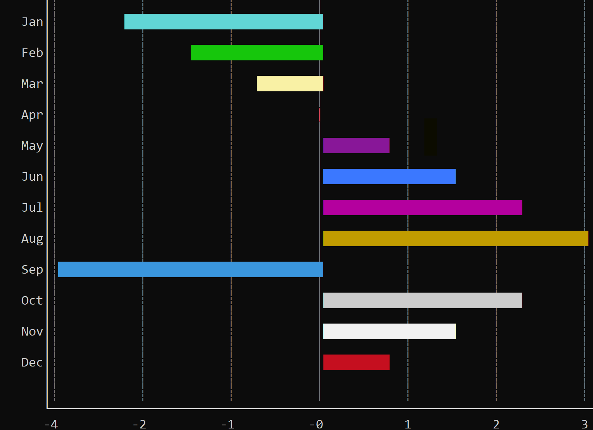

# HBarChart

An `HBarChart` draws one horizontal bar for each value in a numeric series. The value type `T` is any numeric type that implements `Number`: `i8`, `i16`, `i32`, `i64`, `i128`, `u8`, `u16`, `u32`, `u64`, `u128`, `usize`, `isize`, `f32`, or `f64`.

The chart maps those values onto the plot width, and can show an X axis with a grid, labels beside the bars, and a vertical scroll bar when the series is taller than the control. Each bar can keep the chart defaults or override its color, thickness, spacing, and draw mode.



Create one with `HBarChart::new` (a layout and initialization flags) or with the `hbarchart!` macro. With `HBarChart::new`, name the numeric type on the variable or with a turbofish:

```rs
let chart: HBarChart<i32> = HBarChart::new(layout!("d:f"), hbarchart::Flags::ScrollBars);
let chart = HBarChart::<f64>::new(layout!("d:f"), hbarchart::Flags::None);
```

The macro takes the numeric type as its first parameter:

```rs
let c1 = hbarchart!("i32,d:f");
let c2 = hbarchart!("class:i32,x:1,y:1,w:60,h:20,flags:[ScrollBars,ShowZeroLineOnXAxis]");
let c3 = hbarchart!("f64,d:f,scale:Fit,ylabels:BarLabels,bar-height:3,values:[1.5,2.0,0.5,3.25]");
```

A new chart starts empty. It scales bars with `BarScale::FromZero`, shows the X axis and its grid (a label every 3 columns), and draws no category axis. The column reserved for labels beside the bars is 6 characters wide, and stays unused until a Y-axis label mode is set. Bars use the theme color, a thickness of 1, a spacing of 1, and a solid fill. Integer values are formatted with thousands separators. Floating-point values are formatted with two decimals.

An HBarChart supports all common parameters (as they are described in [Instantiate via Macros](../instantiate_via_macros.md) section). Besides them, the following **named parameters** are also accepted:

| Parameter name                                                                       | Type           | Positional parameter | Purpose                                                                                          |
| ------------------------------------------------------------------------------------ | -------------- | -------------------- | ------------------------------------------------------------------------------------------------ |
| `class` or `type`                                                                    | String         | **Yes** (first)      | Numeric type of the series (`i32`, `f64`, ...)                                                   |
| `flags`                                                                              | Flags          | **No**               | Initialization flags                                                                             |
| `values` or `data`                                                                   | List           | **No**               | Bars to add. Each item is a number or a bar description                                          |
| `scale` or `barscale` or `bar-scale`                                                 | String         | **No**               | How values map onto the plot width                                                               |
| `ylabels` or `y-labels` or `yl` or `yaxis` or `y-axis`                               | String or List | **No**               | Labels drawn beside the bars                                                                     |
| `bar-height` or `barheight` or `bh` or `default-bar-height` or `dbh`                 | Integer        | **No**               | Default bar height, from 1 to 100                                                                |
| `spacing` or `space` or `s` or `bar-spacing` or `default-bar-spacing` or `dbs`       | Integer        | **No**               | Default gap before a bar, from 1 to 100                                                          |
| `draw-mode` or `dm` or `bar-draw-mode` or `default-bar-draw-mode` or `dbdm`          | String         | **No**               | Default way to paint a bar                                                                       |
| `bar-color` or `barcolor` or `bar-attr` or `barattr` or `default-bar-draw-mode-attr` | Dict           | **No**               | Default character attribute for bars                                                             |
| `numeric-format` or `nf`                                                             | Dict           | **No**               | Format used for X-axis labels and hover tooltips                                                 |
| `xaxis-width` or `x-axis-width` or `xw`                                              | Integer        | **No**               | Characters reserved for the labels beside the bars (0 to 32; 0 is treated as 1). The default is 6 |
| `xaxis-step` or `x-axis-step` or `xstep` or `step`                                   | Integer        | **No**               | Columns between vertical grid lines (1 to 255)                                                   |
| `lsm` or `left-scroll-margin`                                                        | Integer        | **No**               | Left margin of the scroll bar                                                                    |

## Flags

* `hbarchart::Flags::ScrollBars` or `ScrollBars` (for macro initialization) — shows a vertical scroll bar when the bars are taller than the control. The right margin grows while the chart has focus so the scroll bar stays visible.
* `hbarchart::Flags::DimBarsOnSelection` or `DimBarsOnSelection` (for macro initialization) — after a bar is selected, the other bars are drawn with the inactive chart color. The selected bar is outlined with the theme selection border.
* `hbarchart::Flags::ShowZeroLineOnXAxis` or `ShowZeroLineOnXAxis` (for macro initialization) — draws a solid vertical line at value zero, labeled `0`, while the X-axis grid is visible.

```rs
let chart = hbarchart!("i32,d:f,flags:[ScrollBars,DimBarsOnSelection,ShowZeroLineOnXAxis]");
```

## Scale

`scale` chooses how bar values become lengths. The same values are available from `set_bars_scale` as `hbarchart::BarScale<T>`.

* `FromZero` or `zero` — every bar is drawn from zero. The visible range includes zero and every bar value. This is the default.
* `FromZeroMinRange(min, max)` or `zero-min-range(min, max)` — same as `FromZero`, and the range is also expanded so that it covers `min` and `max`.
* `FitData` or `fit` — the smallest and largest bar values stretch across the full plot width. When every value is equal, each bar is drawn at half the plot width.
* `Fixed(min, max)` or `fix(min, max)` — uses a fixed range. Values outside it are drawn at the corresponding edge of the plot. When `min` is not lower than `max`, every bar is drawn at half the plot width.

```rs
let fit = hbarchart!("f64,d:f,scale:Fit");
let fixed = hbarchart!("i32,d:f,scale:Fixed(0,100)");
let padded = hbarchart!("i32,d:f,scale:FromZeroMinRange(-20,80)");
```

## Y-axis labels

`ylabels` chooses the labels beside the bars. The same modes are available from `set_yaxis_label_mode` as `hbarchart::YAxisLabelMode`.

* `None` — draws no category axis. This is the default.
* `Index(start)` — labels each bar with `start + bar index`. `Index(1)` labels the first bar `1`, the next `2`, and so on.
* `BarLabels` — uses each bar's own label. Bars with an empty label are skipped.
* A list of spans — each span covers a run of bars. A span is `{start, count, label}`. `start` is the zero-based index of the first bar, and `count` is how many bars the label covers (a count below 1 is treated as 1). Named fields are `start`, `count` (also accepted as `end`), and `label` (also `text` or `caption`). The second value is always a count of bars.

Spans are copied into the chart, ordered by start index and then by end index. A span that overlaps an earlier one is dropped. A span label is stored in a 22-character buffer. The label is drawn beside the bars it covers.

```rs
let by_index = hbarchart!("i32,d:f,ylabels:Index(2020)");
let by_name = hbarchart!("i32,d:f,ylabels:BarLabels,values:[{10,label:'Jan'},{12,label:'Feb'}]");
let by_span = hbarchart!("i32,d:f,ylabels:[{0,3,'Q1'},{3,3,'Q2'}]");
```

The same spans from code:

```rs
let spans = [BarSpan::new(0, 3, "Q1"), BarSpan::new(3, 3, "Q2")];
chart.set_yaxis_label_mode(hbarchart::YAxisLabelMode::Custom(&spans));
```

`BarSpan::new(0, 3, "Q1")` labels bars 0, 1, and 2. Inserting or deleting bars does not rewrite these spans; update them after the series changes.

## Bars

A bar stores a numeric value and an optional label. Color, thickness, spacing, and draw mode are also optional: a field left unset uses the chart default. A value of type `T` converts into a bar, so `chart.add_bar(10)` and a bare number in `values` are enough for a default bar.

Build a bar that overrides the defaults with `BarBuilder`:

```rs
let bar = BarBuilder::new(42)
    .label("Jun")
    .thickness(4)
    .spacing(2)
    .attr(CharAttribute::with_fore_color(Color::Yellow))
    .draw_mode(BarDrawMode::Fill(BarFillType::Shade50))
    .build();
chart.add_bar(bar);
```

In the `values` (or `data`) list, a dictionary describes the same fields. `value` is required. The other fields are optional.

| Parameter name                              | Type    | Positional parameter | Purpose                                            |
| ------------------------------------------- | ------- | -------------------- | -------------------------------------------------- |
| `value` or `val` or `v`                     | Number  | **Yes** (first)      | The bar value                                      |
| `width` or `w` or `thickness`               | Integer | **No**               | Thickness in cells                                 |
| `space` or `spacing` or `s`                 | Integer | **No**               | Gap, in cells, before this bar                     |
| `label` or `text` or `caption`              | String  | **No**               | Label used by `BarLabels` and by the hover tooltip |
| `attr` or `attribute` or `charattr`         | Dict    | **No**               | Character attribute for this bar                   |
| `draw-mode` or `drawmode` or `dm` or `mode` | String  | **No**               | Draw mode for this bar                             |

```rs
let chart = hbarchart!("i32,d:f,values:[10,{25,label:'Mar',width:4,attr:yellow},{40,dm:Fill(Shade50),space:2}]");
```

### Draw mode

`BarDrawMode` selects the glyph used to paint a bar. The default is `Fill(Solid)`. Some modes force the thickness into a fixed range; a thickness outside that range is clamped when the bar is painted. Thickness is the height of the bar, in rows.

| Mode                    | Macro form                                          | Thickness                  |
| ----------------------- | --------------------------------------------------- | -------------------------- |
| `Fill(fill)`            | `Fill`, `Fill(Solid)`, `Fill(Shade50)`, `Fill('#')` | at least 1                 |
| `Line(line)`            | `Line`, `Line(Single)`, `Line(Double)`              | always 1                   |
| `Rectangle(line)`       | `Rectangle` or `Rect`, `Rectangle(Double)`          | at least 2                 |
| `FilledRectangle(line)` | `FilledRectangle` or `FilledRect`                   | at least 3                 |
| `Point(marker)`         | `Point(Bullet)`, `Point(Diamond)`, `Point('*')`     | always 1                   |
| `LargePoint(marker)`    | `LargePoint`, `LargePoint(Circle)`                  | always 2 (a 3-by-2 marker) |
| `Cap(cap)`              | `Cap`, `Cap(SingleLine)`, `Cap('=')`                | at least 1                 |

A mode written without parentheses uses its default inner value: `Fill` is solid, `Line` / `Rectangle` / `FilledRectangle` use a single line, `LargePoint` is a rounded square, and `Cap` is solid. Write the point marker explicitly, for example `Point(Bullet)`.

`Fill` accepts `Solid` (█), `Shade75` (▓), `Shade50` (▒), `Shade25` (░), `Braille`, `Checkerboard`, `Grid`, `GridDouble`, `CrossHatch`, `Dashed`, `DiagonalUp`, `DiagonalDown`, `Notched`, or `Custom(char)`. In the macro, a custom glyph is a character (`Fill('#')`) or a code (`Fill(code: 0x2591)`).

`Line`, `Rectangle`, and `FilledRectangle` take a `LineType`: `Single`, `Double`, `SingleThick` (`thick`), `Border`, `Ascii`, `AsciiRound`, `SingleRound` (`round`), or `Braille`.

`Point` accepts `Bullet` (●), `Diamond` (◆), `Square` (■), or a custom character.

`LargePoint` accepts `RoundSquare`, `Square`, `DoubleLineSquare`, `ThickSquare`, `Circle`, `Diamond`, or a custom character that fills the 3-by-2 block.

`Cap` accepts `Solid`, `Shade75`, `Shade50`, `Shade25`, `Braille`, `SingleLine`, `DoubleLine`, `SingleThickLine` (`thick`), or a custom character. The cap is a single column drawn at the bar's value. Line caps are drawn as a vertical stroke.

```rs
chart.set_default_bar_drawmode(BarDrawMode::Rectangle(LineType::Double));
chart.update_bar(0, |bar| {
    bar.set_draw_mode(BarDrawMode::Point(BarPointType::Diamond));
});
```

### Number format

`numeric-format` (or `set_number_format`) controls the text used for X-axis labels, the zero-line label, and hover tooltips. The first value is the base: `dec` / `10`, `hex` / `16`, `oct` / `8`, or `bin` / `2`. Optional fields include `decimals` (or `precision`, at most 8), `group` (`0`, `3`, or `4`) with `sep`, `prefix`, `suffix`, and `digits`.

```rs
let chart = hbarchart!("f64,d:f,numeric-format:{dec,decimals:1}");
let hex = hbarchart!("i32,d:f,nf:{hex,prefix:0x}");
```

## Events

To intercept events from an HBarChart, implement `HBarChartEvents<T>` on the window that runs the event loop. The attribute `events = HBarChartEvents<T>` generates the trait. Both methods are required.

```rs
pub trait HBarChartEvents<T> {
    fn on_bar_selected(&mut self, handle: Handle<HBarChart<T>>, index: u32) -> EventProcessStatus;
    fn on_clear_selection(&mut self, handle: Handle<HBarChart<T>>) -> EventProcessStatus;
}
```

`on_bar_selected` runs when a click or double-click lands on a bar that was not already selected. `index` is the zero-based bar index. `on_clear_selection` runs when a click or double-click lands outside every bar and a bar was selected. Clicking the bar that is already selected does not raise the event again.

## Methods

Besides the [Common methods for all Controls](../common_methods.md), an HBarChart also has the following additional methods:

| Method                          | Purpose                                                                                                                          |
| ------------------------------- | -------------------------------------------------------------------------------------------------------------------------------- |
| `add_bar(...)`                  | Appends one bar and repaints. The argument is a value of type `T` or any type that converts into a `Bar`                         |
| `add_bars(...)`                 | Appends several bars and repaints once                                                                                           |
| `bars_count()`                  | Returns the number of bars                                                                                                       |
| `selected_bar()`                | Returns the index of the selected bar, or `None`                                                                                 |
| `get_bar(index)`                | Returns `Some(&Bar<T>)`, or `None` if `index` is out of range                                                                    |
| `update_bar(index, f)`          | Mutates one bar, then relayouts and repaints. Does nothing if `index` is out of range                                            |
| `update_bars(f)`                | Mutates the whole series through a `Bars` view, then relayouts and repaints once                                                 |
| `ensure_visible(index)`         | Scrolls vertically so the bar at `index` is visible. Does nothing if `index` is out of range or the bar is already fully visible |
| `set_bars_scale(...)`           | Sets the `BarScale` used to map values onto the plot width                                                                       |
| `set_number_format(...)`        | Sets the `FormatNumber` used for axis labels and tooltips                                                                        |
| `set_default_bar_height(...)`   | Sets the height, in cells, of bars that do not specify their own. Values below 1 are treated as 1                                |
| `set_default_bar_spacing(...)`  | Sets the gap, in cells, before bars that do not specify their own                                                                |
| `set_default_bar_drawmode(...)` | Sets the draw mode of bars that do not specify their own                                                                         |
| `set_default_bar_attr(...)`     | Sets the character attribute of bars that do not specify their own. After this call, bars no longer use the theme bar color      |
| `set_xaxis_visible(...)`        | Shows or hides the X axis and the two rows reserved for its line and numeric labels                                              |
| `set_xaxis_show_grid(...)`      | Shows or hides the vertical grid lines and the numeric labels under them                                                         |
| `set_xaxis_width(...)`          | Sets how many characters are reserved for the labels beside the bars. The default is 6. Values below 1 are treated as 1. One extra column is kept for the axis line. Used only while a Y-axis label mode is set. A longer label is cut off and its last visible character is replaced with an ellipsis |
| `set_xaxis_step(...)`           | Sets the distance, in columns, between vertical grid lines. Values below 1 are treated as 1. Each numeric label under the grid is truncated to this many characters. The default is 3 |
| `set_yaxis_label_mode(...)`     | Sets how labels are drawn beside the bars                                                                                        |

### Editing the series (`Bars`)

`update_bars` passes a `Bars` view so several inserts, deletes, and in-place edits share one repaint.

| Method                          | Purpose                                                                  |
| ------------------------------- | ------------------------------------------------------------------------ |
| `len()` / `is_empty()`          | Size of the series                                                       |
| `get(index)` / `get_mut(index)` | Borrow one bar, or `None` if out of range                                |
| `add(...)` / `add_bars(...)`    | Append one bar or several bars                                           |
| `insert(index, bar)`            | Inserts at `index`. Returns `false` if `index` is greater than `len()`   |
| `delete(index)`                 | Removes the bar and returns it, or `None` if out of range                |
| `set(index, bar)`               | Replaces the bar and returns the previous one, or `None` if out of range |
| `clear()`                       | Removes every bar                                                        |
| `iter()` / `iter_mut()`         | Walk the series                                                          |

```rs
chart.update_bars(|bars| {
    bars.get_mut(1).unwrap().set_value(20);
    bars.insert(0, 0);
    bars.delete(3);
});
```

### `Bar`

On a bar returned by `get_bar`, `Bars::get`, or passed into `update_bar`:

| Method                                                     | Purpose                                               |
| ---------------------------------------------------------- | ----------------------------------------------------- |
| `value()` / `set_value(...)`                               | Read or replace the numeric value                     |
| `label()` / `set_label(...)`                               | Read or replace the label                             |
| `attr()` / `set_attr(...)` / `clear_attr()`                | Bar color, or the chart default when cleared          |
| `thickness()` / `set_thickness(...)` / `clear_thickness()` | Bar thickness, or the chart default when cleared      |
| `spacing()` / `set_spacing(...)` / `clear_spacing()`       | Gap before the bar, or the chart default when cleared |
| `draw_mode()` / `set_draw_mode(...)` / `clear_draw_mode()` | Draw mode, or the chart default when cleared          |

Setters return `&mut Self`, so they can be chained.

## Key association

The following keys are processed by an HBarChart when it has focus. They scroll the plot vertically.

| Key                    | Purpose                                                   |
| ---------------------- | --------------------------------------------------------- |
| `Up` / `Down`          | Scroll one cell toward the start or the end of the series |
| `Home`                 | Scroll to the start of the series                         |
| `End`                  | Scroll to the end of the series                           |
| `Ctrl+Up` / `Ctrl+Down` | Make the previous or next bar the first visible bar      |

## Mouse association

| Action                              | Purpose                                                                                                                                |
| ----------------------------------- | -------------------------------------------------------------------------------------------------------------------------------------- |
| Hover                               | Shows a tooltip over the bar under the cursor. The tooltip is the formatted value, or the label and the value when the bar has a label |
| Click or double-click on a bar      | Selects that bar and raises `on_bar_selected` when the selection changes. The click has to land on the painted bar                     |
| Click or double-click outside a bar | Clears the selection and raises `on_clear_selection` when a bar was selected                                                           |
| Wheel left or wheel up              | Scrolls one cell toward the start of the series                                                                                        |
| Wheel right or wheel down           | Scrolls one cell toward the end of the series                                                                                          |
| Drag the scroll bar                 | Scrolls the series when `ScrollBars` is enabled                                                                                        |

## Example

The following window shows four monthly values. Selecting a bar writes that month and its value into the window title. Clearing the selection restores the original title.

A larger editor (per-bar appearance, axes, scale, and Y-axis groups) is in `examples/hbarchart_editor`.

```rs
use appcui::prelude::*;

#[Window(events = HBarChartEvents<i32>)]
struct MyWin {
    chart: Handle<HBarChart<i32>>,
}

impl MyWin {
    fn new() -> Self {
        let mut win = MyWin {
            base: window!("Sales,d:f"),
            chart: Handle::None,
        };
        let mut chart = hbarchart!(
            "i32,d:f,
             flags:[ScrollBars,ShowZeroLineOnXAxis],
             ylabels:BarLabels,
             bar-height:1,
             spacing:1,
             draw-mode:Fill(Shade50),
             bar-color:aqua"
        );
        chart.add_bars([
            BarBuilder::new(12).label("Jan").build(),
            BarBuilder::new(18).label("Feb").build(),
            BarBuilder::new(9).label("Mar").build(),
            BarBuilder::new(22).label("Apr").build(),
        ]);
        win.chart = win.add(chart);
        win
    }
}

impl HBarChartEvents<i32> for MyWin {
    fn on_bar_selected(&mut self, handle: Handle<HBarChart<i32>>, index: u32) -> EventProcessStatus {
        if let Some(chart) = self.control(handle) {
            if let Some(bar) = chart.get_bar(index as usize) {
                let title = format!("Sales - {} = {}", bar.label(), bar.value());
                self.set_title(&title);
            }
        }
        EventProcessStatus::Processed
    }

    fn on_clear_selection(&mut self, _: Handle<HBarChart<i32>>) -> EventProcessStatus {
        self.set_title("Sales");
        EventProcessStatus::Processed
    }
}

fn main() -> Result<(), appcui::system::Error> {
    App::new().window(MyWin::new).run()
}
```
