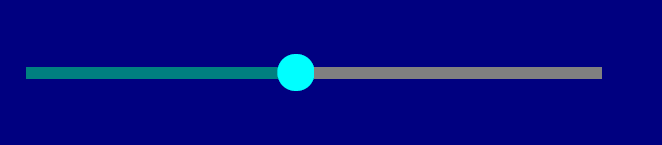

# HSlider

The `HSlider` control is a horizontal slider that allows the user to select a number from a range of numbers by dragging a marker along a track. It can display the current value, tick marks along the track, and can be styled in different visual variants (a standard slider, a progress-bar-like slider, an inline slider, a block slider or a ruler).



It can be created using `HSlider::new(...)` or the `hslider!` macro. Using `HSlider::new(...)` can be done in two ways:
1. by specifying the type for a variable:
    ```rs
    let s: HSlider<T> = HSlider::new(...);
    ```

2. by using turbo-fish notation (usually when you don't want to create a separate variable for the control):
    ```rs
    let s = HSlider::<T>::new(...);
    ```
**Remarks**: The type `T` can be one of the following: `i8`, `i16`, `i32`, `i64`, `i128`, `u8`, `u16`, `u32`, `u64`, `u128`, `usize`, `isize`, `f32`, `f64`.

## Examples

Assuming we want to create an `HSlider` for the `i32` type, we can do it as follows:

```rs
let s1: HSlider<i32> = HSlider::new(0, 10, 1, hslider::Type::Standard, layout!("x:1,y:1,w:20,h:1"), hslider::Flags::None);
let s2 = hslider!("class:i32,min:0,max:10,step:1,x:1,y:2,w:20,h:1,flags:ShowValue");
let s3 = hslider!("i32,0,10,1,x:1,y:3,w:20,h:1,type:ProgressBar");
let mut s4 = hslider!("i32,0,100,5,x:1,y:4,w:20,h:1,flags:ShowValue|Ticks,type:Inline");
s4.set_ticks(5);
let s5 = hslider!("f32,0f32,10f32,1.5f32,x:1,y:5,w:20,h:1,flags:ValueAsMarker");
```

An HSlider supports all common parameters (as they are described in [Instantiate via Macros](../instantiate_via_macros.md) section). Besides them, the following **named parameters** are also accepted:

| Parameter name | Type   | Positional parameter                  | Purpose                                                                                            |
| -------------- | ------ | ------------------------------------- | ------------------------------------------------------------------------------------------------- |
| `class`        | String | **Yes** (first positional parameter)  | The name of the generic type parameter used when creating the slider                              |
| `min`          | String | **Yes** (second positional parameter) | The minimum value that the slider can have. The initial value of the slider is set to this value. |
| `max`          | String | **Yes** (third positional parameter)  | The maximum value that the slider can have.                                                       |
| `step`         | String | **Yes** (fourth positional parameter) | The step by which the value of the slider will be increased or decreased.                         |
| `type`         | String | **No**                                | The visual style of the slider. Defaults to `Standard` if not specified.                          |
| `flags`        | String | **No**                                | Slider initialization flags                                                                        |

**Remarks**: `class` and `type` are distinct parameters: `class` (the first positional parameter) specifies the generic numeric type of the slider, while `type` specifies its visual style.

An HSlider supports the following visual types (set via the `type` parameter):
* `hslider::Type::Standard` or `Standard` (for macro initialization) - a standard slider with `[` `]` caps, a `X` marker delimited by `[` `]` and a dotted track
* `hslider::Type::ProgressBar` or `ProgressBar` (for macro initialization) - a progress-bar-like slider where the filled part is drawn with `=`, the empty part is left blank and the marker is a `>`
* `hslider::Type::Inline` or `Inline` (for macro initialization) - an inline slider drawn with a solid `━` line and a `●` marker, without caps. Its ticks cross the line (`┝`, `┿`, `┥`)
* `hslider::Type::Blocks` or `Blocks` (for macro initialization) - a slider drawn with solid blocks, where the filled part and the marker are `█`, the empty part is `░` and the ticks are `│`, without caps
* `hslider::Type::Ruler` or `Ruler` (for macro initialization) - same line and marker as `Inline`, but with ruler-like graduation ticks (`┕`, `┷`, `┙`) instead of ticks that cross the line

An HSlider supports the following initialization flags:
* `hslider::Flags::ShowValue` or `ShowValue` (for macro initialization) - displays the current value to the right of the slider
* `hslider::Flags::Ticks` or `Ticks` (for macro initialization) - draws tick marks along the track. When this flag is set, the value moves from one tick to another instead of moving by `step`. The number of ticks is set separately via the `set_ticks(...)` method, and at least two of them are required (the two ends of the track). Until then the flag has no effect: nothing is drawn and the value keeps moving by `step`.
* `hslider::Flags::ValueAsMarker` or `ValueAsMarker` (for macro initialization) - displays the current value in place of the marker, on the track itself

## Events

To intercept events from an HSlider, the following trait has to be implemented to the Window that processes the event loop:
```rs
pub trait HSliderEvents<T> {
    fn on_value_changed(&mut self, handle: Handle<HSlider<T>>, value: T) -> EventProcessStatus {...}
}
```

## Methods

Besides the [Common methods for all Controls](../common_methods.md) an HSlider also has the following additional methods:

| Method            | Purpose                                                                                                                                                          |
| ----------------- | --------------------------------------------------------------------------------------------------------------------------------------------------------------- |
| `set_value(...)`  | Sets the current value of the slider. The value is clamped to the `[min, max]` range and the marker is repositioned accordingly.                                 |
| `value()`         | Returns the current value of the slider.                                                                                                                         |
| `set_min(...)`    | Sets the lower bound of the slider. If the current value falls below the new minimum, it is clamped up to it.                                                    |
| `min()`           | Returns the lower bound of the slider.                                                                                                                           |
| `set_max(...)`    | Sets the upper bound of the slider. If the current value exceeds the new maximum, it is clamped down to it.                                                      |
| `max()`           | Returns the upper bound of the slider.                                                                                                                           |
| `set_step(...)`   | Sets the increment used when the slider value changes by one step.                                                                                              |
| `step()`          | Returns the increment used when the slider value changes by one step.                                                                                           |
| `set_ticks(...)`  | Sets the number of tick marks displayed along the slider. The ticks are only shown when the `Ticks` flag is set and the count is at least 2 - a single mark defines no scale, so both `0` and `1` mean "no ticks". |
| `ticks()`         | Returns the number of tick marks configured for the slider.                                                                                                      |

## Key association

The following keys are processed by an `HSlider` control if it has focus:

| Key    | Purpose                                                                                                                                                                         |
| ------ | ----------------------------------------------------------------------------------------------------------------------------------------------------------------------------- |
| `Left` | Decreases the value using the `step` parameter, or moves to the previous tick when the `Ticks` flag is set. If the new value is less than the `min` parameter, it is clamped to it.    |
| `Right`| Increases the value using the `step` parameter, or moves to the next tick when the `Ticks` flag is set. If the new value is greater than the `max` parameter, it is clamped to it.     |

## Mouse association

The following mouse actions are processed by an `HSlider` control:

| Action              | Purpose                                                                                                                       |
| ------------------- | --------------------------------------------------------------------------------------------------------------------------- |
| `Click` / `Drag`    | Moves the marker to the position under the cursor and sets the value accordingly. When the `Ticks` flag is set, the value snaps to the nearest tick. |
| `Wheel Up`          | Increases the value (same behavior as the `Right` key)                                                                       |
| `Wheel Down`        | Decreases the value (same behavior as the `Left` key)                                                                        |

While the marker is being moved with the mouse, a tooltip showing the current value is displayed.

## Example

The following example shows how to create a simple application with two sliders, one for a value and one acting as a progress bar. When the value of the first slider changes, the second slider is updated to reflect the same value.

```rs
use appcui::prelude::*;

#[Window(events = HSliderEvents<i32>)]
struct MyWin {
    value: Handle<HSlider<i32>>,
    progress: Handle<HSlider<i32>>,
}

impl MyWin {
    fn new() -> Self {
        let mut win = MyWin {
            base: window!("'Slider',a:c,w:40,h:8"),
            value: Handle::None,
            progress: Handle::None,
        };
        win.add(label!("'Value:',x:1,y:1,w:10,h:1"));
        win.value = win.add(hslider!("i32,0,100,5,x:12,y:1,w:25,h:1,flags:ShowValue"));
        win.add(label!("'Progress:',x:1,y:3,w:10,h:1"));
        win.progress = win.add(hslider!("i32,0,100,5,x:12,y:3,w:25,h:1,type:ProgressBar"));
        win
    }
}

impl HSliderEvents<i32> for MyWin {
    fn on_value_changed(&mut self, handle: Handle<HSlider<i32>>, value: i32) -> EventProcessStatus {
        if handle == self.value {
            let h = self.progress;
            self.control_mut(h).unwrap().set_value(value);
            EventProcessStatus::Processed
        } else {
            EventProcessStatus::Ignored
        }
    }
}

fn main() -> Result<(), appcui::system::Error> {
    App::new().window(MyWin::new).run()
}
```