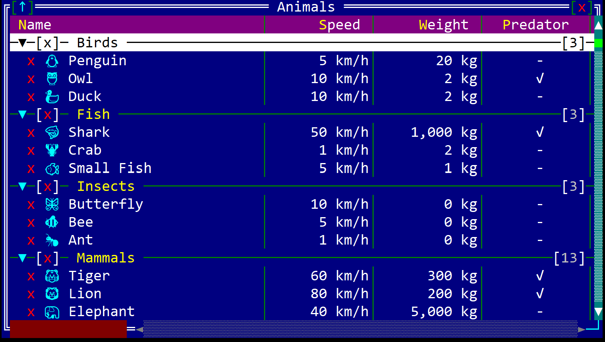
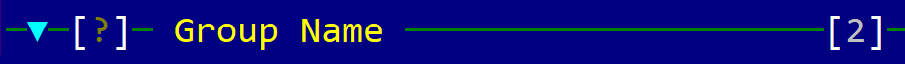
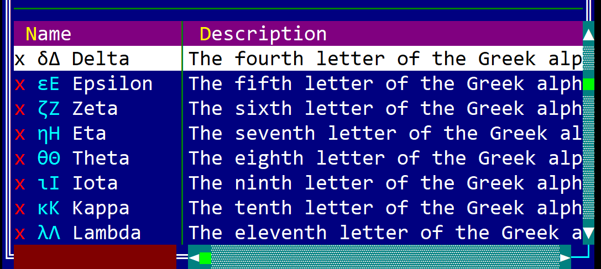
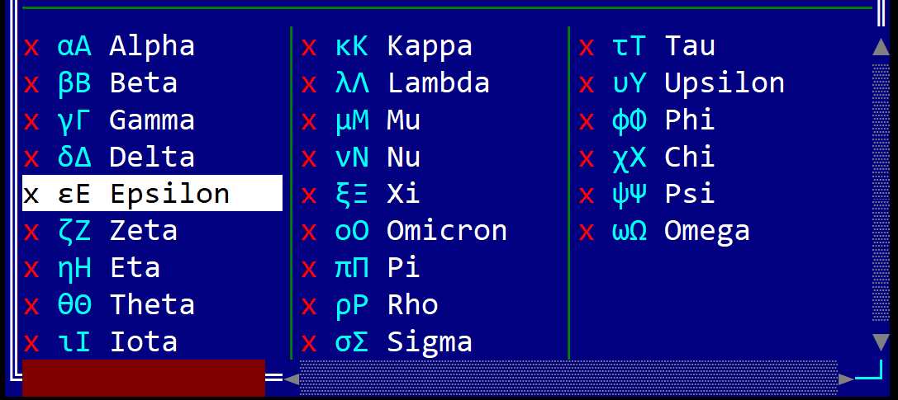

# ListView

A ListView is a templetize (generics based) control that allows you to view a list of objects.



It can be created using `ListView::new(...)` and `ListView::with_capacity(...)` methods or with the `listview!` macro. 

```rs
let l1: ListView<T> = ListView::new(Layout::new("..."),listview::Flags::None);
let l2: ListView<T> = ListView::with_capacity(10,Layout::new("..."),listview::Flags::ScrollBars);
let l3 = listview!("class: T, flags: Scrollbar, d:c, w:100%, h:100%");
let l4 = listview!("type: T, flags: Scrollbar, d:c, view:Columns(3)");
let l5 = listview!("T, d:c, view:Details, columns:[{Name,10,left},{Age,5,right},{City,20,center}]");
```

where type `T` is the type of the elements that are shown in the list view and has to implement `listview::ListItem` trait.

A listview supports all common parameters (as they are described in [Instantiate via Macros](../instantiate_via_macros.md) section). Besides them, the following **named parameters** are also accepted:

| Parameter name                | Type    | Positional parameter                | Purpose                                                                                                                                                                                                                  |
| ----------------------------- | ------- | ----------------------------------- | ------------------------------------------------------------------------------------------------------------------------------------------------------------------------------------------------------------------------ |
| `class` or `type`             | String  | **Yes**, first positional parameter | The type of items that are being displayed in the ListView control.                                                                                                                                                      |
| `flags`                       | String  | **No**                              | ListView initialization flags                                                                                                                                                                                            |
| `lsm` or `left-scroll-margin` | Numeric | **No**                              | The left margin of the bottom scroll bar in characters. If not provided the default value is 0. This should be a positive number and it only has an effect if the flag `ScrollBars` or `SearchBar` flags were specified. |
| `tsm` or `top-scroll-margin`  | Numeric | **No**                              | The top margin of the right scroll bar in characters. If not provided the default value is 0. This should be a positive number and it only has an effect if the flag `ScrollBars` flags was used to create the control.  |
| `view` or `viewmode` or `vm`  | String  | **No**                              | The view mode of the ListView control (`Details` or `Columns`).                                                                                                                                                          |
| `columns`                     | List    | **No**                              | The list of columns for the the ListView control.                                                                                                                                                                        |

The field `columns` is a list of columns that are displayed in the ListView control. Each column is a tuple with three elements: the name of the column, the width of the column in characters, and the alignment of the column (`left`, `right`, or `center`). The column field accespts the following parameters:

| Parameter name                | Type    | Positional parameter                 | Purpose                                                                                                                                                                                |
| ----------------------------- | ------- | ------------------------------------ | -------------------------------------------------------------------------------------------------------------------------------------------------------------------------------------- |
| `caption` or `name` or `text` | String  | **Yes**, first positional parameter  | The name of the column. If a character in the name is precedeed by the `&` character, that column will have a hot key associated that will allow clicking on a column via `Ctrl`+<key> |
| `width` or `w`                | Numeric | **Yes**, second positional parameter | The width of the column in characters.                                                                                                                                                 |
| `align` or `alignment` or `a` | String  | **Yes**, third positional parameter  | The alignment of the column (`left` or `l`, `right` or `r`, and `center` or `c`).                                                                                                      |

To create a column with the name `Test`, that hast `Ctrl+E` assigned as a hot key, with a width of 10 characters, and aligned to the right, you can use the following formats:
* `{caption: "T&est", width: 10, align: right}`
* `{name: "T&est", w: 10, a: right}`
* `{T&est, 10, right}`
* `{T&est,10,r}`

Similary, to create a listview with 3 columns (Name, Age, and City) with the widths of 10, 5, and 20 characters, respectively, and aligned to the left, right, and center, you can use the following format:

```rs
let l = listview!("T, d:c, view:Details, columns:[{Name,10,left},{Age,5,right},{City,20,center}]");
```

A listview supports the following initialization flags:
* `listview::Flags::ScrollBars` or `ScrollBars` (for macro initialization) - this enables a set of scrollbars that can be used to navigate through the list of items. The scrollbars are visible only when the control has focus
* `listview::Flags::SearchBar` or `SearchBar` (for macro initialization) - this enables a search bar that can be used to filter the list of items. The search bar is visible only when the control has focus
* `listview::Flags::CheckBoxes` or `CheckBoxes` (for macro initialization) - this enable a set of checkboxes that can be used to select multiple items from the list.
* `listview::Flags::ShowGroups` or `ShowGroups` (for macro initialization) - this enables the grouping of items in the list view. 
* `listview::Flags::SmallIcons` or `SmallIcons` (for macro initialization) - this enables the small icons (one character) view mode for the list view.
* `listview::Flags::LargeIcons` or `LargeIcons` (for macro initialization) - this enables the large icons (two characters or unicode surrogates) view mode for the list view.
* `listview::Flags::CustomFilter` or `CustomFilter` (for macro initialization) - this enables the custom filter that can be used to filter the list of items. The custom filter should be provided by the user in the `listview::ListItem` implementation.
* `listview::Flags::NoSelection` or `NoSelection` (for macro initialization) - this disables the selection of items from the list view. This flag is useful when the list view is used only for displaying information and the selection is not needed (such as a Save or Open file dialog). Using this flag together with the `CheckBoxes` flag will result in a panic.


## Events

To intercept events from a listview, the following trait has to be implemented to the Window that processes the event loop:

```rs
pub trait ListViewEvents<T: listview::ListItem + 'static> {
    // called when the current item is changed
    fn on_current_item_changed(&mut self, handle: Handle<ListView<T>>) -> EventProcessStatus {
        EventProcessStatus::Ignored
    }
    
    // called when a group (if groups are enabled) is collapsed
    fn on_group_collapsed(&mut self, handle: Handle<ListView<T>>, group: listview::Group) -> EventProcessStatus {
        EventProcessStatus::Ignored
    }

    // called when a group (if groups are enabled) is expanded
    fn on_group_expanded(&mut self, handle: Handle<ListView<T>>, group: listview::Group) -> EventProcessStatus {
        EventProcessStatus::Ignored
    }

    // called when the selection is changed
    fn on_selection_changed(&mut self, handle: Handle<ListView<T>>) -> EventProcessStatus {
        EventProcessStatus::Ignored
    }

    // called when you double click on an item (or press Enter)
    fn on_item_action(&mut self, handle: Handle<ListView<T>>, item_index: usize) -> EventProcessStatus {
        EventProcessStatus::Ignored
    }
}
```

## Methods

Besides the [Common methods for all Controls](../common_methods.md) a button also has the following aditional methods:

### Adding items and groups

| Method              | Purpose                                                                                                                                                                                                                                                |
| ------------------- | ------------------------------------------------------------------------------------------------------------------------------------------------------------------------------------------------------------------------------------------------------ |
| `add_group(...)`    | Creates a new group with a specified name and return a group identifier. You can further used the group identified to add an item to a group.                                                                                                          |
| `add_column(...)`   | Adds a new column to the ListView control. This method is in particular usefull when you need to create a custom listview.                                                                                                                             |
| `add(...)`          | Adds a new item to the ListView control.                                                                                                                                                                                                               |
| `add_item(...)`     | Adds a new item to the ListView control. This methods allows you to specify the color, icon, group and selection state for that item.                                                                                                                  |
| `add_items(...)`    | Adds a vector of items to the ListView control.                                                                                                                                                                                                        |
| `add_to_group(...)` | Adds a vector if items to the ListView control and associate all of them to a group                                                                                                                                                                    |
| `add_batch(...)`    | Adds multiple items to the listview. When an item is added to a listview, it is imediatly filtered based on the current search text. If you want to add multiple items (using various methods) and then filter them, you can use the add_batch method. |
| `clear()`           | Clears all items from the listview                                                                                                                                                                                                                     |


### Item manipulation

| Method                   | Purpose                                                                                                            |
| ------------------------ | ------------------------------------------------------------------------------------------------------------------ |
| `current_item()`         | Returns an immutable reference to the current item or None if the listview is empty or the cursor is over a group. |
| `current_item_mut()`     | Returns a mutable reference to the current item or None if the listview is empty or the cursor is over a group.    |
| `current_item_index()`   | Returns the index of the current item or None if the listview is empty or the cursor is over a group.              |
| `item(...)`              | Returns an immutable reference to an item based on its index or None if the index is out of bounds.                |
| `item_mut(...)`          | Returns a mutable reference to an item based on its index or None if the index is out of bounds.                   |
| `items_count()`          | Returns the number of items in the listview.                                                                       |
| `is_item_selected(...)`  | Returns true if the item is selected or false otherwise. If the index is invalid, false will be returned.          |
| `selected_items_count()` | Returns the number of selected items in the listview.                                                              |
| `select_item(...)`       | Selects or deselects an item based on its index.                                                                   |


### Group manipulation

| Method            | Purpose                                                                                                                 |
| ----------------- | ----------------------------------------------------------------------------------------------------------------------- |
| `current_group()` | Returns the current group or None if the cursor is not on a group or the current item does not have an associated group |
| `group_name(...)` | Returns the name of a group based on its identifier or None if the identifier is invalid                                |


### Miscellaneous

| Method                    | Purpose                                                                                                                         |
| ------------------------- | ------------------------------------------------------------------------------------------------------------------------------- |
| `set_frozen_columns(...)` | Sets the number of frozen columns. Frozen columns are columns that are not scrolled when the listview is scrolled horizontally. |
| `set_view_mode(...)`      | Sets the view mode of the ListView control.                                                                                     |
| `sort(...)`               | Sorts the items in the ListView control based on a column index.                                                                |
| `clear_search()`          | Clears the content of the search box of the listview.                                                                           |


## Key association

The following keys are processed by a `ListView` control if it has focus:

| Key                                                                          | Purpose                                                                                                                                                                                                                                         |
| ---------------------------------------------------------------------------- | ----------------------------------------------------------------------------------------------------------------------------------------------------------------------------------------------------------------------------------------------- |
| `Up`, `Down`                                                                 | Changes the current item from the ListBox.                                                                                                                                                                                                      |
| `Left`, `Right`                                                              | Scrolls the view to the left or to the right (when the view is `Details` or changes the current item if the view is `Columns`)                                                                                                                  |
| `PageUp`, `PageDown`                                                         | Navigates through the list of items page by page.                                                                                                                                                                                               |
| `Home`                                                                       | Moves the current item to the first element in the list                                                                                                                                                                                         |
| `End`                                                                        | Moves the current item to the last element in the list                                                                                                                                                                                          |
| `Shift`+{`Up`, `Down`, `Left`, `Right`, `PageUp`, `PageDown`, `Home`, `End`} | Selects multiple items in the list. If the flag `CheckBoxes` is prezent, the items will be checked, otherwise will be colored with a different color to indicare that they are selected.                                                        |
| `Insert`                                                                     | If the flag `CheckBoxes` is present, this will toggle the selection state of the current item. Once the selection is toggled, the cursor will me moved to the next item in the list.                                                            |
| `Space`                                                                      | If the flag `CheckBoxes` is present, this will toggle the selection state of the current item. If the flag `CheckBoxes` is not present, and the current item is a group, this will expand or collapse the group.                                |
| `Ctrl`+`A`                                                                   | Selects all items in the list. If the flag `CheckBoxes` is present, all items will be checked, otherwise will be colored with a different color to indicare that they are selected.                                                             |
| `Ctrl`+`Alt`+{`Up`, `Down`}                                                  | Moves the scroll up or down                                                                                                                                                                                                                     |
| `Enter`                                                                      | if the current item is a group, this will expand or collapse the group. If the current item is an element from the list, this will trigger the `ListViewEvents::on_item_action` event.                                                          |
| `Ctrl`+{`A`..`Z`, `0`..`9`}                                                  | If a column has a hot key associated (by using the `&` character in the column name), this will sort all items bsed on that column. If that column is already selected, this will reverse the order of the sort items (ascendent or descendent) |
| `Ctrl`+{`Left`, `Right`}                                                     | Enter in the column resize mode.                                                                                                                                                                                                                |

Aditionally, typing any character will trigger the search bar (if the flag `SearchBar` is present) and will filter the items based on the search text. While the search bar is active, the following keys are processed:
* `Backspace` - removes the last character from the search text
* `Escape` - clears the search text and closes the search bar
* Movement keys (such as `Up`, `Down`, `Left`, `Right`, `PageUp`, `PageDown`, `Home`, `End`) - will disable the search bar, but will keep the search text

While in the column resize mode, the following keys are processed:
* `Left`, `Right` - increases or decreases the width of the current column
* `Ctrl`+`Left`, `Ctrl`+`Right` - moves the focus to the previous or next column
* `Escape` or movement keys - exits the column resize mode


## Groups

Groups are a way to organize items in a listview. A group is a special item that can contain other items. If the flag `ShowGroups` is set, the items that are part of a group are displayed below the group item and are indented to the right. The group item can be expanded or collapsed by using the `Space` key or by double clicking on the group item. 

Sorting is done within the group (even if the flag `ShowGroups` is not set) and the items are sorted based on the current sorting column. The groups are always displayed at the top of the listview and are not sorted.

If the `CheckBoxes` flag is set, the group item will have a checkbox that can be used to select all items from the group. The selection state of the group item is updated based on the selection state of the items from the group.

To create a group use the `add_group` method. The method returns a group identifier that can be used to add items to that group. 

A group is displayed in the following way:



that contains the following characteristics:
* `name` - the name of the group
* `expanded` - a button that can be used to expand or collapse the group
* `selected` - a checkbox that can be used to select or deselecte all items from the group. 
* `count` - the right most number that indicates the number of items from the group that are visible (if the search bar is being used, this number will indicate the number of items in the group that have been filtered out)

## Populating a litsview

Whenever an element is being added to a listview, the listview will try to assigned to a group and if the search bar contains a filter expression, will try to filter the item based on that expression. After this steps, the listview will also try to sort the items based on the current sorting column.
Aditionally, there might be cases where you want to add an item with a specific icon, selection status or color.
As such, there are several methods that can be used to add items to a listview (each one design for a different scenario).

These operations can be expensive if the listview contains a large number of items. 
To avoid this, you can use the `add_batch` method that allows you to add multiple items to the listview and then filter and sort them. 

Let's consder the following structure `Student` that represents the type of items that are displayed in the listview:

```rs
struct Student {
    name: String,
    age: u8,
    grade: u8,
}
```

To add an item to the listview (assuming the listview is named `lv`), you can use the following methods:

1. `add` - adds a new item to the listview
    
    ```rs
    lv.add(Student { name: "John", age: 20, grade: 10 });
    lv.add(Student { name: "Alice", age: 21, grade: 9 });
    ```

2. `add_item` - adds a new item to the listview with a specific color, icon, group, and selection status

    ```rs
    lv.add_item(listview::Item::new(
        Student { name: "John", age: 20, grade: 10 }, 
        false,                  // not selected
        None,                   // no color
        [0 as char,0 as char],  // no icon
        listview::Group::None   // no group
    ));
    let g = lv.add_group("Group 1");
    lv.add_item(listview::Item::new(
        Student { name: "Alice", age: 22, grade: 9 }, 
        true,                                               // selected
        Some(CharAttribute::with_fore_color(Color::Red)),   // Red
        ['🐧', 0 as char],                                  // Penguin icon
        g                                                   // link to group g
    ));
    ```
3. `add_items` - adds a vector of items to the listview. You can use this method when you don't use groups and you need to process all items after being added (this will speed up the process for large lists)

    ```rs
    lv.add_items(vec![
        Student { name: "John", age: 20, grade: 10 },
        Student { name: "Alice", age: 21, grade: 9 },
        Student { name: "Bob", age: 21, grade: 8 },
        Student { name: "Mike", age: 21, grade: 7 },
    ]);
    ```
4. `add_to_group` - adds a vector of items to the listview and associates all of them to a group. You can use this method when you want to add multiple items to a group and you need to process all items after being added (this will speed up the process for large lists)

    ```rs
    let g = lv.add_group("Group 1");
    lv.add_to_group(vec![
        Student { name: "John", age: 20, grade: 10 },
        Student { name: "Alice", age: 21, grade: 9 },
        Student { name: "Bob", age: 21, grade: 8 },
        Student { name: "Mike", age: 21, grade: 7 },
    ], g);
    ```

5. `add_batch` - adds multiple items to the listview. This is the most generic way to add items using the preivous methods to a listview and to filter and sort them after the adding process ends. 
    
    ```rs
    lv.add_batch(|lv| {
        lv.add(Student { name: "John", age: 20, grade: 10 });
        lv.add_item(listview::Item::new(
            Student { name: "Ana", age: 21, grade: 10 }, 
            false,                  // not selected
            None,                   // no color
            [0 as char,0 as char],  // no icon
            listview::Group::None   // no group
        ));
    });

To add an item to a listview, the item type has to implement the [ListItem](../object-traits/listitem.md) trait. Based on the implementation of this trait, the listview will:
* display an item based on a specification
* filter the item based on the search text or a specific filtering algorithm
* sort the items based on a column index
* get a list of columns and their specifications (name, width, alignment)


## View modes

The listview control has two ways to display the items:
* `Details` - the items are displayed in a table with multiple columns. Each column can have a different width and alignment and contain information about various fields of the item.
* `Columns` - the items are displayed in a table with multiple columns. Each column has one item and represents the fist content of the first column in the Details view mode.

You can change the view mode of the listview by using the `view` parameter in the `listview!` macro or by using the `set_view_mode` method programatically. The default view mode is `Details`.

| View mode       | Enum                           | Example                                         |
| --------------- | ------------------------------ | ----------------------------------------------- |
| Details         | listview::ViewMode::Details    |  |
| Columns (three) | listview::ViewMode::Columns(3) |  |


## Example

The following example shows how to create a listview with a custom item type and how to add items to it.
The item used in the example is a `DownloadItem` that has the following fields:
* `name` - the name of the item
* `age` - the age of the item
* `server` - the server from which the item is downloaded
* `stars` - the rating of the item
* `download` - the download status of the item
* `created` - the creation date of the item
* `enabled` - a flag that indicates if the item is enabled or not
  

```rs
use appcui::prelude::*;

#[derive(ListItem)]
struct DownloadItem {
    #[Column(name: "&Name", width: 12, align: Left)]
    name: &'static str,
    #[Column(name: "&Age", width: 10, align: Center)]
    age: u32,
    #[Column(name: "&Server")]
    server: &'static str,
    #[Column(name: "&Stars", width: 10, align: Center, render: Rating, format:Stars)]
    stars: u8,
    #[Column(name: "Download", width:15)]
    download: listview::Status,
    #[Column(name: "Created", w: 20, align: Center, render: DateTime, format: Short)]
    created: chrono::NaiveDateTime,
    #[Column(name: "Enabled", align: Center)]
    enabled: bool,
}

fn main() -> Result<(), appcui::system::Error> {
    let mut a = App::new().build()?;
    let mut w = window!("Download,d:c,w:100%,h:100%,flags: Sizeable");
    let mut l = listview!("DownloadItem,d:c,view:Details,flags: ScrollBars+CheckBoxes");
    l.add(DownloadItem {
        name: "music.mp3",
        age: 21,
        server: "London",
        stars: 4,
        download: listview::Status::Running(0.5),
        created: chrono::NaiveDate::from_ymd_opt(2016, 7, 8).unwrap().and_hms_opt(9, 10, 11).unwrap(),
        enabled: true,
    });
    l.add(DownloadItem {
        name: "picture.png",
        age: 30,
        server: "Bucharest",
        stars: 3,
        download: listview::Status::Paused(0.25),
        created: chrono::NaiveDate::from_ymd_opt(2016, 7, 8).unwrap().and_hms_opt(9, 10, 11).unwrap(),
        enabled: false,
    });
    l.add(DownloadItem {
        name: "game.exe",
        age: 40,
        server: "Bucharest",
        stars: 5,
        download: listview::Status::Completed,
        created: chrono::NaiveDate::from_ymd_opt(2016, 7, 8).unwrap().and_hms_opt(9, 10, 11).unwrap(),
        enabled: true,
    });
    w.add(l);
    a.add_window(w);
    a.run();
    Ok(())
}
```