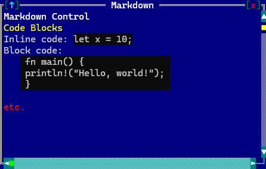
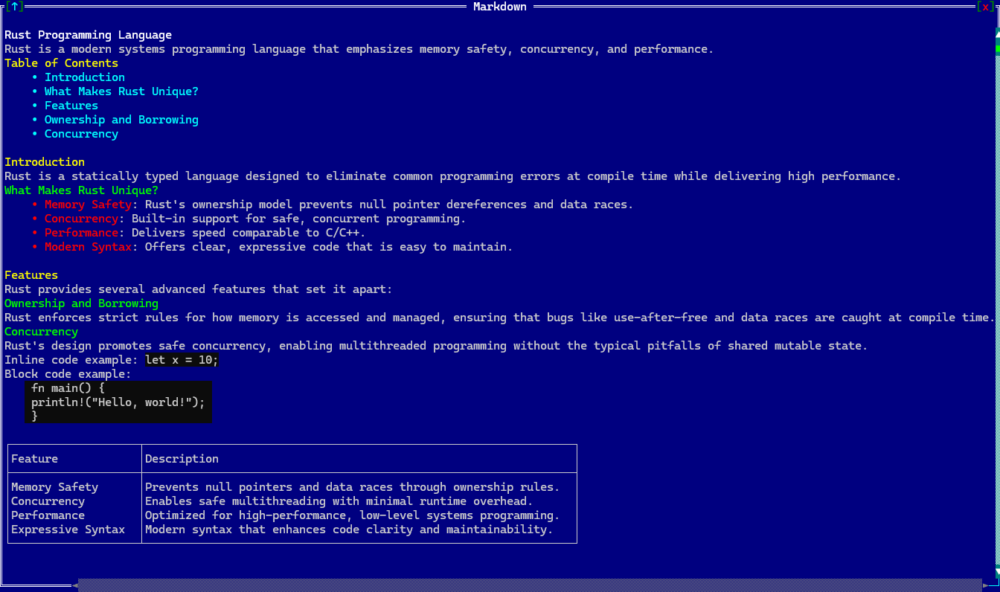

# Markdown
Represent a control that can properly display .md (Markdown) text.


To create a canvas use `Markdown::new` method (with 3 parameters: content, layout and initialization flags).

```rs
let m = Markdown::new(&content,Layout::new("d: c"),markdown::Flags::ScrollBars);
```
or the macro `canvas!`
```rs
let mut m = markdown!(
        "'\r\n\
        # Markdown Control\r\n\r\n\
        ## Code Blocks  \r\n\r\n\
        Inline code: `let x = 10;`\r\n\r\n\
        Block code:\r\n\r\n\
        ```\r\n\
        fn main() {\r\n\
            println!(\"Hello, world!\");\r\n\
        }\r\n\
        ```\r\n\r\n\
        **etc.**\r\n', 
        d: c, 
        flags: ScrollBars"
    );
```



A markdown control supports all common parameters (as they are described in [Instantiate via Macros](../instantiate_via_macros.md) section). Besides them, the following **named parameters** are also accepted:

| Parameter name                | Type         | Positional parameter                | Purpose                                                                                                                                                                                         |
| ----------------------------- | ------------ | ----------------------------------- | ----------------------------------------------------------------------------------------------------------------------------------------------------------------------------------------------- |
| `content` or `text`           | String       | **Yes** (first positional parameter) | The content of the markdown control                                                                                                             |
| `flags`                       | Flags        | **No**                              | Canvas initialization flags                                                                                                               |
| `left-scroll-margin` or `lsm` | Integer      | **No**                              | Defines the left margin of the bottom scroll bar in characters. If not provided, the default value is `0`. Only applies if `ScrollBars` is set.          |
| `top-scroll-margin` or `tsm`  | Integer      | **No**                              | Defines the top margin of the right scroll bar in characters. If not provided, the default value is `0`. Only applies if `ScrollBars` is set.            |

A markdown supports the following initialization flags:
* `markdown::Flags::ScrollBars` or `ScrollBars` (for macro initialization) - thils enable a set of scrollbars that can be used to change the view of the inner surface, but only when the control has focus, as described in [Components](../components.md) section.

Some examples that uses these paramateres:

1. A markdown control with two headers, inline code, a code block and the text `etc.` marcked as **bold**.
    ```rs
    let mut m = markdown!(
        "'\r\n\
        # Markdown Control\r\n\r\n\
        ## Code Blocks  \r\n\r\n\
        Inline code: `let x = 10;`\r\n\r\n\
        Block code:\r\n\r\n\
        ```\r\n\
        fn main() {\r\n\
            println!(\"Hello, world!\");\r\n\
        }\r\n\
        ```\r\n\r\n\
        **etc.**\r\n', 
        d: c, 
        flags: ScrollBars"
    );
    ```
2. A markdown control containging a table and having scrollbars with different margins.
    ```rs
    let mut m = markdown!(
        "'\r\n\
        # Markdown Control\r\n\r\n\
        | Column 1 | Column 2|\r\n\
        | - | --- |\r\n\
        | Cell 1, Row 1| Cell 2, Row 1 |\r\n\
        | Cell 1, Row 2 | Cell 1, Row 2 |\r\n\
        ', 
        d: c, 
        flags: ScrollBars,
        lsm:10,tsm:1"
    );
    ```

## Events
To intercept events from a markdown control, the following trait has to be implemented to the Window that processes the event loop:
```rs
pub trait MarkdownEvents {
    fn on_external_link(&mut self, markdown: Handle<Markdown>, link: &str) -> 
    EventProcessStatus {...}
}
```

## Methods

Besides the [Common methods for all Controls](../common_methods.md) a canvas also has the following aditional methods:

| Method                     | Purpose                                                            |
| -------------------------- | ------------------------------------------------------------------ |
| `set_content(...)` |  Replaces the canvas content with new data. It resets the drawing coordinates (x, y) and re-parses the content.|

## Key association

The following keys are processed by a markdown control if it has focus:

| Key                                 | Purpose                                                                                                                                |
| ----------------------------------- | -------------------------------------------------------------------------------------------------------------------------------------- |
| `Left`,`Right`,`Up`,`Down`          | Move the view port to a specified direction by one character.                                                                          |

## Example

The following code uses a markdown control to create a documentation viewer for the Rust programming language:

```rs
use appcui::prelude::*;

fn main() -> Result<(), appcui::system::Error> {
    let mut a = App::new().build()?;

    let mut w = window!("Markdown,d:c,w:50,h:15,flags:sizeable");
    let m = markdown!(
        "'''
        \r\n\
        # Rust Programming Language\r\n\
        \r\n\
        Rust is a modern systems programming language that emphasizes memory safety, concurrency, and performance.\r\n\
        \r\n\
        ## Table of Contents\r\n\
        - [Introduction](#introduction)\r\n\
            - [What Makes Rust Unique?](#what-makes-rust-unique)\r\n\
        - [Features](#features)\r\n\
            - [Ownership and Borrowing](#ownership-and-borrowing)\r\n\
            - [Concurrency](#concurrency)\r\n\
        \r\n\
        ## Introduction\r\n\
        \r\n\
        Rust is a statically typed language designed to eliminate common programming errors at compile time while delivering high performance.\r\n\
        \r\n\
        ### What Makes Rust Unique?\r\n\
        \r\n\
        - **Memory Safety**: Rust's ownership model prevents null pointer dereferences and data races.\r\n\
        - **Concurrency**: Built-in support for safe, concurrent programming.\r\n\
        - **Performance**: Delivers speed comparable to C/C++.\r\n\
        - **Modern Syntax**: Offers clear, expressive code that is easy to maintain.\r\n\
        \r\n\
        ## Features\r\n\
        \r\n\
        Rust provides several advanced features that set it apart:\r\n\
        \r\n\
        ### Ownership and Borrowing\r\n\
        \r\n\
        Rust enforces strict rules for how memory is accessed and managed, ensuring that bugs like use-after-free and data races are caught at compile time.\r\n\
        \r\n\
        ### Concurrency\r\n\
        \r\n\
        Rust's design promotes safe concurrency, enabling multithreaded programming without the typical pitfalls of shared mutable state.\r\n\
        \r\n\
        Inline code example: `let x = 10;`\r\n\
        \r\n\
        Block code example:\r\n\
        \r\n\
        ```\r\n\
        fn main() {\r\n\
            println!(\"Hello, world!\");\r\n\
        }\r\n\
        ```\r\n\
        \r\n\
        | Feature           | Description                                                          |\r\n\
        | ----------------- | -------------------------------------------------------------------- |\r\n\
        | Memory Safety     | Prevents null pointers and data races through ownership rules.       |\r\n\
        | Concurrency       | Enables safe multithreading with minimal runtime overhead.           |\r\n\
        | Performance       | Optimized for high-performance, low-level systems programming.       |\r\n\
        | Expressive Syntax | Modern syntax that enhances code clarity and maintainability.         |\r\n\
        ''',d: c,flags: ScrollBars,lsm:10,tsm:1"
    );
    w.add(m);
    a.add_window(w);
    a.run();
    Ok(())
}
```
