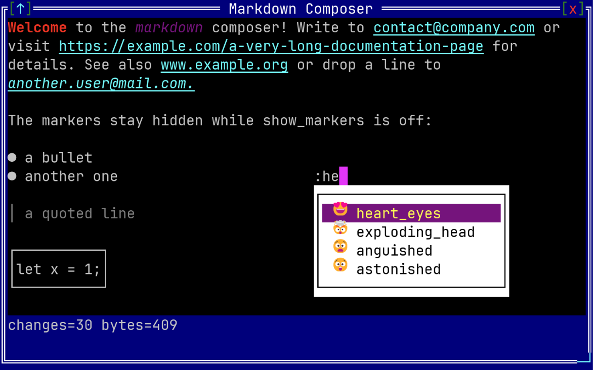

# MarkdownComposer

Represents a control where you can write and edit a markdown text, with the formatting applied while you type:



To create a markdown composer use `MarkdownComposer::new` method (with 2 parameters: a layout and initialization flags) or `MarkdownComposer::from` method (with 3 parameters: a text, a layout and initialization flags).

```rs
let mc1 = MarkdownComposer::new(layout!("x:1,y:1,w:40,h:10"), markdown_composer::Flags::None);
let mc2 = MarkdownComposer::from("**Hello** world", layout!("d:f"), markdown_composer::Flags::ShowMarkers);
```

or the macro `markdown_composer!`

```rs
let mc1 = markdown_composer!("x:1,y:1,w:40,h:10");
let mc2 = markdown_composer!("'**Hello** world',d:f,flags:ShowMarkers");
```

A markdown composer supports all common parameters (as they are described in [Instantiate via Macros](../instantiate_via_macros.md) section). Besides them, the following **named parameters** are also accepted:

| Parameter name      | Type   | Positional parameter                 | Purpose                                                                                                                  |
| ------------------- | ------ | ------------------------------------ | ------------------------------------------------------------------------------------------------------------------------ |
| `content` or `text` | String | **Yes** (first positional parameter) | The markdown text of the control. If ommited, an empty text will be considered as the content of the markdown composer.  |
| `flags`             | List   | **No**                               | MarkdownComposer initialization flags that control how the markers are displayed, if the control is readonly, etc        |
| `emoji`             | String | **No**                               | A single character that opens the predefined emoji list (e.g. `emoji: ':'`)                                              |
| `lists`             | List   | **No**                               | A list of suggestion lists, as described in the [Suggestion lists](#suggestion-lists) section                            |

A markdown composer supports the following initialization flags:
* `markdown_composer::Flags::ShowMarkers` or `ShowMarkers` (for macro initialization) - by default the markdown markers (`**`, `_`, `` ` ``, ` ``` `) are hidden and only their effect is visible. If this flag is being used, the raw text is displayed instead, markers included.
* `markdown_composer::Flags::Emoticons` or `Emoticons` (for macro initialization) - if set, a text emoticon or an emoji name written between colons is replaced with the corresponding emoji while typing (`:B):` becomes 😎, `:smile:` becomes 😀), as described in the [Emoticons](#emoticons) section.
* `markdown_composer::Flags::ReadOnly` or `ReadOnly` (for macro initialization) - this will allow you to view, select and copy the text but not to modify it.

Some examples that uses these paramateres:

1. A markdown composer that shows the raw markers and can not be modified.
    ```rs
    let mc = markdown_composer!("'A **bold** word',x:1,y:1,w:40,h:6,flags:ShowMarkers+ReadOnly");
    ```
2. A markdown composer that replaces emoticons while typing and has an emoji list opened by `:`.
    ```rs
    let mc = markdown_composer!("d:f,flags:Emoticons,emoji:':'");
    ```
3. A markdown composer with a list of names opened by `@` and a list of labels opened by `#`.
    ```rs
    let mc = markdown_composer!("
        d:f,
        lists:[
            {'@',items:['Ana','Bogdan','Cristina'],flags:RemoveTrigger},
            {trigger:'#',values:[{bug,'🐛'},{todo,'📝'}]}
        ]");
    ```

## Events

To intercept events from a markdown composer, the following trait has to be implemented to the Window that processes the event loop:

```rs
pub trait MarkdownComposerEvents {
    fn on_validate(&mut self, handle: Handle<MarkdownComposer>, text: &str) -> EventProcessStatus {...}
    fn on_text_changed(&mut self, handle: Handle<MarkdownComposer>) -> EventProcessStatus {...}
}
```

The `on_validate(...)` method is called when `Ctrl`+`Enter` is pressed and it receives the entire markdown text. The `on_text_changed(...)` method is called after every modification made by the user. Changes made from code (such as `set_text(...)`) do not raise this event.

## Methods

Besides the [Common methods for all Controls](../common_methods.md) a markdown composer also has the following additional methods:

| Method                        | Purpose                                                                                                                 |
| ----------------------------- | ------------------------------------------------------------------------------------------------------------------------- |
| `text()`                      | Returns the markdown text of the control, markers included                                                              |
| `set_text(...)`               | Sets a new markdown text and moves the cursor at its begining                                                           |
| `show_markers()`              | Returns `true` if the markdown markers are displayed or `false` otherwise                                               |
| `set_show_markers(...)`       | Shows (`true`) or hides (`false`) the markdown markers                                                                  |
| `is_read_only()`              | Returns `true` if the control is in a readonly state or `false` otherwise                                               |
| `set_read_only(...)`          | Enables (`true`) or disables (`false`) the readonly state                                                               |
| `emoticons_enabled()`         | Returns `true` if emoticons and emoji names are replaced while typing or `false` otherwise                              |
| `set_emoticons_enabled(...)`  | Enables (`true`) or disables (`false`) the replacement of emoticons and emoji names                                     |
| `flags()`                     | Returns the current flags of the control (they also reflect the setters described above)                                |
| `cursor_offset()`             | Returns the position of the cursor, as an offset in bytes from the begining of the text                                 |
| `set_cursor_offset(...)`      | Moves the cursor to a position. The offset is clamped to the text and aligned to the closest character                   |
| `selected_text()`             | Returns the selected text (if any) or `None` if there is no selection                                                   |
| `select_all()`                | Selects the entire text and moves the cursor at its end                                                                 |
| `clear_selection()`           | Clears the current selection without moving the cursor                                                                  |
| `add_list(...)`               | Adds a suggestion list in which every item inserts its own name                                                         |
| `add_list_with_values(...)`   | Adds a suggestion list in which every item has a separate value that is inserted in the text                            |
| `add_emoji_list(...)`         | Adds the predefined emoji list, opened by a trigger character                                                           |
| `with_list(...)`              | Same as `add_list(...)`, but returns the control so that it can be chained after the constructor                        |
| `with_list_values(...)`       | Same as `add_list_with_values(...)`, but returns the control                                                            |
| `with_emoji_list(...)`        | Same as `add_emoji_list(...)`, but returns the control                                                                  |
| `list(...)`                   | Returns the suggestion list opened by a trigger character (if any)                                                      |
| `list_mut(...)`               | Returns the same list, so that its items and flags can be changed while the application runs                            |
| `remove_list(...)`            | Removes the suggestion list opened by a trigger character. Returns `true` if such a list existed                        |

## Key association

The following keys are processed by a markdown composer control if it has focus:

| Key                                  | Purpose                                                                                                     |
| ------------------------------------ | ------------------------------------------------------------------------------------------------------------- |
| `Left`, `Right`, `Up`, `Down`        | Navigate through the text. If a selection exists, `Left` and `Right` move to its margins and clear it        |
| `Shift`+{`Left`,`Right`,`Up`,`Down`} | Selects part of the text                                                                                    |
| `Ctrl`+`Left`                        | Moves to the begining of the previous word                                                                  |
| `Ctrl`+`Shift`+`Left`                | Selects the text from the begining of the previous word until the current position                          |
| `Ctrl`+`Right`                       | Moves to the begining of the next word                                                                      |
| `Ctrl`+`Shift`+`Right`               | Selects the text from the current position until the begining of the next word                              |
| `Home` / `End`                       | Moves to the begining / the end of the current line                                                         |
| `Shift`+`Home` / `Shift`+`End`       | Selects the text until the begining / the end of the current line                                           |
| `Ctrl`+`Home` / `Ctrl`+`End`         | Moves to the begining / the end of the entire text                                                          |
| `Ctrl`+`Shift`+{`Home`,`End`}        | Selects the text until the begining / the end of the entire text                                            |
| `PageUp` / `PageDown`                | Moves the cursor one page up / down                                                                         |
| `Shift`+{`PageUp`,`PageDown`}        | Selects one page of text up / down                                                                          |
| `Ctrl`+`Up` / `Ctrl`+`Down`          | Scrolls the view one line up / down without moving the cursor                                               |
| `Ctrl`+`PageUp` / `Ctrl`+`PageDown`  | Scrolls the view one page up / down without moving the cursor                                               |
| `Backspace`                          | Deletes the previous character. If a selection exists, it deletes it first                                  |
| `Delete`                             | Deletes the current character. If a selection exists, it deletes it first                                   |
| `Ctrl`+`Backspace`                   | Deletes the previous word                                                                                   |
| `Ctrl`+`Delete`                      | Deletes the next word                                                                                       |
| `Ctrl`+`A`                           | Selects the entire text                                                                                     |
| `Ctrl`+`C` or `Ctrl`+`Insert`        | Copy the current selection to clipboard, as a valid markdown text                                           |
| `Ctrl`+`X` or `Shift`+`Delete`       | Copies the current selection into the clipboard and then deletes it (acts like a `Cut` command)             |
| `Ctrl`+`V` or `Shift`+`Insert`       | Paste the text from the clipboard (if any) to the current position                                          |
| `Enter`                              | Inserts a new line                                                                                          |
| `Ctrl`+`Enter`                       | Triggers a call to `MarkdownComposerEvents::on_validate(...)`                                               |

Additionally, all printable characters can be used to insert / modify or edit the current text.

Deleting a selection keeps the markdown valid: a marker that remains without its pair is removed as well, so a text such as `a **bold** b` can never become `a **bold b`.

When a suggestion list is opened, the following keys are processed by that list:

| Key                     | Purpose                                                                                                  |
| ----------------------- | ---------------------------------------------------------------------------------------------------------- |
| `Up` / `Down`           | Moves the selection to the previous / next item                                                          |
| `PageUp` / `PageDown`   | Moves the selection four items up / down                                                                 |
| `Enter` or `Tab`        | Inserts the selected item and closes the list                                                            |
| `Escape`                | Closes the list and keeps the text that was typed                                                        |

All the other keys are processed by the control itself, so `Home`, `End`, `Left` and `Right` move the cursor and close the list. The list is also closed when no item matches the typed text, or when the trigger character is deleted.

## Mouse actions

| Action                                  | Purpose                                                                     |
| --------------------------------------- | ----------------------------------------------------------------------------- |
| Click on the text                       | Moves the cursor to the clicked position and closes the suggestion list     |
| Drag over the text                      | Selects the text between the two positions                                  |
| Double click over a word                | Selects that word                                                           |
| Mouse wheel over the text               | Scrolls the view three lines up or down                                     |
| Move the mouse over the suggestion list | Selects the item under the cursor                                           |
| Click on an item of the list            | Inserts that item and closes the list                                       |
| Mouse wheel over the suggestion list    | Moves the selection to the previous / next item                             |

## Markdown syntax

The following elements are parsed and displayed:

| Element     | Syntax                | Displayed as                                                     |
| ----------- | --------------------- | ------------------------------------------------------------------ |
| Bold        | `**text**`            | The text, written with a bold attribute                          |
| Italic      | `_text_`              | The text, written with an italic attribute                       |
| Inline code | `` `text` ``          | The text, written with the code color of the theme               |
| Code block  | ` ``` ` on its own line, before and after the code | The code, framed in a box |
| Bullet      | `* ` or `- ` at the begining of a line | The marker is replaced with a bullet character  |
| Quote       | `> ` at the begining of a line | The marker is replaced with a vertical bar and the line is colored |
| Link        | a word that starts with `http://`, `https://` or `www.` | The word, written with the link color |
| E-mail      | a word that contains `@` and a domain | The word, written with the link color            |

When the `ShowMarkers` flag is **not** present, the markers themselves have no width: the cursor moves over them in one step and a selection can never start or end in the middle of a marker. Copying such a selection rebuilds a valid markdown text, so selecting only `bold` from `**bold**` puts `**bold**` in the clipboard.

## Suggestion lists

A suggestion list is opened by a trigger character typed at the begining of a word. While the list is opened, the text written after the trigger filters the items, ignoring the case. Choosing an item replaces the trigger and the typed text with the value of that item.

A list can be added from code with `add_list(...)`, `add_list_with_values(...)` and `add_emoji_list(...)`, or from the macro with the `lists` and `emoji` parameters. Every entry of the `lists` parameter accepts the following parameters:

| Parameter name | Type   | Positional parameter                 | Purpose                                                                       |
| -------------- | ------ | ------------------------------------ | ------------------------------------------------------------------------------- |
| `trigger`      | String | **Yes** (first positional parameter) | The character that opens the list. It has to be exactly one character         |
| `items`        | List   | **No**                               | A list of strings, where every item inserts its own name                      |
| `values`       | List   | **No**                               | A list of `{name, value}` pairs, where the name is shown and the value is inserted |
| `flags`        | List   | **No**                               | The flags of the list                                                         |

A suggestion list supports the following flags:
* `markdown_composer::ListFlags::RemoveTrigger` or `RemoveTrigger` (for macro initialization) - the trigger character is removed when an item is inserted. Without this flag, `@` followed by `Ana` becomes `@Ana`; with it, the result is just `Ana`.

The items of a list can also be changed while the application runs, through `list_mut(...)`:

```rs
if let Some(list) = mc.list_mut('@') {
    list.add("Bogdan");
    list.add_value("me", "@covita");
    list.remove(0);
    list.set_flags(markdown_composer::ListFlags::RemoveTrigger);
}
```

## Emoticons

If the `Emoticons` flag is present, a code written between two colons is replaced with an emoji as soon as the second colon is typed. Both text emoticons and emoji names are accepted:

| Written  | Becomes | Written    | Becomes |
| -------- | ------- | ---------- | ------- |
| `:):`    | 🙂      | `:smile:`  | 😀      |
| `:(:`    | 🙁      | `:rocket:` | 🚀      |
| `:D:`    | 😀      | `:pizza:`  | 🍕      |
| `:B):`   | 😎      | `:heart:`  | ❤       |
| `:<3:`   | ❤       | `:XD:`     | 😆      |

The replacement is not applied inside a code block or an inline code, and the first colon has to be preceded by a space or by the begining of a line, so a text such as `10:30:` is left untouched.

## Example

The following code creates a small message editor: the names are suggested by `@`, the emoji by `:`, and `Ctrl`+`Enter` sends the message and empties the composer.

```rs
use appcui::prelude::*;

#[Window(events = MarkdownComposerEvents)]
struct MyWin {
    composer: Handle<MarkdownComposer>,
    sent: Handle<Label>,
}

impl MyWin {
    fn new() -> Self {
        let mut w = Self {
            base: window!("'Message editor',a:c,w:60,h:14,flags:Sizeable"),
            composer: Handle::None,
            sent: Handle::None,
        };
        w.sent = w.add(label!("'Nothing was sent yet',x:1,y:1,w:56,h:1"));
        w.composer = w.add(markdown_composer!("
            'Write **here** and press Ctrl+Enter',
            x:1,y:3,w:56,h:8,
            flags:Emoticons,
            emoji:':',
            lists:[{'@',items:['Ana','Bogdan','Cristina'],flags:RemoveTrigger}]"));
        w
    }
}

impl MarkdownComposerEvents for MyWin {
    fn on_validate(&mut self, handle: Handle<MarkdownComposer>, text: &str) -> EventProcessStatus {
        let message = format!("Sent: {} characters", text.len());
        let label = self.sent;
        if let Some(label) = self.control_mut(label) {
            label.set_caption(&message);
        }
        if let Some(composer) = self.control_mut(handle) {
            composer.set_text("");
        }
        EventProcessStatus::Processed
    }
}

fn main() -> Result<(), appcui::system::Error> {
    App::new().window(MyWin::new).run()
}
```
