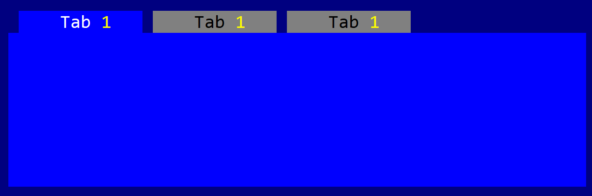

# Tab


Represent tabulator (tab control) where you can select the visible page:



To create a tab use `Tab::new` ,  `Tab::with_type` methods:
```rs
let t1 = Tab::new(Layout::new("d:c,w:15,h:10"),tab::Flags::None);
let t2 = Tab::with_type(Layout::new("d:c,w:15,h:10"),tab::Flags::None, tab::Type::OnLeft);
```
or the macro `tab!`
```rs
let t3 = tab!("d:c,w:15,h:10,tabs:[First,Second,Third],type:OnBottom");
let t4 = tab!("d:c,w:15,h:10,tabs:[A,B,C],flags:TabsBar");
```

The caption of each tab may contain the special character `&` that indicates that the next character is a hot-key. For example, constructing a tab with the following caption `&Start` will set up the text of the tab to `Start` and will set up character `S` as the hot key to activate that tab.

A tab supports all common parameters (as they are described in [Instantiate via Macros](../instantiate_via_macros.md) section). Besides them, the following **named parameters** are also accepted:

| Parameter name                    | Type    | Positional parameter | Purpose                                                       |
| --------------------------------- | ------- | -------------------- | ------------------------------------------------------------- |
| `type`                            | String  | **No**               | Tab type (one of `OnLeft`, `OnBottom`, `OnTop`, `HiddenTabs`) |
| `flags`                           | List    | **No**               | Tab initialization flags                                      |
| `tabs`                            | List    | **No**               | A list of tab pages                                           |
| `tabwidth` or `tab-width` or `tw` | Numeric | **No**               | The size of one tab. Should be between 3 and 32               |

A tab supports the following initialization types:
* `tab::Type::OnTop` or `OnTop` (for macro initialization) - this will position all tabs on top (this is also the default mode if this parameter is not specified)
* `tab::Type::OnBottom` or `OnBottom` (for macro initialization) - this will position all tabs on the bottom the the control
* `tab::Type::OnLeft` or `OnLeft` (for macro initialization) - this will position all tabs on the left side of the control
* `tab::Type::HiddenTabs` or `HiddentTabs` (for macro initialization) - this will hide all tabs. You can use this mode if you plan to change the tabs manually (via `.set_current_tab(...)`) method

and the following flags:
* `tab::Flags::TransparentBackground` or `TransparentBackground` (for macro initialization) - this will not draw the background of the tab
* `tab::Flags::TabsBar` or `TabsBar` (for macro initialization) - this will position all tabs over a bar

Some examples that uses these paramateres:
```rs
let t1 = tab!("type:OnBottom,tabs:[Tab1,Tab2,Tab&3],tw:10,flags:TabsBar,d:c,w:100%,h:100%");
let t2 = tab!("type:OnLeft,tabs:[A,B,C],flags:TabsBar+TransparentBackground,d:c,w:100%,h:100%");
```

## Events
This control does not emits any events.

## Methods

Besides the [Common methods for all Controls](../common_methods.md) a tab also has the following aditional methods:

| Method                 | Purpose                                                                                                  |
| ---------------------- | -------------------------------------------------------------------------------------------------------- |
| `add_tab(...)`         | Adds a new tab                                                                                           |
| `add(...)`             | Add a new control into the tab (the index of the tab where the control has to be added must be provided) |
| `current_tab()`        | Provides the index of the current tab                                                                    |
| `set_current_tab(...)` | Sets the current tab (this method will also change the focus to the tab cotrol)                          |
| `tab_width()`          | Returns the width of a tab                                                                               |
| `set_tab_width(...)`   | Sets the width of a tab (must be a value between `3` and `32`)                                           |
| `tab_caption(...)`     | Returns the caption (name) or a tab based on its index                                                   |
| `set_tab_caption(...)` | Sets the caption (name) of a tab                                                                         |

## Key association

The following keys are processed by a Tab control if it has focus:

| Key              | Purpose                                                                                     |
| ---------------- | ------------------------------------------------------------------------------------------- |
| `Ctrl+Tab`       | Select the next tab. If the current tab is the last one, the first one will be selected.    |
| `Ctrl+Shift+Tab` | Select the previous tab. If the current tab is the first one, the last one will be selected |

Aditionally, `Alt`+**letter or number** will automatically select the tab with that particular hotkey combination.

## Example

The following code creates a tab with 3 tabs pages and adds two buttons on each tab page.

```rs
use appcui::prelude::*;


fn main() -> Result<(), appcui::system::Error> {
    let mut app = App::new().build()?;
    let mut w = window!("Test,d:c,w:100%,h:100%");
    let mut t = tab!("l:1,t:1,r:1,b:3,tabs:['Tab &1','Tab &2','Tab &3']");
    t.add(0, button!("T1-1-A,r:1,b:0,w:10,type:flat"));
    t.add(0, button!("T1-1-B,d:c,w:10,type:flat"));      
    t.add(1, button!("T1-2-A,r:1,b:0,w:14,type:flat"));
    t.add(1, button!("T1-2-B,d:c,w:14,type:flat")); 
    t.add(2, button!("T1-3-A,r:1,b:0,w:20,type:flat"));
    t.add(2, button!("T1-3-B,d:l,w:20,type:flat"));  
    w.add(t); 

    w.add(button!("OK,r:0,b:0,w:10, type: flat"));
    w.add(button!("Cancel,r:12,b:0,w:10, type: flat"));

    a.add_window(w);
    a.run();
    Ok(())
}
```