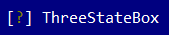

# ThreeStateBox

Represent a control with three states (checked, unckehed or unknown):



To create a threestatebox use `ThreeStateBox::new` method (with 3 parameters: a caption, a layout and a state (**checked**, **unchecked** or **unknown**)).
```rs
let b = ThreeStateBox::new("A ThreeStateBox", Layout::new("x:10,y:5,w:15"),threestatebox::State::Checked);
```
or the macro `threestatebox!`
```rs
let c1 = threestatebox!("caption='Some option',x:10,y:5,w:15,h:1");
let c2 = threestatebox!("'Another &option',x:10,y:5,w:15,h:1,state:checked");
let c3 = threestatebox!("'&Multi-line option\nthis a hot-key',x:10,y:5,w:15,h:3,state:unknown");
let c4 = threestatebox!("'&Unchecked threestatebox',x:10,y:5,w:15,h:3,state:unchecked");
```

The caption of a threestatebox may contain the special character `&` that indicates that the next character is a hot-key. For example, constructing a threestatebox with the following caption `&Option number 1` will set up the text of the button to `Option number 1` and will set up character `O` as the hot key for that threestatebox (pressing `Alt+O` will be equivalent to changing the status for that threestatebox from checked to unchecked to unkown).

A threestatebox can contain a multi-line text but you will have to set the height parameter large enough to a larger value (bigger than 1).

A threestatebox supports all common parameters (as they are described in [Instantiate via Macros](../instantiate_via_macros.md) section). Besides them, the following **named parameters** are also accepted:

| Parameter name      | Type   | Positional parameter                | Purpose                                                                                                                                                                                          |
| ------------------- | ------ | ----------------------------------- | ------------------------------------------------------------------------------------------------------------------------------------------------------------------------------------------------ |
| `text` or `caption` | String | **Yes** (first postional parameter) | The caption (text) written on a threestatebox                                                                                                                                                    |
| `state`             | String | **No**                              | threestatebox state: **checked**, **unchecked** or **unknown**. If the parameter is not provided, it will be defaulted to **unknown** state                                                      |
| `type`              | String | **No**                              | threestatebox type: **Standard**, **Ascii**, **CheckBox**, **CheckMark**, **FilledBox**, **YesNo** or **PlusMinus**. If the parameter is not provided, it will be defaulted to **Standard** type |


Some examples that uses these paramateres:
```rs
let disabled_threestatebox = threestatebox!("caption=&Disabled,x:10,y:5,w:15,enable=false");
let hidden_threestatebox = threestatebox!("text='&Hidden',x=9,y:1,align:center,w:9,visible=false");
let multi_line_threestatebox = threestatebox!("'&Multi line\nLine2\nLine3',x:1,y:1,w:10,h:3");
let custom_type_threestatebox = threestatebox!("'&Custom type',x:1,y:1,w:10,h:1,type=YesNo");
```

The type of the ThreeStateBox describes how the ThreeStateBox state (**checked** , **unchecked** or **unknown**) will be represented on the screen. 

| Type      | Checked State | Unchecked State | Unknown State |
| --------- | ------------- | --------------- | ------------- |
| Standard  | [✓] Checked   | [ ] Unchecked   | [?] Unknown   |
| Ascii     | [X] Checked   | [ ] Unchecked   | [?] Unknown   |
| CheckBox  | ☑ Checked     | ☐ Unchecked     | ⍰ Unknown   |
| CheckMark | ✔ Checked     | ✖ Unchecked     | ? Unknown   |
| FilledBox | ▣ Checked     | ▢ Unchecked     | ◪ Unknown   |
| YesNo     | [Y] Checked   | [N] Unchecked   | [?] Unknown   |
| PlusMinus | ➕ Checked     | ➖ Unchecked     | ± Unknown   |


## Events
To intercept events from a threestatebox, the following trait has to be implemented to the Window that processes the event loop:
```rs
pub trait ThreeStateBoxEvents {
    fn on_status_changed(&mut self, handle: Handle<ThreeStateBoxEvents>, state: threestatebox::State) -> EventProcessStatus {...}
}
```

## Methods

Besides the [Common methods for all Controls](../common_methods.md) a checkbox also has the following aditional methods:

| Method             | Purpose                                                                                                                                                                                                                                                                                                                                                                                                |
| ------------------ | ------------------------------------------------------------------------------------------------------------------------------------------------------------------------------------------------------------------------------------------------------------------------------------------------------------------------------------------------------------------------------------------------------ |
| `set_caption(...)` | Set the new caption. If the string provided contains the special character `&`, this method also sets the hotkey associated with a control. If the string provided does not contain the `&` character, this method will clear the current hotkey (if any).<br>Example: `threestatebox.set_caption("&Option")` - this will set the caption of the threestatebox with `Option` and the hotkey to `Alt+O` |
| `caption()`        | Returns the current caption                                                                                                                                                                                                                                                                                                                                                                            |
| `state()`          | Returns the current state of the threestatebox (**checked**, **unchecked** or **unknown**)                                                                                                                                                                                                                                                                                                             |
| `set_state(...)`   | Sets the new state for the threestatebox (**checked**, **unchecked** or **unknown**)                                                                                                                                                                                                                                                                                                                   |

## Key association

The following keys are processed by the control if it has focus:

| Key                | Purpose                                                                                                                                                                                                                                                                  |
| ------------------ | ------------------------------------------------------------------------------------------------------------------------------------------------------------------------------------------------------------------------------------------------------------------------ |
| `Space` or `Enter` | Cycle throght the states (checked to un-checked and vice-versa). It also emits `ThreeStateBoxEvents::on_status_changed(...)` event with the `state` parameter, the current state of the threestatebox. It has the same action clicking the threestatebox with the mouse. |

Aditionally, `Alt`+**letter or number** will have the same action (even if the threestatebox does not have a focus) if that letter or nunber was set as a hot-key for a threestatebox via its caption. 

## Example

The following code creates a window a threestatebox and a label. Whenever the threestatebox status is being changed, the label will print the new status (checked, unchecked or unkown).
```rs
#[Window(events = ThreeStateBoxEvents)]
struct MyWin {
    c: Handle<ThreeStateBox>,
    l: Handle<Label>,
}

impl MyWin {
    fn new() -> Self {
        let mut win = MyWin {
            base: window!("'My Win',a:c,w:40,h:6"),
            c: Handle::None,
            l: Handle::None,
        };
        win.c = win.add(threestatebox!("'My option',l:1,r:1,b:1"));
        win.l = win.add(label!("'State: Unknown',l:1,r:1,t:1"));
        win
    }
}

impl ThreeStateBoxEvents for MyWin {
    fn on_status_changed(&mut self, _handle: Handle<ThreeStateBox>, state: State) -> EventProcessStatus {
        let handle = self.l;
        let l = self.control_mut(handle).unwrap();
        match state {
            State::Checked => l.set_caption("State: Checked"),
            State::Unchecked => l.set_caption("State: Unchecked"),
            State::Unknown => l.set_caption("State: Unknown"),
        }
        EventProcessStatus::Processed
    }
}

fn main() -> Result<(), appcui::system::Error> {
    let mut app = App::new().build()?;
    app.add_window(MyWin::new());
    app.run();
    Ok(())
}
```