# Stock controls

AppCUI comes with a set of out-of-the-box controls that can be used:

| Control                                              | Class                        | Macro              | Image                                                         |
| ---------------------------------------------------- | ---------------------------- | ------------------ | ------------------------------------------------------------- |
| [Accordion](stock-controls/accordion.md)             | ui::Accordion                | `accordion!`       |        |
| [Button](stock-controls/button.md)                   | ui::Button                   | `button!`          |           |
| [Canvas](stock-controls/canvas.md)                   | ui::Canvas                   | `canvas!`          |           |
| [CheckBox](stock-controls/checkbox.md)               | ui::CheckBox                 | `checkbox!`        |         |
| [ColorPicker](stock-controls/colorpicker.md)         | ui::ColorPicker              | `colorpicker!`     |      |
| [CharPicker](stock-controls/charpicker.md)           | ui::CharPicker               | `charpicker!`      | 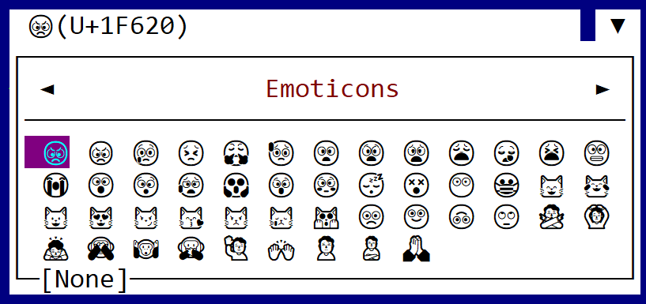      |
| [ComboBox](stock-controls/combobox.md)               | ui::ComboBox                 | `combobox!`        |         |
| [DatePicker](stock-controls/datepicker.md)           | ui::DatePicker               | `datepicker!`      | 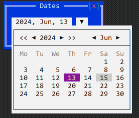      |
| [DropDownList](stock-controls/dropdownlist.md)       | ui::DropDownList&lt;T&gt;    | `dropdownlist!`    | 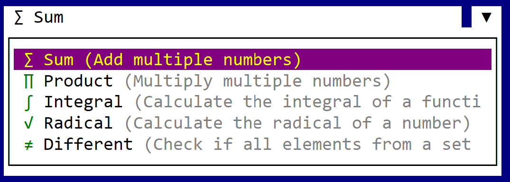    |
| [GraphView](stock-controls/graphview.md)             | ui::GraphView&lt;T&gt;       | `graphview!`       | 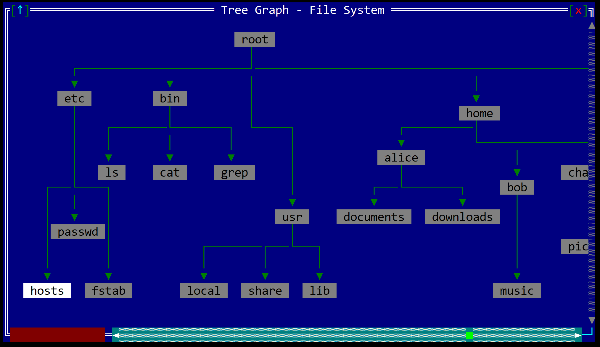       |
| [HLine](stock-controls/hline.md)                     | ui::HLine                    | `hline!`           | 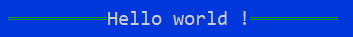           |
| [HSplitter](stock-controls/hsplitter.md)             | ui::HSplitter                | `hsplitter!`       | 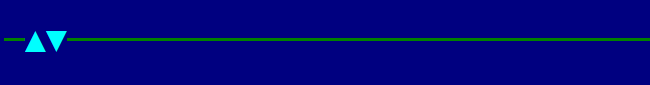       |
| [ImageViewer](stock-controls/imageviewer.md)         | ui::ImageViewer              | `imageviewer!`     |      |
| [KeySelector](stock-controls/keyselector.md)         | ui::KeySelector              | `keyselector!`     |      |
| [Label](stock-controls/label.md)                     | ui::Label                    | `label!`           |            |
| [ListBox](stock-controls/listbox.md)                 | ui::ListBox                  | `listbox!`         | 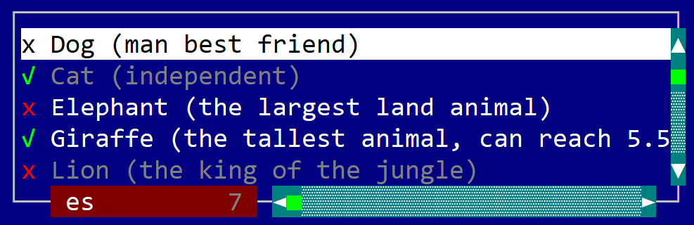         |
| [ListView](stock-controls/listview.md)               | ui::ListView&lt;T&gt;        | `listview!`        |         |
| [Markdown](stock-controls/markdown.md)               | ui::Markdown                 | `markdown!`        | 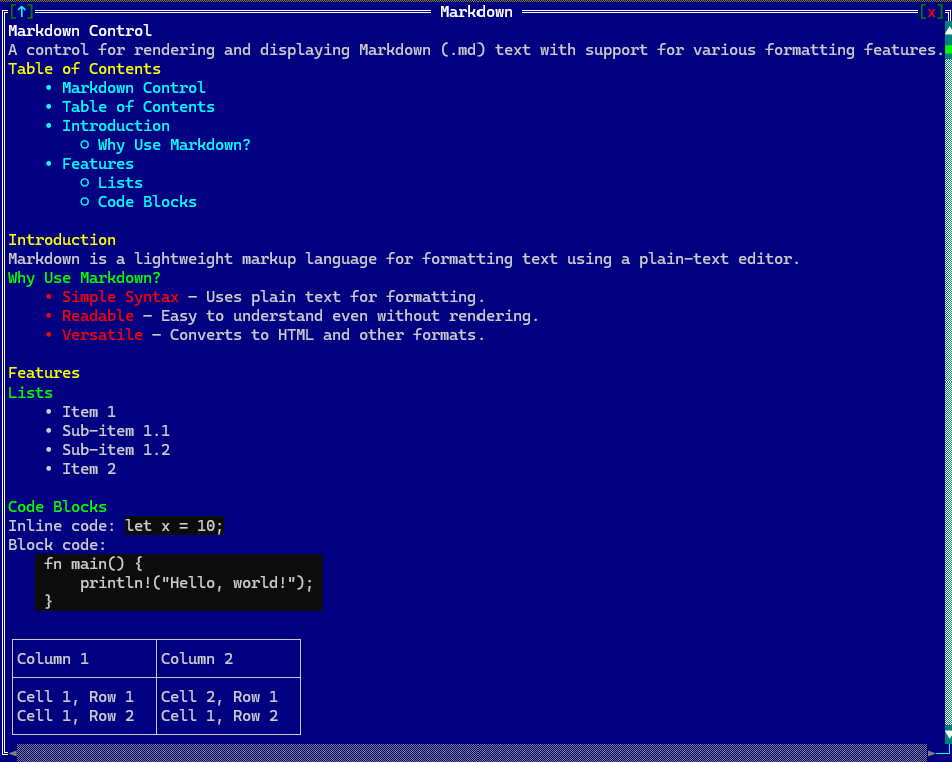        |
| [NumericSelector](stock-controls/numericselector.md) | ui::NumericSelector&lt;T&gt; | `numericselector!` | 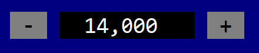 |
| [Panel](stock-controls/panel.md)                     | ui::Panel                    | `panel!`           |            |
| [Password](stock-controls/password.md)               | ui::Password                 | `password!`        |         |
| [PathFinder](stock-controls/pathfinder.md)           | ui::PathFinder               | `pathfinder!`      | 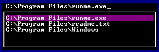      |
| [ProgressBar](stock-controls/progressbar.md)         | ui::ProgressBar              | `progressbar!`     | 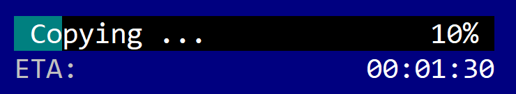     |
| [RadioBox](stock-controls/radiobox.md)               | ui::RadioBox                 | `radiobox!`        |         |
| [Selector](stock-controls/selector.md)               | ui::Selector&lt;T&gt;        | `selector!`        |         |
| [Tab](stock-controls/tab.md)                         | ui::Tab                      | `tab!`             |              |
| [TextArea](stock-controls/textarea.md)               | ui::TextArea                 | `textarea!`        | 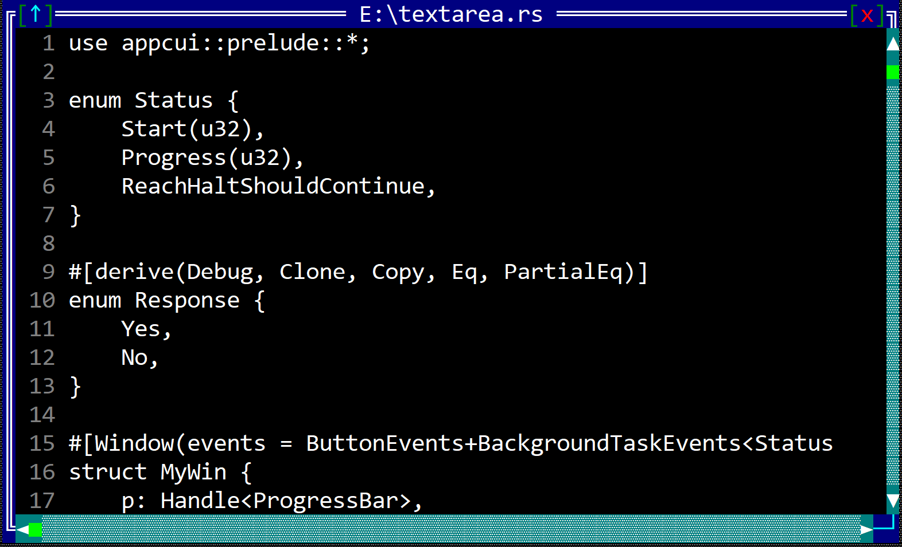        |
| [TextField](stock-controls/textfield.md)             | ui::TextField                | `textfield!`       |        |
| [ThreeStateBox](stock-controls/threestatebox.md)     | ui::ThreeStateBox            | `threestatebox!`   |    |
| [ToggleButton](stock-controls/togglebutton.md)       | ui::ToggleButton             | `togglebutton!`    |     |
| [TreeView](stock-controls/treeview.md)               | ui::TreeView&lt;T&gt;        | `treeview!`        | 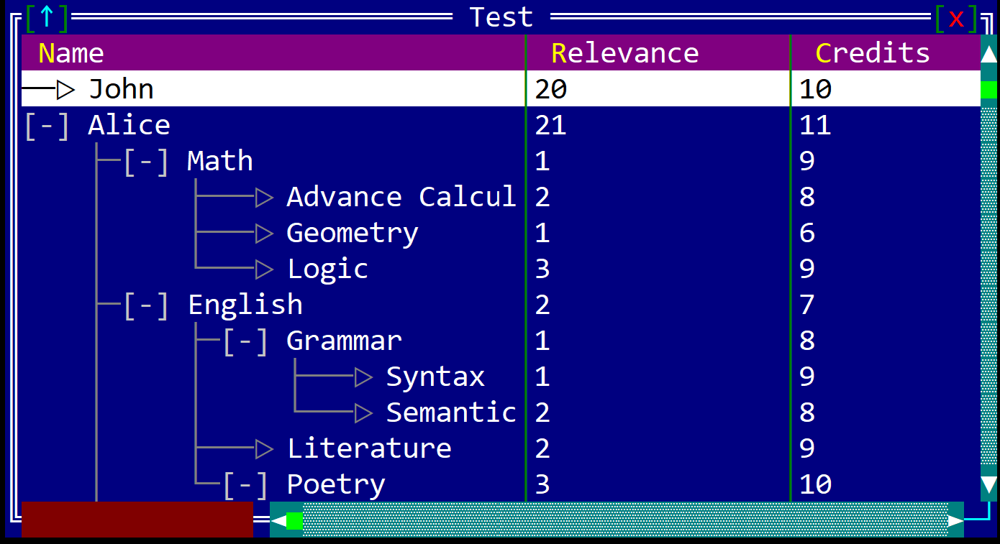        |
| [VLine](stock-controls/vline.md)                     | ui::VLine                    | `vline!`           | 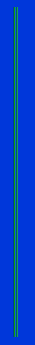           |
| [VSplitter](stock-controls/vsplitter.md)             | ui::VSplitter                | `vsplitter!`       | 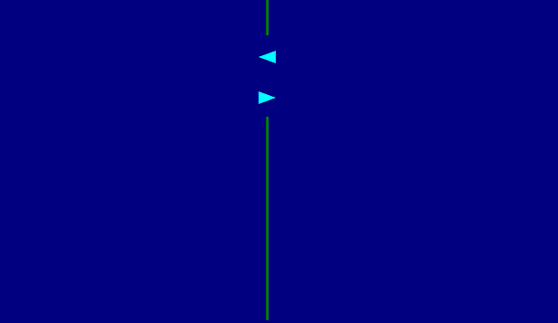       |

