# Stock controls

AppCUI comes with a set of out-of-the-box controls that can be used: 

| Control                                          | Class                 | Macro            | Image                                                       |
| ------------------------------------------------ | --------------------- | ---------------- | ----------------------------------------------------------- |
| [Accordion](stock-controls/accordion.md)         | ui::Accordion         | `accordion!`     | 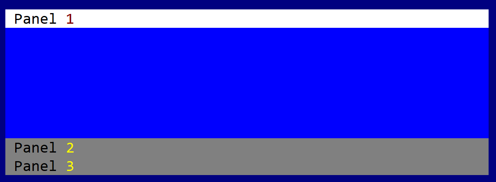     |
| [Button](stock-controls/button.md)               | ui::Button            | `button!`        |         |
| [Canvas](stock-controls/canvas.md)               | ui::Canvas            | `canvas!`        | 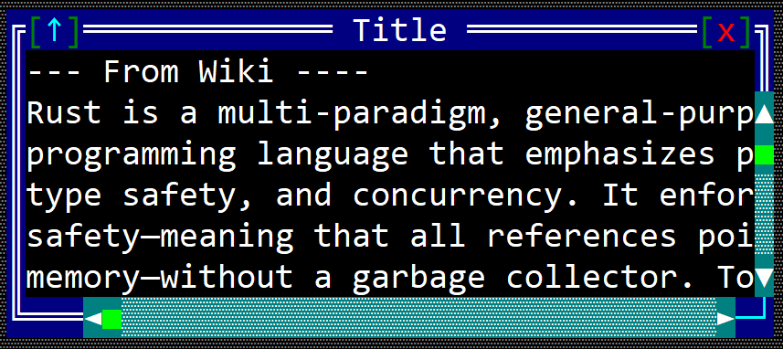        |
| [CheckBox](stock-controls/checkbox.md)           | ui::CheckBox          | `checkbox!`      |       |
| [ColorPicker](stock-controls/colorpicker.md)     | ui::ColorPicker       | `colorpicker!`   | 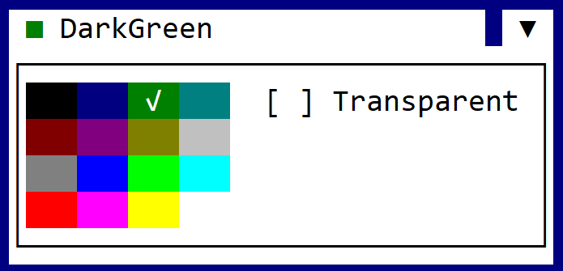   |
| [ComboBox](stock-controls/combobox.md)           | ui::ComboBox          | `combobox!`      | 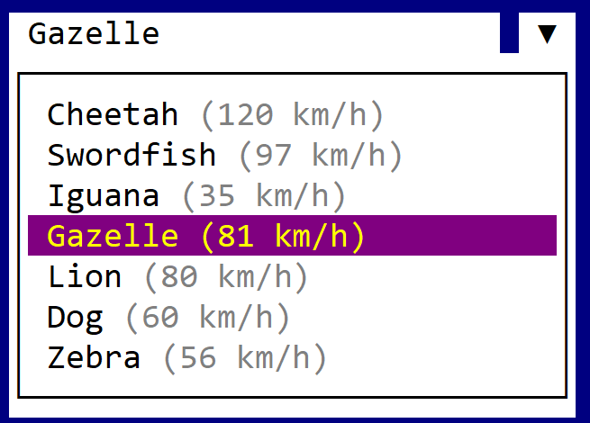      |
| [ImageViewer](stock-controls/imageviewer.md)     | ui::ImageViewer       | `imageviewer!`   | 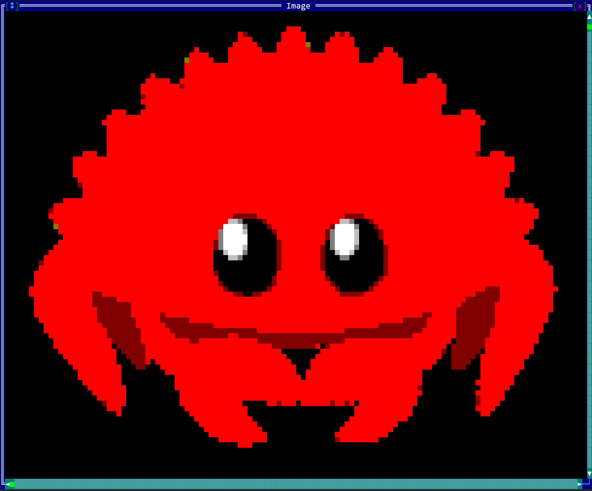   |
| [KeySelector](stock-controls/keyselector.md)     | ui::KeySelector       | `keyselector!`   | 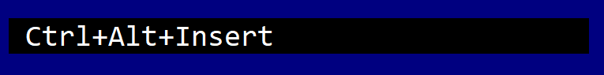   |
| [Label](stock-controls/label.md)                 | ui::Label             | `label!`         | 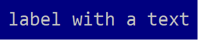         |
| [Panel](stock-controls/panel.md)                 | ui::Panel             | `panel!`         | 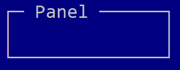         |
| [Password](stock-controls/password.md)           | ui::Password          | `password!`      | 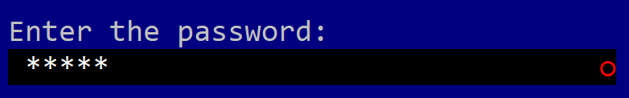      |
| [RadioBox](stock-controls/radiobox.md)           | ui::RadioBox          | `radiobox!`      | 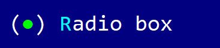      |
| [Selector](stock-controls/selector.md)           | ui::Selector&lt;T&gt; | `selector!`      | 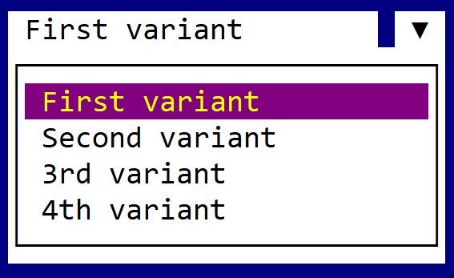      |
| [Tab](stock-controls/tab.md)                     | ui::Tab               | `tab!`           |            |
| [TextField](stock-controls/textField.md)         | ui::TextField         | `textfield!`     | 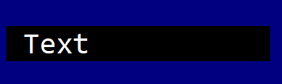     |
| [ThreeStateBox](stock-controls/threestatebox.md) | ui::ThreeStateBox     | `threestatebox!` |  |

