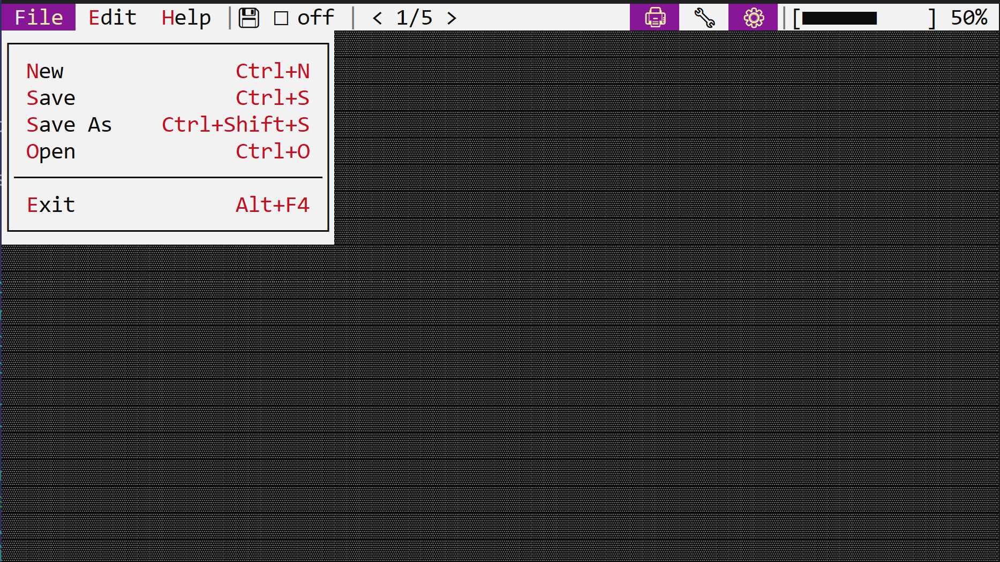

# Application Bar

An application bar is a bar (on the top part of a desktop and on top of every window) that contains all menus and other specific controls associated with an application.



The application bar is unique per application. This means, that you need to enable it when a new application is created. A tipical way to do this is by using `.app_bar()` method when building an application, like in the following snippet:

```rust
let mut app = App.App::new().app_bar().build()?;
```

Once you enabled the application bar, you will need to implement `AppBarEvents` on your window or custom control, and you will also need to add a list of menus and other specific controls when you create your window and/or custom control. A typical template of these flows look like this:

```rust
#[Window(events = AppBarEvents]
struct MyWin { /* data member */ }
impl MyWin { 
    fn new() -> Self {
        let mut w = Self { /* code to instantiate the structure */ };
        // other initialization methods
        let appbar_item_handle = w.appbar().add(/* appbar item */);
        // store the handle for later use
        // add other appbar items
        w
    }
    /* other methods */ 
}
impl AppBarEvents for MyWin {
    // other event related methods

    fn on_update(&self, appbar: &mut AppBar) {
        // this is called whenever the application bar needs to be updated
        // at this point, you can decide which items to show in the application bar.
        appbar.show(/* appbar item handle */);
    }
}
```

Its also important to note that `on_update` is being called only if the current focus (or one of its children) has focus. This implies that except for the case where a modal window is opened, this method will always be called for the desktop object. 

Whenever the focus changes, the application bar is cleared and the method `on_update` is being recall for each control from the focused one to its oldest ancestor (in most cases, the desktop).

You can always request an update to the command bar if by calling the method `.request_update()` that every control should have. This method will force AppCUI to recall `on_update` from the focused control to its oldest ancestor. Keep in mind that this command will not neccesarely call the `on_update` for the control that calls `request_update` , unless that control has the focus.

## Usage

An application bar has the following methods:

| Method         | Purpose                                                                                             |
| -------------- | --------------------------------------------------------------------------------------------------- |
| `add(...)`     | Adds a new item to the application bar (including an order and position)and returns a handle for it |
| `show(...)`    | Shows an item in the application bar                                                                |
| `get(...)`     | Returns an immutable reference to an item from the application bar                                  |
| `get_mut(...)` | Returns a mutable reference to an item from the application bar                                     |

**Remarks:** The `show(...)` method is typically used to show an item in the application bar. This method should only be called in `AppBarEvents::on_update(...)` method (if overwritten). By default, all items are hidden and whenever the focus changes, the AppCUI framework hides all items and starts from the focus control and moves to its ancestors and calls this method to decide which items to show. 

## Item order and positioning

Each item in the application bar has an order and a position. The order is used to determine the order of the items in the application bar. The position is used to determine the position of the item in the application bar (to the left or to the right).
* `order` represents a value of type `u8` that between **0** and **255** (the lower the value the earlier the item will be added in the application bar)
* `position` represents a value of type `appbar::Side` that can be either `Side::Left` or `Side::Right`

**Algorithm:** 

When the focus changes, the AppCUI framework does the following:
1. Hides all items from the application bar
2. Starts from the focus control and moves to its ancestors and calls the `AppBarEvents::on_update(...)` method to decide which items to show. 
   - each control should call `appbar.show(...)` method with the handle of the item it wants to be shown
        ```rust
        impl AppBarEvents for <Control|Window|Desktop> {
            fn on_update(&self, appbar: &mut AppBar) {
                appbar.show(/* handle of the firsti tem to show */);
                appbar.show(/* handle of the second item to show */);
                // ...
            }
        }
        ```
3. Once this process is done (meaning that we rech the desktop control), the items are sort based on thir `order` property. This allows a control to position some items before its parent control.
4. After the sort process is done, items are extracted and their position is configured based on their `position` property.
   - if the `position` property is `Side::Left`, the item is positioned from the left side of the application bar
   - if the `position` property is `Side::Right`, the item is positioned from the right side of the application bar

**Remark:** If there is no space available to position an item without overlapping with other items, the process stops and the rest of the remaining items will not be displayed (even if the user has called the `.show(...)` method for them). This typically happens if the terminal is too small (in width) to fit all items.

Let's see an example with 3 items ('A', 'B' and 'C') and a terminal **width** of 10 characters (we will consider that 'A' , 'B' and 'C' have a width of 2 characters eachF):

| Examples                                                                                                               | 'A' offset | 'B' offset | 'C' offset | Observations                                                                                                        |
| ---------------------------------------------------------------------------------------------------------------------- | ---------: | ---------: | ---------: | ------------------------------------------------------------------------------------------------------------------- |
| `A` (order **0**, position **Left**)<br>`B` (order **1**, position **Left**)<br>`C` (order **2**, position **Left**)   |          0 |          2 |          4 | All items are position one after<br> another                                                                        |
| `A` (order **0**, position **Left**)<br>`B` (order **1**, position **Left**)<br>`C` (order **0**, position **Right**)  |          0 |          2 | 8 *(10-2)* | First we position `A` , then `C`<br> (both have order **0**), and finally<br> `B`(in the space between `A` and `C`) |
| `A` (order **0**, position **Left**)<br>`B` (order **1**, position **Right**)<br>`C` (order **0**, position **Right**) |          0 |  6 *(C-2)* | 8 *(10-2)* | First we position `A` , then `C`<br> (both have order **0**), and finally<br> `B`(relative to `C`)                  |
| `A` (order **2**, position **Left**)<br>`B` (order **1**, position **Left**)<br>`C` (order **0**, position **Left**)   |          4 |          2 |          0 | Items are positioned in reverse<br> order                                                                           |

## Items

An application bar item can be one of the following types:
- [MenuButton](app_bar/menu_button.md)
- [Separator](app_bar/separator.md)
- [Label](app_bar/label.md)
- [Button](app_bar/button.md)
- [ToggleButton](app_bar/toggle_button.md)
- [SwitchButton](app_bar/switch_button.md)

Each item has the following proprties:
- position
- caption
- tooltip
- order
- width
- enabled or disabled

<!-- ## Example

The following example shows a window that creates 3 menus: `File`, `Edit` and `Help` and adds them in this order to the menu bar.

```rust
use appcui::prelude::*;

#[Window(events   = MenuEvents, 
         commands = New+Save+Open+Exit+Copy+Paste+Delete+Cut+CheckUpdate+Help+About)]
struct MyWin {
    m_file: Handle<Menu>,
    m_edit: Handle<Menu>,
    m_help: Handle<Menu>,
}
impl MyWin {
    fn new() -> Self {
        let mut w = MyWin {
            base: window!("Test,a:c,w:40,h:8"),
            m_file: Handle::None,
            m_edit: Handle::None,
            m_help: Handle::None,
        };
        w.m_file = w.register_menu(menu!("&File,class:MyWin,items=[
            { &New,cmd:New },
            { &Save,F2,cmd:Save },
            { &Open,F3,cmd:Open },
            { --- },
            { Exit,cmd:Exit }
        ]"));
        w.m_edit = w.register_menu(menu!("&Edit,class:MyWin,items=[
            { &Copy,Ctrl+Ins,cmd:Copy },
            { &Paste,Shift+Ins,cmd:Paste },
            { &Delete,cmd:Delete },
            { C&ut,Ctrl+X,cmd: Cut}
        ]"));
        w.m_help = w.register_menu(menu!("&Help,class:MyWin,items=[
            { 'Check for updates ...', cmd: CheckUpdate },
            { 'Show online help', cmd: Help },
            { --- },
            { &About,cmd:About }
        ]"));

        w
    }
}
impl MenuEvents for MyWin {
    fn on_update_menubar(&self, menubar: &mut MenuBar) {
        menubar.add(self.m_file, 0);
        menubar.add(self.m_edit, 1);
        menubar.add(self.m_help, 2);
    }
    fn on_command(&mut self, menu: Handle<Menu>, item: Handle<menu::Command>, command: mywin::Commands) {
        match command {
            mywin::Commands::New => todo!(),
            mywin::Commands::Save => todo!(),
            mywin::Commands::Open => todo!(),
            mywin::Commands::Exit => todo!(),
            mywin::Commands::Copy => todo!(),
            mywin::Commands::Paste => todo!(),
            mywin::Commands::Delete => todo!(),
            mywin::Commands::Cut => todo!(),
            mywin::Commands::CheckUpdate => todo!(),
            mywin::Commands::Help => todo!(),
            mywin::Commands::About => todo!(),
        }
    }
}
fn main() -> Result<(), appcui::system::Error> {
    let mut a = App::new().command_bar().build()?;
    a.add_window(MyWin::new());
    a.run();
    Ok(())
}
``` -->