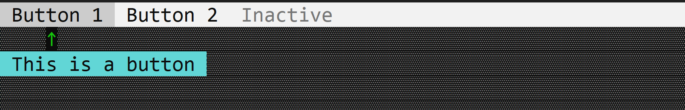

# Button

A button is a clickable item in the application bar.



To create a button, use `appbar::Button::new(...)` method or the `appbar::Button::with_tooltip(...)` method.

```rs
let button = appbar::Button::new("Button", 0, appbar::Side::Left);
```

or

```rs
let button = appbar::Button::with_tooltip("Button", "Tooltip", 0, appbar::Side::Left);
```

## Events

To capture button clicks, implement `AppBarEvents` on your window or custom control and overwrite the `on_button_click` method.

```rs
impl AppBarEvents for /* Window, Desktop or custom control */ {
    fn on_button_click(&mut self, button: Handle<appbar::Button>) {
        // Do something when the button is clicked
    }
}
```

## Methods

The following methods are available for a button:

| Method             | Purpose                                                                                                                                                                                                                                                                                                                                                                                           |
| ------------------ | ------------------------------------------------------------------------------------------------------------------------------------------------------------------------------------------------------------------------------------------------------------------------------------------------------------------------------------------------------------------------------------------------- |
| `set_caption(...)` | Set the new caption for a button. If the string provided contains the special character `&`, this method also sets the hotkey associated with a control. If the string provided does not contain the `&` character, this method will clear the current hotkey (if any).<br>Example: `button.set_caption("&Start")` - this will set the caption of the button cu `Start` and the hotket to `Alt+S` |
| `caption()`        | Returns the current caption of a button.                                                                                                                                                                                                                                                                                                                                                          |
| `set_tooltip(...)` | Set the tooltip for a button.                                                                                                                                                                                                                                                                                                                                                                     |
| `tooltip()`        | Returns the current tooltip of a button.                                                                                                                                                                                                                                                                                                                                                          |
| `set_enabled(...)` | Set the enabled state of a button.                                                                                                                                                                                                                                                                                                                                                                |
| `is_enabled()`     | Returns the enabled state of a button.                                                                                                                                                                                                                                                                                                                                                            |

## Example

The following code creates a window with three buttons (`Button 1`, `Button 2` and `Inactive`). The `Button 1` and `Button 2` buttons are enabled, while the `Inactive` button is disabled.

```rs
use appcui::prelude::*;

#[Window(events = AppBarEvents)]
pub(crate) struct Win {
    h_b1: Handle<appbar::Button>,
    h_b2: Handle<appbar::Button>,
    h_b3: Handle<appbar::Button>,
}
impl Win {
    pub(crate) fn new() -> Self {
        let mut w = Win {
            base: window!("'Separators',a:c,w:40,h:8,Flags: Sizeable"),
            h_b1: Handle::None,
            h_b2: Handle::None,
            h_b3: Handle::None,
        };

        w.h_b1 = w.appbar().add(
            appbar::Button::with_tooltip(" Button 1 ", 
                                         "This is a button", 
                                         0, 
                                         appbar::Side::Left));
        w.h_b2 = w.appbar().add(
            appbar::Button::new(" Button 2 ", 0, appbar::Side::Left));

        let mut b3 = appbar::Button::new(" Inactive ", 0, appbar::Side::Left);
        b3.set_enabled(false);
        w.h_b3 = w.appbar().add(b3);
        w
    }
}
impl AppBarEvents for Win {
    fn on_update(&self, appbar: &mut AppBar) {
        appbar.show(self.h_b1);
        appbar.show(self.h_b2);
        appbar.show(self.h_b3);
    }
}

fn main() -> Result<(), appcui::system::Error> {
    let mut app = App::new().app_bar().build()?;
    app.add_window(Win::new());
    app.run();
    Ok(())
}
```