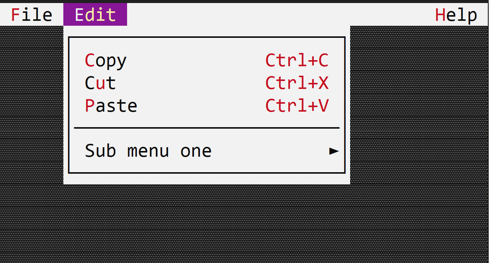

# MenuButton

A menu button is a button that opens a menu when clicked. Once the menu is opened, moving the mouse over anothe menu button or using the keyboad to go to another menu button will close the current menu and open the new one automatically.



To create a menu button, use `appbar::MenuButton::new(...)` method or `appbar::MenuButton::with_handle(...)` method.

```rs
let m = appbar::MenuButton::new("&File", 
                                menu!(...), 
                                0, // order
                                appbar::Side::Left);
```
or
```rs
let menu = menu!(....);
let menu_handle = self.register_menu(menu);
let m = appbar::MenuButton::with_handle("&File", 
                                        menu_handle, 
                                        0, // order
                                        appbar::Side::Left);
```

The caption of a menu button may contain the special character `&` that indicates that the next character is a hot-key. For example, constructing a menu button with the following caption `&File` will set up the text of the button to `File` and will set up character `F` as the hot key for that button (pressing `Alt+F` will open the menu).

## Events

A menu button does not have an associated menthod in the `AppBarEvents` trait. However, once opened, any events generated by the menu will can be received via the `MenuEvents` trait.

## Methods

The following methods are available for a menu button:

| Method             | Purpose                                                                                                                                                                                                                                                                                                                                                                                                        |
| ------------------ | -------------------------------------------------------------------------------------------------------------------------------------------------------------------------------------------------------------------------------------------------------------------------------------------------------------------------------------------------------------------------------------------------------------- |
| `set_caption(...)` | Set the new caption for a menu button. If the string provided contains the special character `&`, this method also sets the hotkey associated with a control. If the string provided does not contain the `&` character, this method will clear the current hotkey (if any).<br>Example: `menu_button.set_caption("&File")` - this will set the caption of the menu button cu `File` and the hotket to `Alt+F` |
| `caption()`        | Returns the current caption of a menu button                                                                                                                                                                                                                                                                                                                                                                   |
| `set_enabled(...)` | Enables or disables the menu button                                                                                                                                                                                                                                                                                                                                                                            |
| `is_enabled()`     | Returns `true` if the menu button is enabled, `false` otherwise                                                                                                                                                                                                                                                                                                                                                |

## Example

The following example creates 3 menu buttons (`File`, `Edit` and `Help`) and adds them to the app bar. 
`File` and `Edit` are on the left side of the app bar, while `Help` is on the right side.
The window implements:
* `AppBarEvents` - to select what menu button will be visible in the app bar when the window has focus
* `MenuEvents` - to receive the commands from the menus if opened

```rs
use appcui::prelude::*;

#[Window(events = [AppBarEvents, MenuEvents], 
         commands=[New,Save,SaveAs,Open,Exit,Copy,Cut,Paste,Time,Date,Convert,About,Welcome])]
pub(crate) struct Win {
    h_file: Handle<appbar::MenuButton>,
    h_edit: Handle<appbar::MenuButton>,
    h_help: Handle<appbar::MenuButton>,
}

impl Win {
    pub(crate) fn new() -> Self {
        let mut w = Win {
            base: window!("'Menu Buttons',a:c,w:40,h:8,Flags: Sizeable"),
            h_file: Handle::None,
            h_edit: Handle::None,
            h_help: Handle::None,
        };

        // File menu
        let m = menu!(
            "class: Win, items=[
                { &New, cmd: New , key: Ctrl+N },
                { &Save, cmd: Save, key: Ctrl+S },
                { 'Save &as...', cmd: SaveAs },
                { &Open, cmd: Open, key: Ctrl+O },
                { --- },
                { E&xit, cmd: Exit, key: Alt+F4 },
            ]"
        );
        w.h_file = w.appbar().add(appbar::MenuButton::new("&File", m, 1, appbar::Side::Left));

        // Edit menu
        let m = menu!(
            "class: Win, items=[
                { &Copy, cmd: Copy , key: Ctrl+C },
                { C&ut, cmd: Cut, key: Ctrl+X },
                { &Paste, cmd: Paste, key: Ctrl+V },
                { --- },
                { 'Sub menu one', items = [
                      { &Time, cmd: Time, Key: F1 },
                      { &Date, cmd: Date, Key: F2 },
                      { &Convert, items = [
                           { 'From milliseconds', cmd: Convert, key: Ctrl+1 },
                           { 'From seconds', cmd: Convert, key: Ctrl+2 },
                        ] 
                       }
                   ] 
                }
            ]"
        );
        w.h_edit = w.appbar().add(appbar::MenuButton::new("&Edit", m, 1, appbar::Side::Left));

        // Help menu
        let m = menu!(
            "class: Win, items=[
                { &About, cmd: About },
                { Welcome, cmd: Welcome },
            ]"
        );
        w.h_help = w.appbar().add(appbar::MenuButton::new("&Help", m, 1, appbar::Side::Right));

        w
    }
}
impl AppBarEvents for Win {
    fn on_update(&self, appbar: &mut AppBar) {
        // order will be File, Edit, Help (on the right)
        appbar.show(self.h_file);
        appbar.show(self.h_edit);
        appbar.show(self.h_help);
    }
}
impl MenuEvents for Win {
    fn on_command(&mut self, _menu:Handle<Menu>, _item:Handle<menu::Command>, command:win::Commands){
        match command {
            win::Commands::New => { /* Handle New command */ },
            win::Commands::Save => { /* Handle Save command */ },
            win::Commands::SaveAs => { /* Handle SaveAs command */ },
            win::Commands::Open => { /* Handle Open command */ },
            win::Commands::Exit => { /* Handle Exit command */ },
            win::Commands::Copy => { /* Handle Copy command */ },
            win::Commands::Cut => { /* Handle Cut command */ },
            win::Commands::Paste => { /* Handle Paste command */ },
            win::Commands::Time => { /* Handle Time command */ },
            win::Commands::Date => { /* Handle Date command */ },
            win::Commands::Convert => { /* Handle Convert command */ },
            win::Commands::About => { /* Handle About command */ },
            win::Commands::Welcome => { /* Handle Welcome command */ },
        }
    }
}


fn main() -> Result<(), appcui::system::Error> {
    let mut app = App::new().app_bar().build()?;
    app.add_window(Win::new());
    app.run();
    Ok(())
}
```