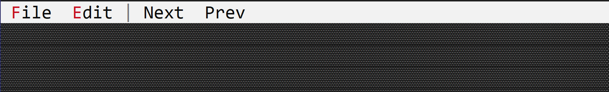

# Separator

A separator is a line that separates different items in the app bar.



To create a separator, use `appbar::Separator::new(...)` method. You will also need to specify the order and position of the separator in the app bar (a lower number will be displayed first from either **left** or **right** depending on the **position** parameter).

```rs
let separator = appbar::Separator::new(0, appbar::Side::Left);
```

**Remarks:** Even if a separator does not require aditional processing after it is being created, you would still be required to store that handle in order to be able to show it in the app bar.

## Events

There are no events associated with a separator.

## Methods

There are no methods associated with a separator.

## Example

The following example adds a separator to the app bar to separate the menu buttons `File` and `Edit` from the buttons `Next` and `Prev`.

```rs
use appcui::prelude::*;

#[Window(events = AppBarEvents)]
pub(crate) struct Win {
    h_file: Handle<appbar::MenuButton>,
    h_edit: Handle<appbar::MenuButton>,
    h_sep: Handle<appbar::Separator>,
    h_next: Handle<appbar::Button>,
    h_prev: Handle<appbar::Button>,
}
impl Win {
    pub(crate) fn new() -> Self {
        let mut w = Win {
            base: window!("'Separators',a:c,w:40,h:8,Flags: Sizeable"),
            h_file: Handle::None,
            h_edit: Handle::None,
            h_sep: Handle::None,
            h_next: Handle::None,
            h_prev: Handle::None,
        };

        let m_file = Menu::new();
        // add items to menu 'm_file'
        w.h_file = w.appbar().add(appbar::MenuButton::new("&File", m_file, 1, appbar::Side::Left));

        let m_edit = Menu::new();
        // add items to menu 'm_edit'
        w.h_edit = w.appbar().add(appbar::MenuButton::new("&Edit", m_edit, 1, appbar::Side::Left));

        // add separator
        w.h_sep = w.appbar().add(appbar::Separator::new(1, appbar::Side::Left));

        // Next and Prev buttons
        w.h_next = w.appbar().add(appbar::Button::new(" Next ", 1, appbar::Side::Left));
        w.h_prev = w.appbar().add(appbar::Button::new(" Prev ", 1, appbar::Side::Left));
        
        w
    }
}
impl AppBarEvents for Win {
    fn on_update(&self, appbar: &mut AppBar) {
        // the order will be File, Edit, Separator (|), Next, Prev
        appbar.show(self.h_file);
        appbar.show(self.h_edit);
        appbar.show(self.h_sep);
        appbar.show(self.h_next);
        appbar.show(self.h_prev);
    }
}

fn main() -> Result<(), appcui::system::Error> {
    let mut app = App::new().app_bar().build()?;
    app.add_window(Win::new());
    app.run();
    Ok(())
}
```