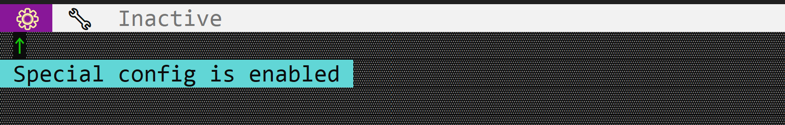

# ToggleButton

A toggle button is a button that can be toggled on and off. It is in particular usefull for features that can be enabled or disabled (e.g. dark mode, full screen, Bold/Italic/Underlined text, etc.).



To create a toggle button, use the `appbar::ToggleButton::new(...)` or `appbar::ToggleButton::with_tooltip(...)` methods:

```rs
let toggle_button = appbar::ToggleButton::new(
            "ToggleButton",      // Caption
            false,               // Initial state
            0,                   // Order
            appbar::Side::Left); // Position
```
or

```rs
let toggle_button = appbar::ToggleButton::with_tooltip(
            "ToggleButton",              // Caption
            "Tooltip for toggle button", // Tooltip
            false,                       // Initial state
            0,                           // Order
            appbar::Side::Left);         // Position
```

## Events

To capture toggle button clicks, implement `AppBarEvents` on your window or custom control and overwrite the `on_togglebutton_state_changed` method.

```rs
impl AppBarEvents for /* Window, Desktop or custom control */ {
    fn on_togglebutton_state_changed(&mut self, 
                                     togglebutton: Handle<appbar::ToggleButton>, 
                                     selected: bool) {
        // Do something when the toggle button's state changes
    }
}
```

## Methods

The following methods are available for a toggle button:

| Method              | Purpose                                                                                                                                                                                                                               |
| ------------------- | ------------------------------------------------------------------------------------------------------------------------------------------------------------------------------------------------------------------------------------- |
| `set_caption(...)`  | Set the new caption for a toggle button. If the caption contains the `&` character, the next character (if it is a letter or number) will be set as a hot-key for the button. For example, `"&Save"` will set the hot-key to `Alt+S`. |
| `caption()`         | Returns the current caption of a toggle button                                                                                                                                                                                        |
| `set_selected(...)` | Set the state of the toggle button (on or off)                                                                                                                                                                                        |
| `is_selected()`     | Returns the current state of the toggle button (selected or not)                                                                                                                                                                      |
| `set_tooltip(...)`  | Set the tooltip of the toggle button                                                                                                                                                                                                  |
| `tooltip()`         | Returns the current tooltip of a toggle button                                                                                                                                                                                        |
| `set_enabled(...)`  | Set the enabled state of the toggle button                                                                                                                                                                                            |
| `is_enabled()`      | Returns **true** if the toggle button is enabled, **false** otherwise.                                                                                                                                                                |

## Example

The following code creates a window with three toggle buttons (`⚙`, `🔧` and `Inactive`). The `⚙` and `🔧` buttons are enabled, while the `Inactive` button is disabled.

```rs
use appcui::prelude::*;

#[Window(events = AppBarEvents)]
pub(crate) struct Win {
    h_tb1: Handle<appbar::ToggleButton>,
    h_tb2: Handle<appbar::ToggleButton>,
    h_tb3: Handle<appbar::ToggleButton>,
}
impl Win {
    pub(crate) fn new() -> Self {
        let mut w = Win {
            base: window!("'Test Toggle Button',a:c,w:40,h:8,Flags: Sizeable"),
            h_tb1: Handle::None,
            h_tb2: Handle::None,
            h_tb3: Handle::None,
        };

        w.h_tb1 = w.appbar().add(appbar::ToggleButton::with_tooltip(
            " ⚙  ",
            "Special config is enabled",
            true,
            0,
            appbar::Side::Left,
        ));
        w.h_tb2 = w.appbar().add(appbar::ToggleButton::new(
            " 🔧  ",
            false,
            0,
            appbar::Side::Left,
        ));

        let mut b3 = appbar::ToggleButton::new(
            " Inactive ",
            false,
            0,
            appbar::Side::Left,
        );
        b3.set_enabled(false);
        w.h_tb3 = w.appbar().add(b3);
        w
    }
}
impl AppBarEvents for Win {
    fn on_update(&self, appbar: &mut AppBar) {
        appbar.show(self.h_tb1);
        appbar.show(self.h_tb2);
        appbar.show(self.h_tb3);
    }
}

fn main() -> Result<(), appcui::system::Error> {
    let mut app = App::new().app_bar().build()?;
    app.add_window(Win::new());
    app.run();
    Ok(())
}
```