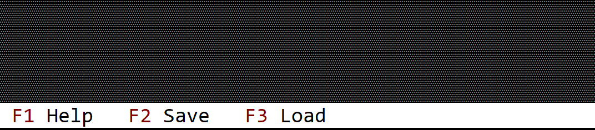

# Command Bar

A command bar is a bar (on the bottom part of a desktop and on top of every window) that contains key associations with commands. All associations are checked first - meaning that if you associate the key `F1` with a command, when you press `F1` you will not receive the key event, but the command associated with it.



The command bar is unique per application. This means, that you need to enable it when a new application is created. A tipical way to do this is by using `.command_bar()` method when building an application, like in the following snippet:

```rust
let mut app = App.App::new().command_bar().build()?;
```

Once you enabled the command bar, you will need to implement `CommandBarEvents` on your window or custom control, and you will also need to add a list of commands when you create your window and/or custom control. A tipical template of these flows look like this:

```rust
#[Window(events = CommandBarEvents, commands=[Command_1, Command_2 ... Command_n])]
struct MyWin { /* data member */ }
impl MyWin { /* internal methods */ }
impl CommandBarEvents for MyWin {
    fn on_update_commandbar(&self, commandbar: &mut CommandBar) {
        // this is where you add associations (key - command)
        // this can be done via `commandbar.set(...)` method
    }

    fn on_event(&mut self, command_id: mywin::Commands) {
        // this method is called whenever a key from the associated list is being pressed
    }
}
```

Its also important to note that `on_update_commandbar` is being called only if the current focus (or one of its children) has focus. This implies that except for the case where a modal window is opened, this method will always be called for the desktop object. 

Whenever the focus changes, the command bar is clear and the method `on_update_commandbar` is being recall for each control from the focused one to its oldest ancestor (in most cases, the desktop).

You can always request an update to the command bar if by calling the method `.request_update()` that every control should have. This method will force AppCUI to recall `on_update_commandbar` from the focused control to its oldest ancestor. Keep in mind that this command will not neccesarely call the `on_update_commandbar` for the control that calls `request_update` , unless that control has the focus.

All of the command that you add via the `commands` attribute, will be automatically added in a module (with the same name as you window or control, but lowercased) under the enum `Commands`. 

## Example

The following example shows a window that associates three keys: `F1`, `F2` and `F3` to some commands:

```rust
use appcui::prelude::*;

#[Window(events = CommandBarEvents, commands=[Help, Save,Load])]
struct MyWin { }
impl MyWin {
    fn new() -> Self {
        Self {
            base: window!("Win,x:1,y:1,w:20,h:7"),
        }
    }
}
impl CommandBarEvents for MyWin {
    fn on_update_commandbar(&self, commandbar: &mut CommandBar) {
        commandbar.set(key!("F1"), "Help", mywin::Commands::Save);
        commandbar.set(key!("F2"), "Save", mywin::Commands::Save);
        commandbar.set(key!("F3"), "Load", mywin::Commands::Load);
    }

    fn on_event(&mut self, command_id: mywin::Commands) {
        match command_id {
            mywin::Commands::Help => {
                // show a help
            },
            mywin::Commands::Save => {
                // save current data
            },
            mywin::Commands::Load => {
                // load something
            },
        }
    }
}

fn main() -> Result<(), appcui::system::Error> {
    let mut a = App::new().size(Size::new(60, 20)).command_bar().build()?;
    a.add_window(MyWin::new());
    a.run();
    Ok(())
}
```