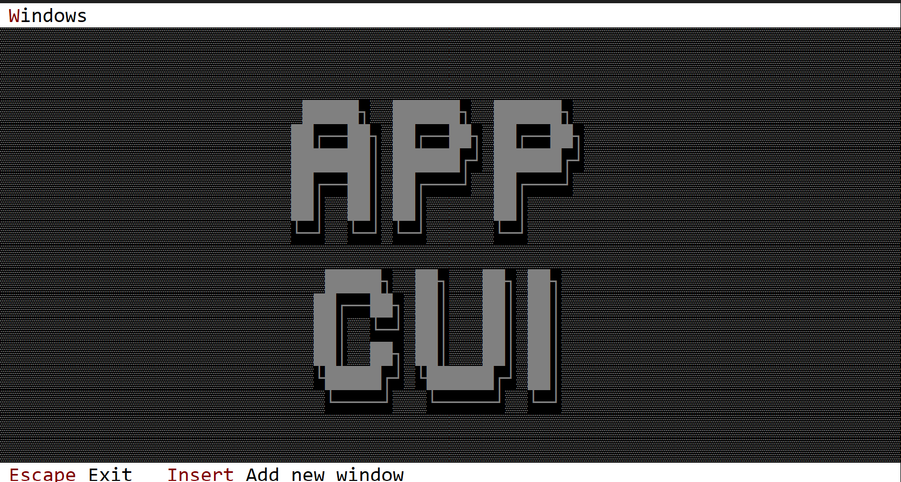

# Custom Desktop

A custom desktop is an user defined desktop where various method can be overwritten and system events can be processed. 



To build a custom Desktop that supports event handling, you must use a special procedural macro call `Desktop`, defined in the the following way:

```rs
#[Desktop(events=..., overwrite=... )]
struct MyDesktop {
    // specific fields
}
```

where the attribute `events` has the following form:
`events=EventTrait-1 + EventTrait-2 + EventTrait-3 + ... EventTrait-n`

and an `event trait` can be one of the following:
* MenuEvents
* CommandBarEvents
* DesktopEvents

and the `overwrite` atribute allows you to overwrite the following traits:
* OnPaint
* OnResize

In other words, a custom Desktop object can have specific logic for paint and for scenarious where it gets resized and can process its internal events as well as events from menus and command bar.

## Events

The most important event trait for a desktop is DesktopEvents (that allows you to intercept desktop specific events):

```rs
pub trait DesktopEvents {
    fn on_start(&mut self) { }
    fn on_close(&mut self) -> ActionRequest {...}
    fn on_update_window_count(&mut self, count: usize) {...}
}
```

These methods have the following purpose:
* `on_start` is being called once (after the AppCUI framework was started). A desktop object is being constructed before AppCUI framework starts. As such, you can not instantiate other objects such as menus, windows, etc in its constructor. However, you can do this by overwriting the `on_start` method.
* `on_close` is called whenever a desktop is being closed (usually when you pressed `Escape` key on a desktop). You can use this to performa some aditional validations (such sa saving all files, closing various handles, etc)
* `on_update_window_count` is being called whenever a new window is being added or removed from the desktop. You can use this method to re-arange the remaining methods.

## Using the custom desktop

To use the custom desktop, use the `.desktop(...)` method from the **App** like in the following example:

```rs
#[Desktop(events=..., overwrite=...)]
struct MyDesktop {
    // aditional fields
}
impl MyDesktop {
    fn new()->Self {...}
    // aditional methods
}
// aditional implementation for events and overwritten traits

fn main() -> Result<(), appcui::system::Error> {
    let a = App::new().desktop(MyDesktop::new()).build()?;
    // do aditional stuff with the application
    // such as add some windows into it
    a.run();
    Ok(())
}
```

It is important to notice that usually it is prefered that the entire logic to instantiate a desktop and add windows / menus or other settings to be done via `on_start` method. From this point of view, the code from main becomes quite simple:

```rs
fn main() -> Result<(), appcui::system::Error> {
    App::new().desktop(MyDesktop::new()).build()?.run();
    Ok(())
}
```

## Methods

Besides the [Common methods for all Controls](../chapter-3/common_methods.md) a desktop also has the following aditional methods:

| Method                 | Purpose                                                                                                                                                                                                                                                                                                                      |
| ---------------------- | ---------------------------------------------------------------------------------------------------------------------------------------------------------------------------------------------------------------------------------------------------------------------------------------------------------------------------- |
| `terminal_size()`      | Returns the size of the current terminal                                                                                                                                                                                                                                                                                     |
| `desktop_rect()`       | Returns the actual rectangle for the desktop. If menu bar and command bar are prezent, the desktop rectangle provides the visible side of the desktop. For example, if the terminal size is `80x20` and we also have a coomand bar and a menu bar, then the desktop rectangle will be `[Left:0, Top:1, Right:79, bottom:18]` |
| `add_window(...)`      | Adds a new window to the desktop                                                                                                                                                                                                                                                                                             |
| `arrange_windows(...)` | Arranges windows on the desktop. 4 methods are provided: `Cascade`, `Verical`, `Horizontal` and `Grid`                                                                                                                                                                                                                       |
| `close()`              | Closes the desktop and the entire app                                                                                                                                                                                                                                                                                        |
| `active_window()`      | Returns a handle to the focused windows                                                                                                                                                                                                                                                                                      |
| `window_mut(...)`      | Returns a mutable reference to a window with the specified handle. If the handle is not valid, an error is returned.                                                                                                                                                                                                         |
| `window(...)`          | Returns a reference to a window with the specified handle. If the handle is not valid, an error is returned.                                                                                                                                                                                                                 |


## Key associations

A desktop intercepts the following keys (if they are not process at window level):

| Key                             | Purpose                                                                                                                |
| ------------------------------- | ---------------------------------------------------------------------------------------------------------------------- |
| `Tab` or `Ctrl+Tab`             | Changes the focus to the next window                                                                                   |
| `Shift+Tab` or `Ctrl+Shift+Tab` | Changes the focus to the previous window                                                                               |
| `Escape`                        | Calls the `on_close` method and if the result is `ActionRequest::Allow` closes the desktop and the entire application. |

If hotkeys are present for window, `Alt+{hotkey}` is checked by the desktop window and the focused is moved to that window that has that specific hotkey association.


## Example

The following example created a custom desktop that that prints `My desktop` on the top-left side of the screen with white color on a red background. The desktop has one command (`AddWindow`) to add new windows via key `Insert`.

At the same time, `DesktopEvents::on_update_window_count(...)` is intercepted and whenever a new window is being added, it reorganize all windows in a grid.

```rs
use appcui::prelude::*;

#[Desktop(events: CommandBarEvents+DesktopEvents, overwrite:OnPaint, commands:AddWindow)]
struct MyDesktop {
    index: u32,
}
impl MyDesktop {
    fn new() -> Self {
        Self {
            base: Desktop::new(),
            index: 1,
        }
    }
}
impl OnPaint for MyDesktop {
    fn on_paint(&self, surface: &mut Surface, theme: &Theme) {
        surface.clear(theme.desktop.character);
        surface.write_string(1, 1, "My desktop", CharAttribute::with_color(Color::White, Color::Red), false);
    }
}
impl DesktopEvents for MyDesktop {
    fn on_update_window_count(&mut self, _count: usize) {
        self.arrange_windows(desktop::ArrangeWindowsMethod::Grid);
    }   
}
impl CommandBarEvents for MyDesktop {
    fn on_update_commandbar(&self, commandbar: &mut CommandBar) {
        commandbar.set(key!("Insert"), "Add new_window", mydesktop::Commands::AddWindow);
    }

    fn on_event(&mut self, command_id: mydesktop::Commands) {
        match command_id {
            mydesktop::Commands::AddWindow => {
                let name = format!("Win─{}", self.index);
                self.index += 1;
                self.add_window(Window::new(&name, Layout::new("a:c,w:20,h:10"), window::Flags::None));
            }
        }
    }
}

fn main() -> Result<(), appcui::system::Error> {
    App::new().size(Size::new(80,20)).desktop(MyDesktop::new()).command_bar().build()?.run();
    Ok(())
}
```