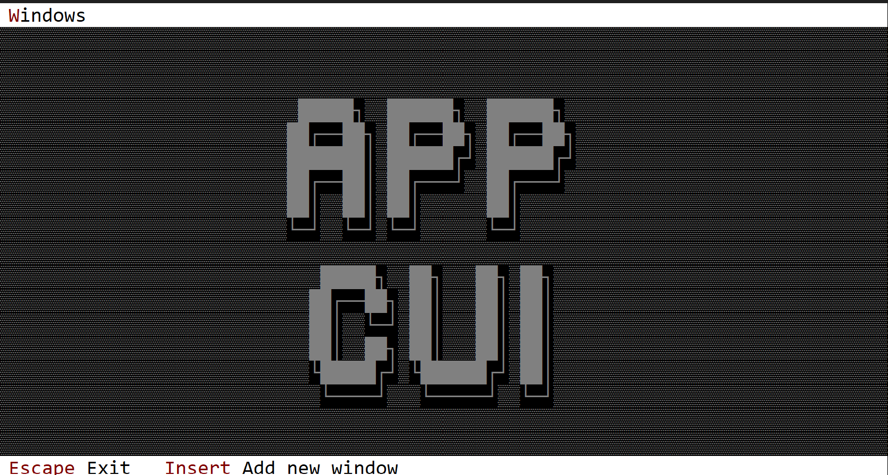

# Custom Desktop

A custom desktop is a user-defined desktop where various methods can be overridden and system events can be processed.



To build a custom desktop that supports event handling, you must use a special procedural macro called `Desktop`, defined in the following way:

```rs
#[Desktop(events=..., overwrite=... )]
struct MyDesktop {
    // specific fields
}
```

where the attribute `events` has the following form:
`events=EventTrait-1 + EventTrait-2 + EventTrait-3 + ... EventTrait-n`

and an `event trait` can be one of the following:
* MenuEvents
* AppBarEvents
* CommandBarEvents
* DesktopEvents

and the `overwrite` attribute allows you to override the following traits:
* OnPaint
* OnResize

In other words, a custom desktop object can have specific logic for painting and for scenarios where it is resized, and it can process its internal events as well as events from menus and the command bar.

## Events

The most important event trait for a desktop is DesktopEvents (that allows you to intercept desktop specific events):

```rs
pub trait DesktopEvents {
    fn on_start(&mut self) { }
    fn on_close(&mut self) -> ActionRequest {...}
    fn on_update_window_count(&mut self, count: usize) {...}
}
```

These methods have the following purpose:
* `on_start` is called once (after the AppCUI framework has started). A desktop object is constructed before the AppCUI framework starts. As such, you cannot instantiate other objects such as menus or windows in its constructor. However, you can do that by overriding the `on_start` method.
* `on_close` is called whenever a desktop is being closed (usually when you press the `Escape` key on a desktop). You can use this to perform some additional validations (such as saving all files, closing various handles, etc.).
* `on_update_window_count` is called whenever a new window is added or removed from the desktop. You can use this method to rearrange the remaining windows.

## Using the custom desktop

To use the custom desktop, use the `.desktop(...)` method from the **App** like in the following example:

```rs
#[Desktop(events=..., overwrite=...)]
struct MyDesktop {
    // additional fields
}
impl MyDesktop {
    fn new()->Self {...}
    // additional methods
}
// additional implementation for events and overridden traits

fn main() -> Result<(), appcui::system::Error> {
    let a = App::new().desktop(MyDesktop::new()).build()?;
    // do additional setup with the application
    // such as add some windows into it
    a.run();
    Ok(())
}
```

It is important to note that it is usually preferable for the entire logic that instantiates a desktop and adds windows, menus, or other settings to run in the `on_start` method. From that point of view, the code in `main` becomes quite simple:

```rs
fn main() -> Result<(), appcui::system::Error> {
    App::new().desktop(MyDesktop::new()).build()?.run();
    Ok(())
}
```

## Methods

Besides the [Common methods for all Controls](../chapter-3/common_methods.md), a desktop also has the following additional methods:

| Method                 | Purpose                                                                                                                                                                                                                                                                                                                                    |
| ---------------------- | ------------------------------------------------------------------------------------------------------------------------------------------------------------------------------------------------------------------------------------------------------------------------------------------------------------------------------------------ |
| `terminal_size()`      | Returns the size of the current terminal                                                                                                                                                                                                                                                                                                   |
| `desktop_rect()`       | Returns the actual rectangle for the desktop. If the application bar and command bar are present, the desktop rectangle describes the visible area of the desktop. For example, if the terminal size is `80x20` and we also have a command bar and an application bar, then the desktop rectangle might be `[Left:0, Top:1, Right:79, Bottom:18]` |
| `add_window(...)`      | Adds a new window to the desktop                                                                                                                                                                                                                                                                                                           |
| `arrange_windows(...)` | Arranges windows on the desktop. Four methods are provided: `Cascade`, `Vertical`, `Horizontal`, and `Grid`.                                                                                                                                                                                                                                     |
| `close()`              | Closes the desktop and the entire app                                                                                                                                                                                                                                                                                                      |
| `active_window()`      | Returns a handle to the focused window                                                                                                                                                                                                                                                                                                    |
| `window_mut(...)`      | Returns a mutable reference to a window with the specified handle. If the handle is not valid, an error is returned.                                                                                                                                                                                                                       |
| `window(...)`          | Returns a reference to a window with the specified handle. If the handle is not valid, an error is returned.                                                                                                                                                                                                                               |


## Key associations

A desktop intercepts the following keys (if they are not processed at window level):

| Key                             | Purpose                                                                                                                |
| ------------------------------- | ---------------------------------------------------------------------------------------------------------------------- |
| `Tab` or `Ctrl+Tab`             | Changes the focus to the next window                                                                                   |
| `Shift+Tab` or `Ctrl+Shift+Tab` | Changes the focus to the previous window                                                                               |
| `Escape`                        | Calls the `on_close` method and if the result is `ActionRequest::Allow` closes the desktop and the entire application. |

If hotkeys are present for windows, `Alt+{hotkey}` is handled by the desktop, and the focus is moved to the window that has that hotkey association.


## Example

The following example creates a custom desktop that prints `My desktop` in the top-left corner of the screen in white on a red background. The desktop has one command (`AddWindow`) to add new windows via the `Insert` key.

At the same time, `DesktopEvents::on_update_window_count(...)` is intercepted, and whenever a new window is added, it rearranges all windows in a grid.

```rs
use appcui::prelude::*;

#[Desktop(events: CommandBarEvents+DesktopEvents, overwrite:OnPaint, commands:AddWindow)]
struct MyDesktop {
    index: u32,
}
impl MyDesktop {
    fn new() -> Self {
        Self {
            base: Desktop::new(),
            index: 1,
        }
    }
}
impl OnPaint for MyDesktop {
    fn on_paint(&self, surface: &mut Surface, theme: &Theme) {
        surface.clear(theme.desktop.character);
        surface.write_string(1, 1, "My desktop", CharAttribute::with_color(Color::White, Color::Red), false);
    }
}
impl DesktopEvents for MyDesktop {
    fn on_update_window_count(&mut self, _count: usize) {
        self.arrange_windows(desktop::ArrangeWindowsMethod::Grid);
    }   
}
impl CommandBarEvents for MyDesktop {
    fn on_update_commandbar(&self, commandbar: &mut CommandBar) {
        commandbar.set(key!("Insert"), "Add new_window", mydesktop::Commands::AddWindow);
    }

    fn on_event(&mut self, command_id: mydesktop::Commands) {
        match command_id {
            mydesktop::Commands::AddWindow => {
                let name = format!("Win─{}", self.index);
                self.index += 1;
                self.add_window(Window::new(&name, layout!("a:c,w:20,h:10"), window::Flags::None));
            }
        }
    }
}

fn main() -> Result<(), appcui::system::Error> {
    App::new().size(Size::new(80,20))
             .desktop(MyDesktop::new())
             .command_bar()
             .build()?
        .run();
    Ok(())
}
```